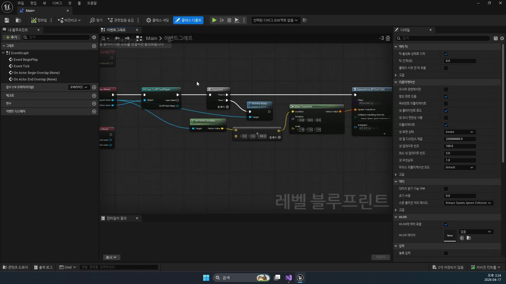

# 260417 몬스터 비전투 루프와 순찰 디버깅

## 문서 개요

이 문서는 `260417_1_Monster Wait Task`, `260417_2_Monster Patrol Task 작업중.`, `260417_3_엔진 버그 수정`을 하나의 교재로 다시 정리한 것이다.
핵심 흐름은 `비전투 대기 -> 점 기반 순찰 -> 디버깅과 안정화`다.

전날 강의까지 몬스터는 플레이어를 감지하면 추적하고 공격하는 전투 루프를 가지게 되었다.
하지만 실제 필드형 몬스터는 전투 중이 아닐 때 더 자주 보인다.
가만히 서 있는지, 잠깐 멈췄다가 움직이는지, 순찰을 어떻게 도는지, 디버깅 중에 왜 갑자기 멈추거나 이상하게 끝나는지를 다뤄야 비로소 “게임에 놓을 수 있는 AI”가 된다.

이번 날짜의 강의는 그래서 기능 추가보다 상태 정리에 가깝다.
전투 브랜치가 비어 있을 때 몬스터가 어떤 식으로 시간을 보내야 하는지, 그 흐름이 왜 일반 `Wait` 노드만으로는 부족한지, 순찰 로직을 실제 점 이동으로 만들 때 어떤 버그가 생기는지를 차례로 보여 준다.

이 교재는 다음 자료를 함께 대조해 작성했다.

- 강의 영상과 자막
- 원본 MP4에서 다시 추출한 고해상도 장면 캡처
- `D:\UnrealProjects\UE_Academy_Stduy\Source\UE20252`의 실제 소스

## 학습 목표

- 일반 `Wait` 태스크 대신 커스텀 `MonsterWait` 태스크가 필요한 이유를 설명할 수 있다.
- `BTTask_MonsterWait`가 `NodeMemory`와 타이머를 이용해 대기 상태를 관리하는 방식을 읽을 수 있다.
- `BTTask_Patrol`이 왜 곡선 추종이 아니라 점 기반 이동을 택했는지 설명할 수 있다.
- `mPatrolIndex = 1`, `GetPatrolEnable()`, `NextPatrol()`이 순찰 루프를 어떻게 만드는지 말할 수 있다.
- Map Check, 레벨 블루프린트 참조, 전체 빌드 정리 같은 에디터 문제를 순찰 버그와 구분해서 진단할 수 있다.

## 강의 흐름 요약

1. 비전투 상태에서는 일정 시간 대기하되, 플레이어가 감지되면 즉시 대기를 끊을 수 있어야 한다.
2. 순찰은 스플라인을 그대로 따르기보다 점을 기준으로 이동하는 방식으로 구현한다.
3. 첫 점은 스폰 위치와 겹치므로 실제 이동은 `1번 인덱스`부터 시작하는 편이 자연스럽다.
4. 버그가 생기면 코드와 런타임 문제만 보지 말고 Map Check, 블루프린트 참조, 빌드 상태도 같이 점검해야 한다.

---

## 제1장. Monster Wait Task: 비전투 상태를 제어하는 법

### 1.1 왜 기본 Wait 노드만으로는 부족한가

강의는 먼저 “비전투 상태의 몬스터가 어떻게 보여야 하는가”를 묻는다.
가장 단순한 답은 제자리 대기다.
하지만 단순히 엔진 기본 `Wait` 노드를 쓰면, 대기 중 플레이어가 시야에 들어와도 정해진 시간이 끝날 때까지 반응이 늦어질 수 있다.

이 점이 이번 장의 출발점이다.
필드 몬스터는 가만히 있는 것처럼 보여도 사실은 계속 주변 상황을 감시해야 한다.
즉 대기라는 행동은 “완전히 멈춰 있는 상태”가 아니라, 전투 브랜치로 즉시 넘어갈 준비를 한 비전투 상태여야 한다.

강의가 일반 `Wait`를 일부러 피하는 이유도 바로 여기에 있다.
비전투 루프는 정적인 연출이 아니라, 전투로의 전환성을 품고 있어야 한다.


### 1.2 순찰하지 않는 몬스터도 지원해야 한다

강의 초반부는 스플라인 점을 줄여 “가만히 있어야 하는 몬스터”를 만드는 쪽으로 설명이 이어진다.
여기서 중요한 해석은 간단하다.

- 스플라인 점이 충분히 있으면 순찰형 몬스터가 된다.
- 시작점 하나만 남기면 대기형 몬스터로 볼 수 있다.

즉 순찰 여부는 별도의 몬스터 클래스로 나누지 않아도 된다.
SpawnPoint와 PatrolPoints의 상태만으로도 비전투 패턴을 바꿀 수 있다.
이 설계는 레벨 작업자 입장에서 매우 편하다.
같은 몬스터라도 배치 방식만 달리해 정지형, 왕복형, 루프형 배치를 만들 수 있기 때문이다.


### 1.3 MonsterWait는 NodeMemory와 타이머로 기다린다

`BTTask_MonsterWait`는 `BTTaskNode`를 상속하지만, 핵심은 “얼마나 기다렸는지”를 외부 전역 변수에 두지 않는다는 데 있다.
강의는 이를 위해 `NodeMemory`를 사용한다.
소스에서는 `FWaitTimer` 구조체를 만들고, 여기에 `FTimerHandle`과 완료 플래그를 저장한다.

```cpp
USTRUCT()
struct FWaitTimer
{
    GENERATED_BODY()

    FTimerHandle Timer;
    bool Complete = false;
};
```

이 구조를 택하면 태스크 인스턴스가 자기 대기 상태를 직접 들고 있을 수 있다.
여러 몬스터가 동시에 같은 태스크를 실행해도 각자의 타이머가 섞이지 않는다.
즉 이번 장은 “대기한다”보다 “대기 상태를 어떤 메모리 구조에 담을 것인가”를 배우는 장이기도 하다.

### 1.4 Blackboard의 WaitTime을 읽고 Idle로 전환한다

`ExecuteTask()`의 흐름은 의외로 단순하고 깔끔하다.

1. AIController와 Blackboard를 가져온다.
2. 이미 `Target`이 있으면 대기할 이유가 없으므로 즉시 `Succeeded`를 반환한다.
3. 몬스터를 가져와 `Idle` 애니메이션으로 전환한다.
4. Blackboard의 `WaitTime`을 읽는다.
5. 타이머를 걸고 `InProgress`를 반환한다.

```cpp
AActor* Target = Cast<AActor>(BlackboardComp->GetValueAsObject(TEXT("Target")));

if (Target)
    return EBTNodeResult::Succeeded;

Monster->ChangeAnim(EMonsterNormalAnim::Idle);

float WaitTime = BlackboardComp->GetValueAsFloat(TEXT("WaitTime"));

FWaitTimer* Timer = (FWaitTimer*)NodeMemory;
Timer->Complete = false;

OwnerComp.GetWorld()->GetTimerManager().SetTimer(
    Timer->Timer,
    FTimerDelegate::CreateUObject(this, &UBTTask_MonsterWait::WaitFinish, NodeMemory),
    WaitTime,
    false
);

return EBTNodeResult::InProgress;
```

여기서 Blackboard를 쓰는 이유는 Wait 시간이 고정 상수가 아니기 때문이다.
나중에 몬스터 타입별로 다르게 주거나, 스폰 위치별로 다르게 조정하고 싶다면 Blackboard 변수화가 훨씬 유리하다.

### 1.5 TickTask가 중요한 이유

이번 장의 핵심은 사실 `ExecuteTask()`보다 `TickTask()`에 있다.
대기 태스크가 정말 “비전투 상태”로 동작하려면, 타이머만 기다려서는 안 되고 매 틱마다 `Target` 유무를 다시 봐야 한다.

`BTTask_MonsterWait`는 그래서 다음 두 경우에 대기를 끝낸다.

- 대기 중 플레이어를 감지한 경우: `Succeeded`
- 대기 시간이 정상적으로 끝난 경우: `Failed`

이 반환값 설계는 매우 중요하다.
`Succeeded`는 전투 브랜치 쪽으로 즉시 넘기는 신호가 되고, `Failed`는 비전투 브랜치 내 다음 동작, 즉 Patrol 같은 후속 행동을 열어 주는 신호가 된다.
즉 실패가 곧 오류라는 뜻은 아니다.

### 1.6 OnTaskFinished에서 타이머를 지우는 이유

커스텀 태스크를 만들 때 흔히 놓치는 것이 정리(cleanup) 단계다.
`OnTaskFinished()`에서 타이머를 명시적으로 지우는 이유는, 이미 끝난 대기 태스크의 타이머가 뒤늦게 불려 예상치 못한 상태를 만들지 않게 하기 위해서다.

짧은 함수지만 의미는 크다.
이번 장에서 배워야 할 것은 대기 시간보다 태스크 수명주기 전체를 관리하는 습관이다.


### 1.7 장 정리

제1장의 결론은 “비전투 상태도 실시간 반응성을 가져야 한다”는 데 있다.
커스텀 `MonsterWait`는 단순한 대기 노드가 아니라, 전투 감지를 계속 열어 둔 채 시간을 소비하는 상태 노드다.

즉 이 장에서 대기란 멈춤이 아니라 준비다.

---

## 제2장. Monster Patrol Task: 점 기반 순찰을 만드는 법

### 2.1 왜 곡선을 그대로 따라가지 않는가

강의는 Patrol을 설명하면서 스플라인을 그대로 따라가는 방식과 “점으로 이동하는 방식”을 구분한다.
이때 선택은 후자다.
곡선 추종도 가능하지만, 필드 몬스터 순찰에는 오히려 너무 레일을 타는 듯한 움직임이 나올 수 있기 때문이다.

점 기반 이동을 택하면 다음 장점이 생긴다.

- Behavior Tree와 잘 맞는다.
- `MoveToLocation()` 호출이 단순해진다.
- 도착 판정, 다음 포인트 전환, 대기 삽입이 쉬워진다.

즉 스플라인은 편집용 입력으로 남겨 두고, 실제 AI는 포인트 배열을 순차적으로 소비하는 편이 더 자연스럽다.


### 2.2 실제 이동이 1번 인덱스부터 시작하는 이유

이번 강의에서 아주 중요한 디테일은 `mPatrolIndex = 1`이다.
처음 보면 왜 0이 아닌지 의문이 생긴다.
하지만 0번은 대개 SpawnPoint의 시작 위치와 겹친다.
즉 스폰 직후 몬스터가 이미 서 있는 자리를 다시 목표로 잡으면, 순찰이 시작되자마자 제자리 판정이나 이상한 루프가 생기기 쉽다.

그래서 실제 첫 이동 목표는 두 번째 점, 즉 `1번 인덱스`가 더 자연스럽다.
소스도 이를 분명하게 반영한다.

```cpp
TArray<FVector> mPatrolPoints;
int32 mPatrolIndex = 1;

bool GetPatrolEnable() const
{
    return mPatrolPoints.Num() > 1;
}

FVector GetPatrolPoint() const
{
    return mPatrolPoints[mPatrolIndex];
}

void NextPatrol()
{
    mPatrolIndex = (mPatrolIndex + 1) % mPatrolPoints.Num();
}
```

이 네 줄만 이해해도 이번 날짜의 순찰 흐름 절반은 끝난다.
순찰 가능 여부, 현재 목표, 다음 목표, 루프 구조가 전부 들어 있기 때문이다.


### 2.3 Patrol 태스크는 Trace를 단순 복사하지 않는다

강의에서는 Patrol 태스크를 만들 때 Trace 태스크의 틀을 가져와 수정하는 모습을 보여 준다.
하지만 중요한 것은 복사가 아니라 역할 변화다.
Trace는 Target을 추적하는 태스크이고, Patrol은 Target이 없을 때 기본 이동을 담당하는 태스크다.

그래서 `ExecuteTask()` 초반부는 다음 순서로 읽으면 된다.

1. Controller와 Blackboard를 확인한다.
2. `Target`이 있으면 전투 쪽 우선순위를 넘겨 주기 위해 `Succeeded` 한다.
3. Monster를 얻는다.
4. `GetPatrolEnable()`이 거짓이면 순찰할 필요가 없으므로 `Failed` 한다.
5. `MoveToLocation(GetPatrolPoint())`를 호출한다.
6. 애니메이션을 `Walk`로 바꾼다.

즉 Patrol은 비전투 브랜치 내부에서만 의미를 갖는 기본 동작이다.
전투 상태가 생기면 곧바로 자리를 비켜 줘야 한다.

### 2.4 TickTask에서는 도착 판정을 직접 본다

`BTTask_Patrol`의 Tick은 단순히 “아직 이동 중인가”만 보지 않는다.
코드상으로는 `GetMoveStatus()`와 거리 계산을 같이 본다.
그리고 Patrol 포인트는 액터가 아니라 단순한 `FVector`이므로, 몬스터 위치 쪽만 캡슐 높이를 보정해 바닥 기준으로 거리를 맞춘다.

```cpp
FVector TargetLocation, MonsterLocation;

TargetLocation = Monster->GetPatrolPoint();
MonsterLocation = Monster->GetActorLocation();

UCapsuleComponent* Capsule = Cast<UCapsuleComponent>(Monster->GetRootComponent());
if (Capsule)
    MonsterLocation.Z -= Capsule->GetScaledCapsuleHalfHeight();

float Distance = FVector::Dist(MonsterLocation, TargetLocation);

if (Distance <= 5.f)
{
    FinishLatentTask(OwnerComp, EBTNodeResult::Failed);
}
```

이 장면이 중요한 이유는, 강의 후반부의 여러 “이상하게 끝난다”는 문제가 사실 거리 판정과 인덱스 전환의 합성 효과였기 때문이다.
결국 순찰 버그는 길찾기 버그가 아니라 상태 전환과 종료 조건의 버그인 경우가 많다.


### 2.5 OnTaskFinished가 루프를 완성한다

`OnTaskFinished()`에서 이동을 멈추고 `NextPatrol()`을 호출하는 부분은 아주 짧지만, 순찰 루프를 닫는 핵심이다.
도착하든 중간에 끊기든 일단 현재 태스크가 끝나면 다음 순찰 인덱스를 준비한다.

이 구조 덕분에 Patrol은 “한 번의 이동 명령”이 아니라 다음 포인트로 계속 이어지는 순환 구조가 된다.
Wait 태스크와 붙이면 `대기 -> 이동 -> 대기 -> 이동`의 비전투 루프가 자연스럽게 만들어진다.


### 2.6 장 정리

제2장의 결론은 순찰을 곡선이 아니라 상태 전환의 연속으로 읽는 데 있다.
`GetPatrolEnable`, `GetPatrolPoint`, `NextPatrol`, 거리 판정, 반환값 설계가 맞물릴 때 비로소 몬스터는 필드에서 자연스럽게 시간을 보낸다.

즉 Patrol의 핵심은 이동 함수보다 루프 구조다.

---

## 제3장. 엔진 버그 수정: 코드 밖의 문제를 다루는 법

### 3.1 왜 마지막 장이 버그 수정인가

이번 날짜의 세 번째 강의는 새로운 기능보다 “왜 지금 이상하게 보이는가”를 해부하는 시간에 가깝다.
대기 시간이 0으로 돌아가거나, 순찰이 갑자기 멈추거나, 아무 이유 없이 태스크가 끝나는 것처럼 보이는 문제는 모두 코드 한 줄만으로 설명되지 않는다.

강의가 보여 주는 중요한 태도는 다음과 같다.

- 게임플레이 로직 문제
- 거리 판정 문제
- Nav Mesh 문제
- 블루프린트 참조 문제
- 전체 빌드 상태 문제

이 다섯 가지를 분리해서 봐야 한다.
즉 “엔진 버그”라고 느껴지는 현상도 실제로는 프로젝트 구성 문제일 때가 많다.

### 3.2 블루프린트 참조가 남아 있으면 Map Check가 흔들린다

강의 후반부에서는 레벨 블루프린트 안에 남아 있던 Trap 참조를 정리하는 장면이 나온다.
이 부분은 의외로 중요하다.
C++ 코드가 멀쩡해도 레벨 블루프린트 쪽의 끊긴 참조나 오래된 액터 참조가 남아 있으면 Map Check와 실행 흐름이 어수선해질 수 있기 때문이다.



이 장면은 이번 강의가 단순 코딩 수업이 아니라는 점을 잘 보여 준다.
실제 프로젝트는 코드, 에셋, 레벨, 블루프린트가 함께 묶여 있으므로, 문제가 보이는 지점만 봐서는 해결되지 않는다.

### 3.3 Patrol 버그는 코드 줄 하나보다 종료 조건의 조합에서 생긴다

강의에서는 Patrol이 “아무 이유 없이 끝난다”고 느껴지는 순간들을 계속 관찰한다.
이때 봐야 할 것은 다음 조합이다.

- `PathStatus == Idle`이 너무 빨리 잡히는가
- 거리 판정 `Distance <= 5.f`가 너무 이른가
- 처음 인덱스가 0으로 잘못 시작되는가
- Wait 시간이 초기화되며 Patrol이 예상보다 빨리 다시 도는가

결국 많은 순찰 버그는 길찾기 시스템의 근본 오류가 아니라, “끝났다고 판단하는 조건”이 잘못 조합된 결과다.
이 점은 이후 더 복잡한 보스 패턴이나 스킬 태스크를 만들 때도 그대로 중요하다.


### 3.4 전체 빌드 정리와 재생성도 디버깅의 일부다

자막 후반부에서는 솔루션을 다시 정리하고, 엔진 코드와 프로젝트 코드를 함께 다시 빌드해 보는 흐름이 나온다.
이 장면의 의미는 단순 재빌드가 아니다.

언리얼 프로젝트에서는 다음 같은 상황이 생길 수 있다.

- 엔진 모듈과 프로젝트 모듈의 빌드 상태가 어긋난다.
- 에디터가 오래된 바이너리를 잡고 있어 현상이 들쭉날쭉해 보인다.
- 한 번 실패한 뒤 다시 실행하면 우연히 통과하는 것처럼 느껴진다.

이럴 때는 “코드가 맞는데 왜 안 되지?”라고 버티기보다, 솔루션 정리와 전체 재빌드를 디버깅 루틴 안에 포함시키는 편이 낫다.
이번 강의의 마지막 장은 바로 그 습관을 보여 준다.

### 3.5 장 정리

제3장의 결론은 “AI 버그는 코드 밖에서도 생긴다”는 데 있다.
Map Check, 레벨 블루프린트 참조, 빌드 상태까지 같이 보는 태도가 있어야 Wait와 Patrol 같은 기본 시스템도 안정적으로 굴러간다.

즉 이번 장은 문제를 고치는 법보다 문제를 분류하는 법을 가르친다.

---

## 전체 정리

260417 강의는 몬스터를 전투 가능한 존재에서 “필드에 놓아도 자연스럽게 시간을 보내는 존재”로 바꾸는 날짜다.
핵심은 세 가지다.

1. `MonsterWait`로 반응 가능한 대기를 만든다.
2. `MonsterPatrol`로 점 기반 순찰 루프를 만든다.
3. 코드, 블루프린트, 빌드 상태를 함께 보며 디버깅한다.

이 흐름을 이해하면 비전투 루프는 아래처럼 읽힌다.

`대기 -> 플레이어 감지 여부 확인 -> 순찰 포인트 이동 -> 도착 -> 다시 대기`

그리고 감지 성공 시에는 언제든 이 루프를 빠져나와 Trace와 Attack 브랜치로 넘어갈 수 있다.
즉 이번 날짜는 전투와 비전투를 같은 트리 안에서 매끄럽게 공존시키는 과정이라고 볼 수 있다.

## 복습 체크리스트

- 기본 `Wait` 노드 대신 커스텀 `MonsterWait`가 필요한 이유를 설명할 수 있는가
- `NodeMemory`와 `FTimerHandle`이 Wait 태스크에서 어떤 역할을 하는지 말할 수 있는가
- `mPatrolIndex = 1`이 필요한 이유를 순찰 시작 위치 관점에서 설명할 수 있는가
- Patrol 태스크가 `Succeeded`와 `Failed`를 어떤 상황에서 각각 쓰는지 구분할 수 있는가
- Patrol이 이상하게 끝날 때 거리 판정, MoveStatus, 인덱스 전환을 어떤 순서로 볼지 정리했는가
- Map Check와 레벨 블루프린트 참조 문제를 코드 문제와 구분해 진단할 수 있는가

## 세미나 질문

1. `MonsterWait`가 대기 중 Target을 감지하면 즉시 빠져나오는 구조는 플레이 감각에 어떤 차이를 만드는가.
2. Patrol을 곡선 추종이 아니라 점 이동으로 구현한 선택은 어떤 장단점을 가지는가.
3. `mPatrolIndex`를 0이 아니라 1로 두는 설계는 모든 SpawnPoint 배치에서 항상 안전한가.
4. 프로젝트 디버깅에서 “엔진 버그처럼 보이는 문제”를 실제 빌드/참조 문제와 구분하려면 어떤 로그와 점검 절차가 필요한가.

## 권장 과제

1. Blackboard의 `WaitTime`을 몬스터 종류별로 다르게 주고 비전투 리듬 차이를 비교한다.
2. Patrol 포인트 수가 1개, 2개, 4개일 때 루프 감각이 어떻게 달라지는지 기록한다.
3. Patrol 도착 판정 임계값 `5.f`를 여러 값으로 바꿔 보고, 끊김이나 멈춤 현상이 어떻게 달라지는지 비교한다.
4. 레벨 블루프린트 참조를 일부러 꼬이게 만든 뒤 Map Check와 런타임 증상을 정리해 본다.
