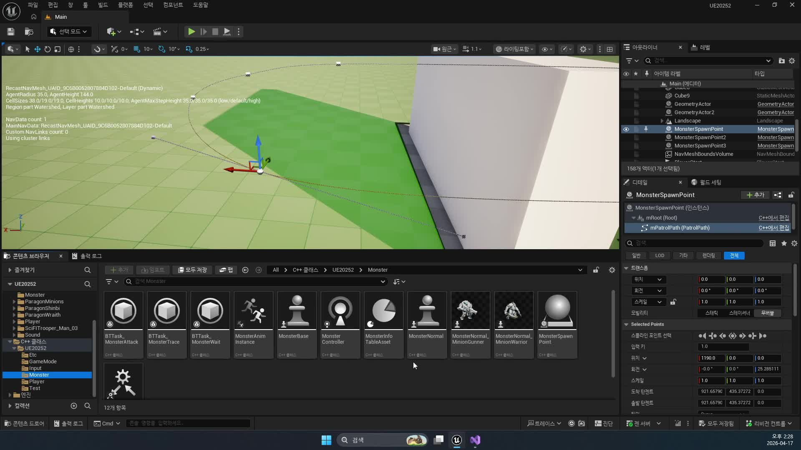
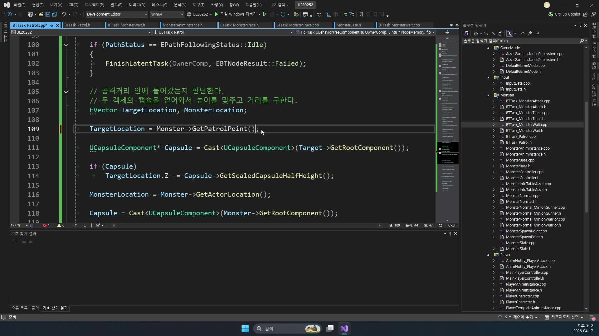
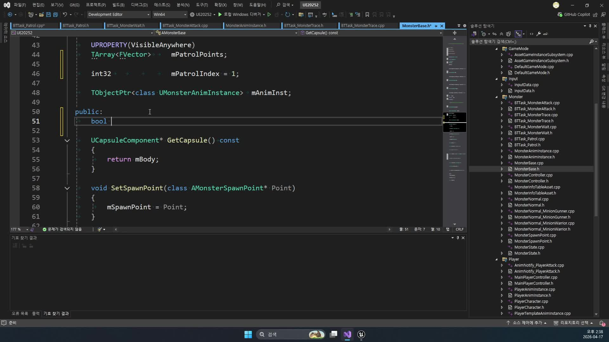
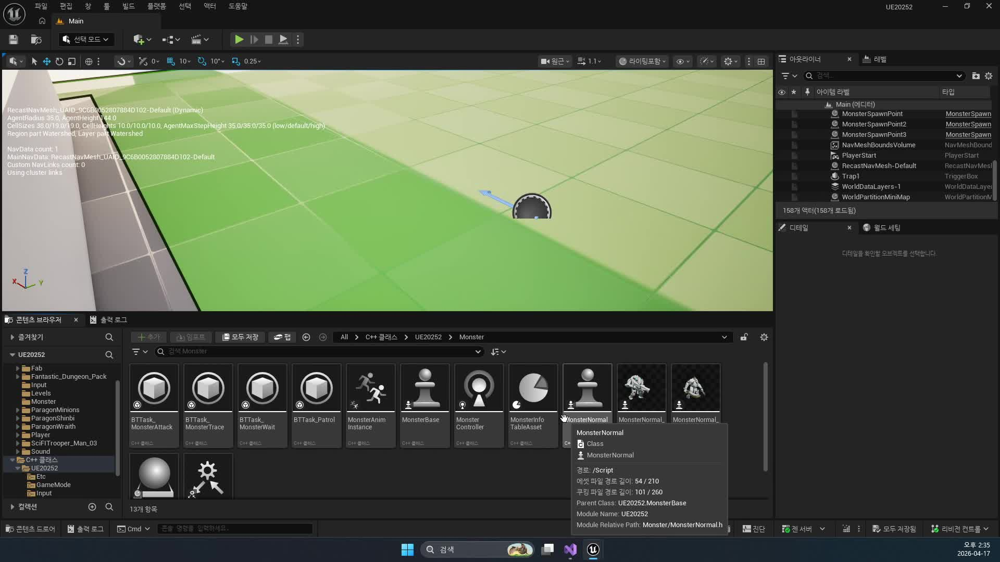
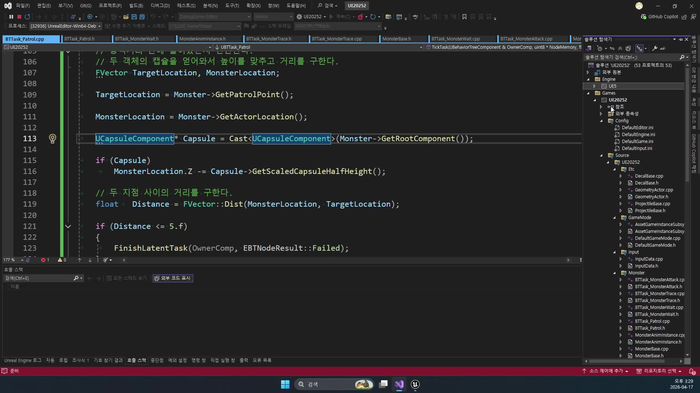

# 260417 비전투 대기와 순찰을 반복하는 AI를 만들고 순찰 버그를 디버깅하는 날

## 문서 개요

이 문서는 `260417_1_Monster Wait Task`, `260417_2_Monster Patrol Task 작업중.`, `260417_3_엔진 버그 수정`을 하나의 교재로 다시 정리한 것이다.
핵심 흐름은 `비전투 대기 -> 점 기반 순찰 -> 디버깅과 안정화`다.

전날 강의까지 몬스터는 플레이어를 감지하면 추적하고 공격하는 전투 루프를 가지게 되었다.
하지만 실제 필드형 몬스터는 전투 중이 아닐 때 더 자주 보인다.
가만히 서 있는지, 잠깐 멈췄다가 움직이는지, 순찰을 어떻게 도는지, 디버깅 중에 왜 갑자기 멈추거나 이상하게 끝나는지를 다뤄야 비로소 “게임에 놓을 수 있는 AI”가 된다.

이번 날짜의 강의는 그래서 기능 추가보다 상태 정리에 가깝다.
전투 브랜치가 비어 있을 때 몬스터가 어떤 식으로 시간을 보내야 하는지, 그 흐름이 왜 일반 `Wait` 노드만으로는 부족한지, 순찰 로직을 실제 점 이동으로 만들 때 어떤 버그가 생기는지를 차례로 보여 준다.

이 교재는 다음 자료를 함께 대조해 작성했다.

- 강의 영상과 자막
- 원본 MP4에서 다시 추출한 고해상도 장면 캡처
- `D:\UnrealProjects\UE_Academy_Stduy\Source\UE20252`의 실제 소스
- `D:\UnrealProjects\UE_Academy_Stduy\Saved\AcademyUtility`의 덤프 결과
- Epic Developer Community의 언리얼 공식 문서

## 학습 목표

- 일반 `Wait` 태스크 대신 커스텀 `MonsterWait` 태스크가 필요한 이유를 설명할 수 있다.
- `BTTask_MonsterWait`가 `NodeMemory`와 타이머를 이용해 대기 상태를 관리하는 방식을 읽을 수 있다.
- `BTTask_Patrol`이 왜 곡선 추종이 아니라 점 기반 이동을 택했는지 설명할 수 있다.
- `mPatrolIndex = 1`, `GetPatrolEnable()`, `NextPatrol()`이 순찰 루프를 어떻게 만드는지 말할 수 있다.
- `WaitFinish()`, `OnTaskFinished()`, `SpawnMonster()`, `SetPatrolPoints()`가 비전투 루프를 어떤 순서로 이어 주는지 코드 기준으로 설명할 수 있다.
- `Behavior Tree`, `Basic Navigation`, `AI Perception`, `Visual Logger` 공식 문서가 왜 `260417`과 직접 연결되는지 설명할 수 있다.
- 현재 코드 기준으로 `WaitTime`, `Target`, `PathStatus`, 거리 판정, 순찰 인덱스를 어떤 순서로 디버깅할지 설명할 수 있다.

## 강의 흐름 요약

1. 비전투 상태에서는 일정 시간 대기하되, 플레이어가 감지되면 즉시 대기를 끊을 수 있어야 한다.
2. 순찰은 스플라인을 그대로 따르기보다 점을 기준으로 이동하는 방식으로 구현한다.
3. 첫 점은 스폰 위치와 겹치므로 실제 이동은 `1번 인덱스`부터 시작하는 편이 자연스럽다.
4. 버그가 생기면 Blackboard 값, `GetMoveStatus()`, 거리 판정, `mPatrolIndex`, Behavior Tree 브랜치 흐름을 먼저 분리해서 본다.
5. 언리얼 공식 문서를 통해 `Behavior Tree`, `Navigation`, `Perception`, 디버깅 도구가 엔진 표준 용어로 어떻게 정리되는지 확인한다.
6. 현재 프로젝트 C++ 코드를 읽으며, 위 구조가 `BTTask_MonsterWait`, `BTTask_Patrol`, `MonsterSpawnPoint`, `MonsterBase` 안에서 어떻게 하나의 비전투 루프로 이어지는지 확인한다.

## 2026-04-23 덤프 반영 메모

이번 보강에서는 `Wait`와 `Patrol`이 실제로 얼마나 "간단한 태스크 두 개"가 아닌지를 덤프 결과로 다시 확인했다. 그래서 이 날짜는 순찰 기능 추가라기보다, 비전투 상태를 안전하게 돌리는 런타임 제어문을 만드는 날로 보는 편이 맞다.

- `BTTask_MonsterWait_FileDump.txt`를 보면 이 태스크는 `GetInstanceMemorySize()`로 `FWaitTimer` 크기만큼 메모리를 잡고, 블랙보드 `WaitTime`을 읽어 타이머를 건 뒤 `Complete` 플래그가 바뀔 때까지 기다린다. 즉 일반 `Wait` 노드를 끼워 넣은 것이 아니라, 전투 전환을 끊지 않으면서도 상태를 추적할 수 있는 커스텀 대기 노드다.
- 같은 덤프는 `WaitTime = BlackboardComp->GetValueAsFloat(TEXT("WaitTime"))` 흐름을 드러낸다. 그래서 대기 시간은 하드코딩된 고정값이 아니라 블랙보드 문맥으로 내려오며, 이후 몬스터 타입별로 조정하기 좋은 구조가 이미 갖춰져 있다.
- `BTTask_Patrol_FileDump.txt`를 보면 순찰 태스크는 `MoveToLocation(Monster->GetPatrolPoint())`로 현재 점을 향해 이동하고, 거리가 `5.f` 이하가 되면 태스크를 마무리한 뒤 `OnTaskFinished()`에서 `Monster->NextPatrol()`을 호출한다. 즉 다음 점 계산은 이동 중이 아니라 "현재 태스크 종료" 시점에 일어난다.
- `MonsterSpawnPoint_FileDump.txt`는 `USplineComponent`의 점들을 월드 좌표 배열로 복사해 `SetPatrolPoints()`로 넘긴다는 사실을 보여 준다. 그래서 본문에서 설명한 "순찰은 곡선 추종이 아니라 점 기반 이동"이라는 문장이 추상 비유가 아니라 실제 데이터 파이프라인 설명이 된다.
- `BT_Monster_Normal_AssetDump.txt`까지 함께 보면 `Target is Not Set` 브랜치 아래에 실제로 `BTTask_MonsterWait -> BTTask_Patrol` 순서가 놓여 있다. 즉 `260417`의 핵심은 새 AI 계통을 만드는 것이 아니라, 기존 블랙보드/비헤이비어 트리 안에서 비전투 시간대를 안정적으로 소비하는 방법을 만드는 데 있다.

---

## 제1장. Monster Wait Task: 비전투 상태를 제어하는 법

### 1.1 왜 기본 Wait 노드만으로는 부족한가

강의는 먼저 “비전투 상태의 몬스터가 어떻게 보여야 하는가”를 묻는다.
가장 단순한 답은 제자리 대기다.
하지만 단순히 엔진 기본 `Wait` 노드를 쓰면, 대기 중 플레이어가 시야에 들어와도 정해진 시간이 끝날 때까지 반응이 늦어질 수 있다.

이 점이 이번 장의 출발점이다.
필드 몬스터는 가만히 있는 것처럼 보여도 사실은 계속 주변 상황을 감시해야 한다.
즉 대기라는 행동은 “완전히 멈춰 있는 상태”가 아니라, 전투 브랜치로 즉시 넘어갈 준비를 한 비전투 상태여야 한다.

강의가 일반 `Wait`를 일부러 피하는 이유도 바로 여기에 있다.
비전투 루프는 정적인 연출이 아니라, 전투로의 전환성을 품고 있어야 한다.


### 1.2 순찰하지 않는 몬스터도 지원해야 한다

강의 초반부는 스플라인 점을 줄여 “가만히 있어야 하는 몬스터”를 만드는 쪽으로 설명이 이어진다.
여기서 중요한 해석은 간단하다.

- 스플라인 점이 충분히 있으면 순찰형 몬스터가 된다.
- 시작점 하나만 남기면 대기형 몬스터로 볼 수 있다.

즉 순찰 여부는 별도의 몬스터 클래스로 나누지 않아도 된다.
SpawnPoint와 PatrolPoints의 상태만으로도 비전투 패턴을 바꿀 수 있다.
이 설계는 레벨 작업자 입장에서 매우 편하다.
같은 몬스터라도 배치 방식만 달리해 정지형, 왕복형, 루프형 배치를 만들 수 있기 때문이다.


### 1.3 MonsterWait는 NodeMemory와 타이머로 기다린다

`BTTask_MonsterWait`는 `BTTaskNode`를 상속하지만, 핵심은 “얼마나 기다렸는지”를 외부 전역 변수에 두지 않는다는 데 있다.
강의는 이를 위해 `NodeMemory`를 사용한다.
소스에서는 `FWaitTimer` 구조체를 만들고, 여기에 `FTimerHandle`과 완료 플래그를 저장한다.

```cpp
USTRUCT()
struct FWaitTimer
{
    GENERATED_BODY()

    // 이 Wait 태스크가 잡아 둔 실제 타이머 핸들
    FTimerHandle Timer;
    // 대기 완료 여부만 따로 기록하는 플래그
    bool Complete = false;
};
```

이 구조를 택하면 태스크 인스턴스가 자기 대기 상태를 직접 들고 있을 수 있다.
여러 몬스터가 동시에 같은 태스크를 실행해도 각자의 타이머가 섞이지 않는다.
즉 이번 장은 “대기한다”보다 “대기 상태를 어떤 메모리 구조에 담을 것인가”를 배우는 장이기도 하다.

현재 코드에서는 `GetInstanceMemorySize()`가 `sizeof(FWaitTimer)`를 반환한다.
즉 `NodeMemory`는 추상적인 개념 설명이 아니라, 이 태스크가 실제로 `FWaitTimer` 한 덩어리를 자기 전용 메모리로 받는다는 뜻이다.
덤프 기준 `BT_Monster_Normal`에서도 `MonsterWait` 노드는 `Memory=16`으로 잡혀 있어, 강의 설명과 현재 구현이 그대로 맞아떨어진다.

### 1.4 Blackboard의 WaitTime을 읽고 Idle로 전환한다

`ExecuteTask()`의 흐름은 의외로 단순하고 깔끔하다.

1. AIController와 Blackboard를 가져온다.
2. 이미 `Target`이 있으면 대기할 이유가 없으므로 즉시 `Succeeded`를 반환한다.
3. 몬스터를 가져와 `Idle` 애니메이션으로 전환한다.
4. Blackboard의 `WaitTime`을 읽는다.
5. 타이머를 걸고 `InProgress`를 반환한다.

```cpp
// 이미 타겟이 있으면 굳이 대기하지 않고 전투 브랜치로 넘긴다.
AActor* Target = Cast<AActor>(BlackboardComp->GetValueAsObject(TEXT("Target")));

if (Target)
    return EBTNodeResult::Succeeded;

// 비전투 상태이므로 애니메이션을 Idle로 맞춘다.
Monster->ChangeAnim(EMonsterNormalAnim::Idle);

// 블랙보드에 저장된 기다릴 시간을 읽는다.
float WaitTime = BlackboardComp->GetValueAsFloat(TEXT("WaitTime"));

// NodeMemory를 FWaitTimer 구조체처럼 사용한다.
FWaitTimer* Timer = (FWaitTimer*)NodeMemory;
Timer->Complete = false;

// WaitTime 뒤에 WaitFinish가 호출되도록 타이머를 건다.
OwnerComp.GetWorld()->GetTimerManager().SetTimer(
    Timer->Timer,
    FTimerDelegate::CreateUObject(this, &UBTTask_MonsterWait::WaitFinish, NodeMemory),
    WaitTime,
    false
);

return EBTNodeResult::InProgress;
```

여기서 Blackboard를 쓰는 이유는 Wait 시간이 고정 상수가 아니기 때문이다.
나중에 몬스터 타입별로 다르게 주거나, 스폰 위치별로 다르게 조정하고 싶다면 Blackboard 변수화가 훨씬 유리하다.
현재 `BB_Monster_Base` 덤프에도 `SelfActor`, `DetectRange`, `Target`, `AttackTarget`, `AttackEnd`, `WaitTime`이 실제 키로 들어 있어, 이 대기 시간은 말뿐인 개념이 아니라 현재 BT가 직접 읽는 런타임 데이터다.

### 1.5 TickTask가 중요한 이유

이번 장의 핵심은 사실 `ExecuteTask()`보다 `TickTask()`에 있다.
대기 태스크가 정말 “비전투 상태”로 동작하려면, 타이머만 기다려서는 안 되고 매 틱마다 `Target` 유무를 다시 봐야 한다.

`BTTask_MonsterWait`는 그래서 다음 두 경우에 대기를 끝낸다.

- 대기 중 플레이어를 감지한 경우: `Succeeded`
- 대기 시간이 정상적으로 끝난 경우: `Failed`

이 반환값 설계는 매우 중요하다.
`Succeeded`는 전투 브랜치 쪽으로 즉시 넘기는 신호가 되고, `Failed`는 비전투 브랜치 내 다음 동작, 즉 Patrol 같은 후속 행동을 열어 주는 신호가 된다.
즉 실패가 곧 오류라는 뜻은 아니다.

현재 `BT_Monster_Normal` 덤프를 보면 이 의미가 더 분명해진다.
루트 셀렉터 아래에는 `Target is Set`일 때의 `Combat` 브랜치와, `Target is Not Set`일 때의 `NonCombat` 브랜치가 나뉘어 있다.
비전투 브랜치의 첫 노드가 `MonsterWait`, 두 번째 노드가 `MonsterPatrol`이므로, `MonsterWait`의 `Failed`는 “문제 발생”이 아니라 “이제 다음 비전투 행동으로 넘어가도 된다”는 제어 신호에 가깝다.

### 1.6 OnTaskFinished에서 타이머를 지우는 이유

커스텀 태스크를 만들 때 흔히 놓치는 것이 정리(cleanup) 단계다.
`OnTaskFinished()`에서 타이머를 명시적으로 지우는 이유는, 이미 끝난 대기 태스크의 타이머가 뒤늦게 불려 예상치 못한 상태를 만들지 않게 하기 위해서다.

짧은 함수지만 의미는 크다.
이번 장에서 배워야 할 것은 대기 시간보다 태스크 수명주기 전체를 관리하는 습관이다.


### 1.7 장 정리

제1장의 결론은 “비전투 상태도 실시간 반응성을 가져야 한다”는 데 있다.
커스텀 `MonsterWait`는 단순한 대기 노드가 아니라, 전투 감지를 계속 열어 둔 채 시간을 소비하는 상태 노드다.

즉 이 장에서 대기란 멈춤이 아니라 준비다.

---

## 제2장. Monster Patrol Task: 점 기반 순찰을 만드는 법

### 2.1 왜 곡선을 그대로 따라가지 않는가

강의는 Patrol을 설명하면서 스플라인을 그대로 따라가는 방식과 “점으로 이동하는 방식”을 구분한다.
이때 선택은 후자다.
곡선 추종도 가능하지만, 필드 몬스터 순찰에는 오히려 너무 레일을 타는 듯한 움직임이 나올 수 있기 때문이다.

점 기반 이동을 택하면 다음 장점이 생긴다.

- Behavior Tree와 잘 맞는다.
- `MoveToLocation()` 호출이 단순해진다.
- 도착 판정, 다음 포인트 전환, 대기 삽입이 쉬워진다.

즉 스플라인은 편집용 입력으로 남겨 두고, 실제 AI는 포인트 배열을 순차적으로 소비하는 편이 더 자연스럽다.
현재 프로젝트도 정확히 이 구조를 쓴다.
`MonsterSpawnPoint::OnConstruction()`이 스플라인 점을 월드 좌표 배열 `mPatrolPoints`로 다시 만들고, 실제 런타임 이동은 `BTTask_Patrol`이 그 배열의 현재 인덱스를 읽어 `MoveToLocation()`으로 처리한다.



### 2.2 실제 이동이 1번 인덱스부터 시작하는 이유

이번 강의에서 아주 중요한 디테일은 `mPatrolIndex = 1`이다.
처음 보면 왜 0이 아닌지 의문이 생긴다.
하지만 0번은 대개 SpawnPoint의 시작 위치와 겹친다.
즉 스폰 직후 몬스터가 이미 서 있는 자리를 다시 목표로 잡으면, 순찰이 시작되자마자 제자리 판정이나 이상한 루프가 생기기 쉽다.

그래서 실제 첫 이동 목표는 두 번째 점, 즉 `1번 인덱스`가 더 자연스럽다.
소스도 이를 분명하게 반영한다.

```cpp
// 실제 순찰 좌표 배열
TArray<FVector> mPatrolPoints;
// 현재 순찰 중인 목표 점 인덱스
int32 mPatrolIndex = 1;

bool GetPatrolEnable() const
{
    // 점이 2개 이상 있어야 왕복이든 순환이든 순찰이 가능하다.
    return mPatrolPoints.Num() > 1;
}

FVector GetPatrolPoint() const
{
    // 지금 향해야 할 점 하나를 돌려준다.
    return mPatrolPoints[mPatrolIndex];
}

void NextPatrol()
{
    // 다음 점으로 인덱스를 넘긴다.
    mPatrolIndex = (mPatrolIndex + 1) % mPatrolPoints.Num();
}
```

이 네 줄만 이해해도 이번 날짜의 순찰 흐름 절반은 끝난다.
순찰 가능 여부, 현재 목표, 다음 목표, 루프 구조가 전부 들어 있기 때문이다.



### 2.3 Patrol 태스크는 Trace를 단순 복사하지 않는다

강의에서는 Patrol 태스크를 만들 때 Trace 태스크의 틀을 가져와 수정하는 모습을 보여 준다.
하지만 중요한 것은 복사가 아니라 역할 변화다.
Trace는 Target을 추적하는 태스크이고, Patrol은 Target이 없을 때 기본 이동을 담당하는 태스크다.

그래서 `ExecuteTask()` 초반부는 다음 순서로 읽으면 된다.

1. Controller와 Blackboard를 확인한다.
2. `Target`이 있으면 전투 쪽 우선순위를 넘겨 주기 위해 `Succeeded` 한다.
3. Monster를 얻는다.
4. `GetPatrolEnable()`이 거짓이면 순찰할 필요가 없으므로 `Failed` 한다.
5. `MoveToLocation(GetPatrolPoint())`를 호출한다.
6. 애니메이션을 `Walk`로 바꾼다.

즉 Patrol은 비전투 브랜치 내부에서만 의미를 갖는 기본 동작이다.
전투 상태가 생기면 곧바로 자리를 비켜 줘야 한다.
여기서도 반환값 의미가 중요하다.
`Target`이 생겨 `Succeeded` 하면 상위 셀렉터가 전투 브랜치를 다시 평가하게 되고, 순찰 지점이 없거나 `MoveToLocation()` 요청 자체가 실패해 `Failed` 하면 이번 프레임의 순찰 시도를 접고 다음 비전투 판단으로 넘어간다.

### 2.4 TickTask에서는 도착 판정을 직접 본다

`BTTask_Patrol`의 Tick은 단순히 “아직 이동 중인가”만 보지 않는다.
코드상으로는 `GetMoveStatus()`와 거리 계산을 같이 본다.
그리고 Patrol 포인트는 액터가 아니라 단순한 `FVector`이므로, 몬스터 위치 쪽만 캡슐 높이를 보정해 바닥 기준으로 거리를 맞춘다.

```cpp
// 현재 목표 순찰점과 몬스터 위치를 비교한다.
FVector TargetLocation, MonsterLocation;

TargetLocation = Monster->GetPatrolPoint();
MonsterLocation = Monster->GetActorLocation();

// 캡슐 절반 높이를 빼서 바닥 기준 거리처럼 계산한다.
UCapsuleComponent* Capsule = Cast<UCapsuleComponent>(Monster->GetRootComponent());
if (Capsule)
    MonsterLocation.Z -= Capsule->GetScaledCapsuleHalfHeight();

// 거의 도착했다고 보면 이번 태스크를 끝낸다.
float Distance = FVector::Dist(MonsterLocation, TargetLocation);

if (Distance <= 5.f)
{
    FinishLatentTask(OwnerComp, EBTNodeResult::Failed);
}
```

이 장면이 중요한 이유는, 강의 후반부의 여러 “이상하게 끝난다”는 문제가 사실 거리 판정과 인덱스 전환의 합성 효과였기 때문이다.
결국 순찰 버그는 길찾기 버그가 아니라 상태 전환과 종료 조건의 버그인 경우가 많다.
현재 구현은 여기에 `PathStatus == Idle` 조건도 함께 본다.
즉 `BTTask_Patrol`은 `GetMoveStatus()`가 이미 `Idle`인지, 거리 `<= 5.f`인지, 혹은 도중에 `Target`이 생겼는지를 동시에 보며 태스크를 끝낸다.
그래서 Patrol의 `Failed`는 단순히 “못 갔다”가 아니라, “이제 다음 판단 루프로 돌아가도 된다”는 종료 의미를 자주 가진다.



### 2.5 OnTaskFinished가 루프를 완성한다

`OnTaskFinished()`에서 이동을 멈추고 `NextPatrol()`을 호출하는 부분은 아주 짧지만, 순찰 루프를 닫는 핵심이다.
도착하든 중간에 끊기든 일단 현재 태스크가 끝나면 다음 순찰 인덱스를 준비한다.

이 구조 덕분에 Patrol은 “한 번의 이동 명령”이 아니라 다음 포인트로 계속 이어지는 순환 구조가 된다.
Wait 태스크와 붙이면 `대기 -> 이동 -> 대기 -> 이동`의 비전투 루프가 자연스럽게 만들어진다.
현재 코드는 여기서 `AIController->StopMovement()`도 함께 호출한다.
즉 이전 이동 명령을 깔끔히 끊고, `GetPatrolEnable()`이 참일 때만 `NextPatrol()`로 다음 점을 준비하는 식으로 루프를 닫는다.



### 2.6 장 정리

제2장의 결론은 순찰을 곡선이 아니라 상태 전환의 연속으로 읽는 데 있다.
`GetPatrolEnable`, `GetPatrolPoint`, `NextPatrol`, 거리 판정, 반환값 설계가 맞물릴 때 비로소 몬스터는 필드에서 자연스럽게 시간을 보낸다.

즉 Patrol의 핵심은 이동 함수보다 루프 구조다.

---

## 제3장. 비전투 루프 디버깅: 현재 코드에서 먼저 봐야 할 것들

### 3.1 왜 마지막 장이 디버깅 정리인가

이번 날짜의 세 번째 강의는 새로운 기능보다 “왜 지금 이상하게 보이는가”를 해부하는 시간에 가깝다.
대기 시간이 0처럼 느껴지거나, 순찰이 갑자기 멈추거나, 아무 이유 없이 태스크가 끝나는 것처럼 보이는 문제는 대부분 한 줄 버그라기보다 상태 전환을 읽는 순서가 꼬여서 생긴다.

강의가 보여 주는 중요한 태도는 다음과 같다.

- Blackboard 값 문제
- Behavior Tree 브랜치 문제
- 거리 판정 문제
- `MoveStatus` 문제
- 순찰 포인트/인덱스 문제

현재 저장소와 덤프 기준으로 직접 검증되는 것도 이 다섯 가지다.
즉 이번 문서에서는 “엔진 버그”라는 표현보다, 비전투 루프를 어떤 순서로 좁혀 가며 확인할지에 초점을 맞추는 편이 더 정확하다.

### 3.2 첫 점검은 Blackboard와 BT 브랜치부터 시작한다

현재 코드에서 가장 먼저 확인할 것은 `BB_Monster_Base`의 키 값이다.
특히 `Target`과 `WaitTime`은 비전투 루프의 분기 조건과 시간을 직접 좌우한다.

- `Target`이 이미 잡혀 있으면 `MonsterWait`와 `MonsterPatrol`은 둘 다 곧바로 전투 쪽으로 길을 비켜 준다.
- `WaitTime`이 너무 작거나 0에 가깝게 들어가면 대기 연출이 거의 보이지 않을 수 있다.
- `AttackTarget`, `AttackEnd`는 전투 쪽 값이지만, 이전 전투 문맥이 남아 보일 때 함께 의심해야 한다.

그리고 `BT_Monster_Normal` 덤프를 보면 루트 셀렉터 아래에 `Combat`와 `NonCombat`가 명확히 갈라져 있다.
따라서 “대기가 안 돈다”는 현상은 실제로는 `MonsterWait`가 망가진 것이 아니라, `Target`이 계속 살아 있어 아예 비전투 브랜치에 들어가지 못하는 경우일 수 있다.

### 3.3 Patrol 버그는 코드 줄 하나보다 종료 조건의 조합에서 생긴다

강의에서는 Patrol이 “아무 이유 없이 끝난다”고 느껴지는 순간들을 계속 관찰한다.
이때 봐야 할 것은 다음 조합이다.

- `PathStatus == Idle`이 너무 빨리 잡히는가
- 거리 판정 `Distance <= 5.f`가 너무 이른가
- 처음 인덱스가 0으로 잘못 시작되는가
- Wait 시간이 초기화되며 Patrol이 예상보다 빨리 다시 도는가

결국 많은 순찰 버그는 길찾기 시스템의 근본 오류가 아니라, “끝났다고 판단하는 조건”이 잘못 조합된 결과다.
이 점은 이후 더 복잡한 보스 패턴이나 스킬 태스크를 만들 때도 그대로 중요하다.



현재 코드로 보면 여기에 두 가지를 더 붙여서 보는 편이 좋다.

- `GetPatrolEnable()`이 거짓이면 애초에 순찰 태스크는 `Failed`로 빠진다.
- `OnTaskFinished()`에서 `NextPatrol()`이 돌기 때문에, 종료 원인을 잘못 해석하면 인덱스가 이상하게 튄 것처럼 느껴질 수 있다.

즉 Patrol 디버깅은 “이동이 실패했는가”만 보는 것이 아니라, “왜 지금 이 태스크가 끝나도 되는 상황으로 판정되었는가”를 읽는 과정에 가깝다.

### 3.4 스폰 포인트와 순찰 배열도 함께 봐야 한다

현재 프로젝트의 `MonsterSpawnPoint`는 `OnConstruction()`에서 스플라인 점을 순찰 배열로 만들고, `BeginPlay()`에서 곧바로 `SpawnMonster()`를 호출한다.
그리고 스폰된 몬스터에게 `SetSpawnPoint(this)`와 `SetPatrolPoints(mPatrolPoints)`를 넘긴다.

즉 순찰이 이상하면 BT만 볼 것이 아니라, 스폰 포인트가 실제로 몇 개의 점을 넘겼는지도 확인해야 한다.
현재 `MonsterBase`는 `mPatrolPoints.Num() > 1`일 때만 순찰 가능으로 보기 때문에, 점이 하나뿐이면 의도적으로 대기형 몬스터가 된다.

참고로 `MonsterSpawnPoint`에는 `ClearSpawn()`, `mSpawnTime`, `SpawnTimerFinish()`까지 준비되어 있다.
다만 현재 저장소 기준으로 이 리스폰 훅이 다른 사망 루프와 완전히 연결되어 있지는 않으므로, 이번 날짜는 “완성된 재스폰 시스템”보다 “순찰 문맥을 전달하는 스폰 지점 설계”로 읽는 편이 맞다.

### 3.5 장 정리

제3장의 결론은 “비전투 루프 버그는 Blackboard, BT 브랜치, 거리 판정, 순찰 배열을 순서대로 분리해서 봐야 한다”는 데 있다.
현재 저장소와 덤프 기준으로 직접 확인되는 핵심도 바로 이 런타임 디버깅 포인트들이다.

강의 후반부에서 언급되는 에디터 정리, 참조 정리, 재빌드 습관도 여전히 유효한 태도다.
다만 현재 남아 있는 프로젝트 재료로 가장 명확하게 검증되는 것은 `MonsterWait`와 `MonsterPatrol`의 상태 전환 구조라고 보는 편이 정확하다.

---

## 제4장. 언리얼 공식 문서로 다시 읽는 260417 핵심 구조

### 4.1 왜 260417부터 공식 문서를 같이 보는가

`260417`은 기능을 새로 많이 추가하는 날이라기보다, 이미 만들어 둔 비전투 루프를 안정적으로 돌게 만드는 날이다.
그래서 이 날짜는 오히려 공식 문서의 `Behavior Tree`, `Navigation`, `AI Perception`, `Visual Logger` 같은 디버깅/운용 문서와 함께 볼 때 더 잘 읽힌다.

이번 보강에서는 특히 아래 공식 문서를 기준점으로 삼는다.

- [Behavior Tree in Unreal Engine - User Guide](https://dev.epicgames.com/documentation/en-us/unreal-engine/behavior-tree-in-unreal-engine---user-guide?application_version=5.6)
- [Basic Navigation in Unreal Engine](https://dev.epicgames.com/documentation/en-us/unreal-engine/basic-navigation-in-unreal-engine)
- [AI Perception in Unreal Engine](https://dev.epicgames.com/documentation/en-us/unreal-engine/ai-perception-in-unreal-engine)
- [Visual Logger in Unreal Engine](https://dev.epicgames.com/documentation/en-us/unreal-engine/visual-logger-in-unreal-engine)

즉 이 장의 목적은 `MonsterWait`, `MonsterPatrol`을 더 복잡하게 설명하는 것이 아니라, 비전투 루프와 디버깅 포인트가 언리얼 공식 문서 기준으로 어떤 AI 운용 문법에 해당하는지 보여 주는 데 있다.

### 4.2 공식 문서의 `Behavior Tree`와 `Navigation`은 강의의 `Wait -> Patrol` 루프를 더 명확하게 만든다

강의 1장과 2장의 핵심은 몬스터가 아무것도 안 하는 것처럼 보여도, 사실은 `대기 -> 순찰 -> 다시 대기`를 반복하는 행동 브랜치 안에 있다는 점이다.
공식 문서 기준으로 보면 이 루프는 아래처럼 읽을 수 있다.

- `Behavior Tree`: 지금 어떤 비전투 브랜치를 타고 있는가
- `Navigation`: 현재 순찰점까지 실제로 이동 가능한가

즉 `Wait`와 `Patrol`은 단순한 보조 기능이 아니라, 플레이어가 감지되지 않았을 때 AI가 시간을 보내는 기본 행동 트리라고 이해할 수 있다.

### 4.3 공식 문서의 `AI Perception`과 `Visual Logger`는 강의의 디버깅 관점을 더 실전적으로 정리해 준다

강의 3장은 왜 마지막에 디버깅 정리를 넣는지 설명한다.
비전투 루프는 "코드 한 줄이 틀려서" 깨지기보다, `Target`, `WaitTime`, `PathStatus`, `PatrolIndex`, 감지 상태가 서로 엇갈리면서 깨지는 경우가 많기 때문이다.

공식 문서의 `AI Perception`과 `Visual Logger`도 비슷한 관점을 준다.

- `AI Perception`: 감지 정보가 실제로 들어오고 있는가
- `Visual Logger`: 어떤 상태와 이벤트가 언제 기록되는가

즉 `260417`의 핵심은 새로운 기술 이름을 많이 배우는 것이 아니라, AI 문제를 `Blackboard -> 태스크 종료 이유 -> 이동 상태 -> 배열 데이터` 순으로 분리해서 좁혀 가는 습관을 만드는 데 있다.

### 4.4 260417 공식 문서 추천 읽기 순서

이번 날짜는 아래 순서로 공식 문서를 읽으면 가장 자연스럽다.

1. [Behavior Tree in Unreal Engine - User Guide](https://dev.epicgames.com/documentation/en-us/unreal-engine/behavior-tree-in-unreal-engine---user-guide?application_version=5.6)
2. [Basic Navigation in Unreal Engine](https://dev.epicgames.com/documentation/en-us/unreal-engine/basic-navigation-in-unreal-engine)
3. [AI Perception in Unreal Engine](https://dev.epicgames.com/documentation/en-us/unreal-engine/ai-perception-in-unreal-engine)
4. [Visual Logger in Unreal Engine](https://dev.epicgames.com/documentation/en-us/unreal-engine/visual-logger-in-unreal-engine)

이 순서가 좋은 이유는 먼저 `브랜치와 이동`을 잡고, 그 다음 `감지`를 보고, 마지막에 `무엇을 어떻게 기록하며 좁혀 갈 것인가`를 디버깅 도구 문서로 연결할 수 있기 때문이다.

### 4.5 장 정리

공식 문서 기준으로 다시 보면 `260417`은 아래 다섯 가지를 배우는 날이다.

1. 비전투 루프도 Behavior Tree 안의 정식 행동 브랜치다.
2. `Wait`는 완전 정지가 아니라 반응 가능한 대기여야 한다.
3. `Patrol`은 내비게이션과 종료 조건이 함께 맞아야 안정적으로 돈다.
4. Perception과 Blackboard 값은 디버깅의 첫 출발점이다.
5. 그래서 `260417`은 순찰 기능 추가보다 `AI를 필드에 안전하게 놓는 법`을 배우는 날이다.

---

## 제5장. 현재 프로젝트 C++ 코드로 다시 읽는 260417 핵심 구조

### 5.1 왜 260417은 "가만히 있는 AI"가 아니라 "비전투 루프를 안전하게 반복하는 AI" 강의인가

`260417`을 겉으로만 보면 몬스터를 잠깐 세워 두고 순찰시키는 날처럼 보인다.
하지만 현재 프로젝트 C++를 기준으로 읽으면, 이 날짜의 핵심은 정지와 이동을 번갈아 재생하는 것이 아니라,
`대기 조건`, `순찰 조건`, `종료 조건`, `다음 인덱스 준비`를 분리해서 비전투 루프를 안전하게 반복하게 만드는 데 있다.

현재 구현의 큰 흐름은 아래처럼 이어진다.

1. `MonsterSpawnPoint`가 스플라인을 `mPatrolPoints` 배열로 바꾼다.
2. `SpawnMonster()`가 스폰된 몬스터에게 `SetSpawnPoint(this)`와 `SetPatrolPoints(mPatrolPoints)`를 넘긴다.
3. `UBTTask_MonsterWait`가 `Target`이 없는 동안 `WaitTime`만큼 대기한다.
4. 대기가 끝나면 `Failed`로 빠져 `UBTTask_Patrol`이 열리게 만든다.
5. `UBTTask_Patrol`이 현재 `mPatrolIndex` 지점으로 이동하고, 끝나면 `NextPatrol()`로 다음 점을 준비한다.
6. 도중에 `Target`이 생기면 두 태스크 모두 곧바로 `Succeeded`로 빠져 전투 브랜치에 자리를 내준다.

즉 `260417`은 "멍하니 서 있는 몬스터"를 만드는 강의가 아니라,
`대기 -> 이동 -> 다음 점 준비 -> 다시 대기`가 자연스럽게 되풀이되면서도 언제든 전투로 끊어질 수 있는 비전투 루프를 만드는 강의다.

아래 코드는 `D:\UnrealProjects\UE_Academy_Stduy\Source\UE20252`의 실제 구현에서 핵심만 추려 온 뒤,
처음 보는 사람도 읽을 수 있게 설명용 주석을 붙인 축약판이다.

### 5.2 `UBTTask_MonsterWait`와 `FWaitTimer`: 대기 상태를 전역 변수 없이 태스크 메모리에 저장한다

현재 `MonsterWait` 태스크의 핵심은 "기다린다"보다 "기다리는 상태를 어디에 저장하느냐"에 있다.
이 구현은 대기 완료 여부를 전역 bool이나 몬스터 멤버에 두지 않고, 태스크 전용 메모리 안에 넣는다.

```cpp
USTRUCT()
struct FWaitTimer
{
    GENERATED_BODY()

    // 이 태스크가 걸어 둔 타이머 핸들
    FTimerHandle Timer;

    // 대기 시간이 끝났는지 기록하는 플래그
    bool Complete = false;
};

class UE20252_API UBTTask_MonsterWait : public UBTTaskNode
{
    GENERATED_BODY()

public:
    virtual uint16 GetInstanceMemorySize() const;
};

uint16 UBTTask_MonsterWait::GetInstanceMemorySize() const
{
    // 이 태스크는 실행될 때마다 FWaitTimer 크기만큼 자기 메모리를 받는다.
    return sizeof(FWaitTimer);
}
```

이 방식이 좋은 이유는 몬스터가 여러 마리 있어도 각자 자기 대기 상태를 따로 가진다는 점이다.
즉 A 몬스터의 대기 타이머와 B 몬스터의 대기 타이머가 서로 섞이지 않는다.

덤프 기준으로도 `BT_Monster_Normal`의 `MonsterWait` 노드는 `Memory=16`으로 잡혀 있다.
즉 강의에서 말한 `NodeMemory`는 개념 설명이 아니라 현재 프로젝트가 실제로 쓰는 런타임 메모리 구조다.

### 5.3 `ExecuteTask()`, `TickTask()`, `WaitFinish()`: 대기 중에도 계속 반응성을 유지한다

`MonsterWait`의 실제 흐름을 보면 왜 기본 `Wait` 노드 대신 커스텀 태스크를 썼는지 바로 이해된다.

```cpp
EBTNodeResult::Type UBTTask_MonsterWait::ExecuteTask(
    UBehaviorTreeComponent& OwnerComp, uint8* NodeMemory)
{
    AAIController* AIController = OwnerComp.GetAIOwner();
    UBlackboardComponent* BlackboardComp = OwnerComp.GetBlackboardComponent();
    AActor* Target = Cast<AActor>(BlackboardComp->GetValueAsObject(TEXT("Target")));

    // 이미 타겟이 있으면 굳이 대기할 필요가 없다.
    if (Target)
        return EBTNodeResult::Succeeded;

    AMonsterBase* Monster = AIController->GetPawn<AMonsterBase>();

    // 비전투 상태에서 보이는 애니메이션을 Idle로 맞춘다.
    Monster->ChangeAnim(EMonsterNormalAnim::Idle);

    float WaitTime = BlackboardComp->GetValueAsFloat(TEXT("WaitTime"));

    FWaitTimer* Timer = (FWaitTimer*)NodeMemory;
    Timer->Complete = false;

    // WaitTime 후에 WaitFinish를 호출해 Complete를 true로 올린다.
    OwnerComp.GetWorld()->GetTimerManager().SetTimer(
        Timer->Timer,
        FTimerDelegate::CreateUObject(this, &UBTTask_MonsterWait::WaitFinish, NodeMemory),
        WaitTime,
        false
    );

    return EBTNodeResult::InProgress;
}
```

여기서 중요한 점은 대기 시간이 끝나는 판단이 `WaitFinish()`에서 이뤄지고, 실제 태스크 종료는 `TickTask()`가 맡는다는 것이다.

```cpp
void UBTTask_MonsterWait::WaitFinish(uint8* NodeMemory)
{
    FWaitTimer* Timer = (FWaitTimer*)NodeMemory;

    // 시간이 다 됐다는 사실만 기록한다.
    Timer->Complete = true;
}

void UBTTask_MonsterWait::TickTask(
    UBehaviorTreeComponent& OwnerComp, uint8* NodeMemory, float DeltaSeconds)
{
    AAIController* AIController = OwnerComp.GetAIOwner();
    UBlackboardComponent* BlackboardComp = OwnerComp.GetBlackboardComponent();
    AActor* Target = Cast<AActor>(BlackboardComp->GetValueAsObject(TEXT("Target")));

    // 대기 중 Target이 생기면 곧바로 전투 쪽에 자리를 비켜 준다.
    if (Target)
    {
        FinishLatentTask(OwnerComp, EBTNodeResult::Succeeded);
        return;
    }

    FWaitTimer* Timer = (FWaitTimer*)NodeMemory;

    // 시간이 다 됐으면 이번 대기는 끝났고, 다음 비전투 행동으로 넘어간다.
    if (Timer->Complete)
    {
        FinishLatentTask(OwnerComp, EBTNodeResult::Failed);
    }
}
```

즉 이 태스크는 두 종류의 종료를 가진다.

- `Succeeded`: 대기 중 플레이어를 감지해서 전투 브랜치가 다시 열려야 할 때
- `Failed`: 대기 시간이 정상적으로 끝나서 다음 비전투 행동인 순찰로 넘어가도 될 때

이 설계 때문에 `Failed`는 오류가 아니라 "다음 상태 전환을 열어 주는 제어 신호"가 된다.

### 5.4 `OnTaskFinished()`: 끝난 타이머를 정리해서 뒤늦은 콜백을 막는다

커스텀 태스크에서 정말 중요한 습관이 정리 단계다.
현재 구현은 `OnTaskFinished()`에서 타이머를 명시적으로 비운다.

```cpp
void UBTTask_MonsterWait::OnTaskFinished(
    UBehaviorTreeComponent& OwnerComp, uint8* NodeMemory, EBTNodeResult::Type TaskResult)
{
    FWaitTimer* Timer = (FWaitTimer*)NodeMemory;

    if (Timer->Timer.IsValid())
    {
        // 이미 끝난 대기 태스크의 타이머가 뒤늦게 발동하지 않도록 정리한다.
        OwnerComp.GetWorld()->GetTimerManager().ClearTimer(Timer->Timer);
    }
}
```

이 코드를 보면 `MonsterWait`는 그냥 시간만 재는 태스크가 아니라,
`시작 -> 틱 감시 -> 타이머 완료 -> 종료 -> 정리`까지 전체 수명주기를 깔끔하게 관리하는 태스크라는 점이 드러난다.

### 5.5 `AMonsterSpawnPoint`와 `AMonsterBase`: 순찰 루프의 입력 데이터는 스폰 시점에 이미 주입된다

비전투 루프가 제대로 돌려면 `Patrol` 태스크가 읽을 데이터가 먼저 들어와 있어야 한다.
그 입력을 준비하는 쪽이 `MonsterSpawnPoint`와 `MonsterBase`다.

```cpp
void AMonsterSpawnPoint::OnConstruction(const FTransform& Transform)
{
    Super::OnConstruction(Transform);

    // 에디터에서 그린 스플라인 점을 런타임용 월드 좌표 배열로 바꾼다.
    mPatrolPoints.Empty();

    int32 Count = mPatrolPath->GetNumberOfSplinePoints();
    for (int32 i = 0; i < Count; ++i)
    {
        FVector Point = mPatrolPath->GetLocationAtSplinePoint(
            i, ESplineCoordinateSpace::World);

        mPatrolPoints.Add(Point);
    }
}

void AMonsterSpawnPoint::SpawnMonster()
{
    mSpawnMonster = GetWorld()->SpawnActor<AMonsterBase>(...);

    // 스폰된 몬스터에게 자기 SpawnPoint 문맥과 순찰 배열을 넘긴다.
    mSpawnMonster->SetSpawnPoint(this);
    mSpawnMonster->SetPatrolPoints(mPatrolPoints);
}
```

그리고 몬스터 본체는 이 배열을 아래처럼 들고 있다.

```cpp
// 실제 순찰 좌표 배열
TArray<FVector> mPatrolPoints;
// 현재 목표 점 인덱스
int32 mPatrolIndex = 1;

bool GetPatrolEnable() const
{
    // 점이 2개 이상 있어야 순찰 가능
    return mPatrolPoints.Num() > 1;
}

FVector GetPatrolPoint() const
{
    // 지금 향해야 할 순찰점 반환
    return mPatrolPoints[mPatrolIndex];
}

void NextPatrol()
{
    // 다음 점으로 이동
    mPatrolIndex = (mPatrolIndex + 1) % mPatrolPoints.Num();
}
```

여기서 `mPatrolIndex = 1`이 중요한 이유는, 0번 점이 대개 스폰 지점과 겹치기 때문이다.
즉 스폰 직후 첫 목표를 0번으로 잡으면 "이미 도착했다"는 식의 어색한 종료 판정이 나기 쉬워서,
현재 구현은 처음 실제 이동 목표를 1번 인덱스로 두고 있다.

### 5.6 `UBTTask_Patrol`: Target이 없을 때만 현재 인덱스 위치로 걷게 만든다

`Patrol` 태스크는 `Trace`의 단순 복사판이 아니라, 비전투 브랜치 전용 이동 태스크다.
실제 코드를 보면 우선순위가 아주 분명하다.

```cpp
EBTNodeResult::Type UBTTask_Patrol::ExecuteTask(
    UBehaviorTreeComponent& OwnerComp, uint8* NodeMemory)
{
    AAIController* AIController = OwnerComp.GetAIOwner();
    UBlackboardComponent* BlackboardComp = OwnerComp.GetBlackboardComponent();
    AActor* Target = Cast<AActor>(BlackboardComp->GetValueAsObject(TEXT("Target")));

    // 타겟이 생겼다면 지금은 순찰할 때가 아니다.
    if (Target)
        return EBTNodeResult::Succeeded;

    AMonsterBase* Monster = AIController->GetPawn<AMonsterBase>();

    // 순찰점이 2개 미만이면 애초에 순찰형 몬스터가 아니다.
    if (!Monster->GetPatrolEnable())
        return EBTNodeResult::Failed;

    EPathFollowingRequestResult::Type MoveResult =
        AIController->MoveToLocation(Monster->GetPatrolPoint());

    if (MoveResult == EPathFollowingRequestResult::Failed)
        return EBTNodeResult::Failed;

    // 비전투 이동이므로 달리기 대신 Walk 상태를 쓴다.
    Monster->ChangeAnim(EMonsterNormalAnim::Walk);

    return EBTNodeResult::InProgress;
}
```

즉 `Patrol`은 세 가지 전제 위에서만 동작한다.

- `Target`이 없어야 한다.
- `mPatrolPoints`가 2개 이상이어야 한다.
- 현재 인덱스 위치로 `MoveToLocation()` 요청이 성공해야 한다.

이 조건 하나라도 어긋나면 태스크는 바로 끝난다.
그래서 순찰 버그를 볼 때는 "왜 이동이 안 되지?"보다 먼저 "지금 이 태스크가 애초에 열릴 조건이 맞았나?"를 봐야 한다.

### 5.7 `TickTask()`와 `OnTaskFinished()`: 종료 조건과 다음 인덱스 준비가 루프를 완성한다

`Patrol`의 진짜 핵심은 이동 시작보다 종료 처리다.
현재 구현은 `TickTask()`에서 종료 조건을 직접 읽고, `OnTaskFinished()`에서 다음 루프를 준비한다.

```cpp
void UBTTask_Patrol::TickTask(
    UBehaviorTreeComponent& OwnerComp, uint8* NodeMemory, float DeltaSeconds)
{
    AAIController* AIController = OwnerComp.GetAIOwner();
    UBlackboardComponent* BlackboardComp = OwnerComp.GetBlackboardComponent();
    AActor* Target = Cast<AActor>(BlackboardComp->GetValueAsObject(TEXT("Target")));
    AMonsterBase* Monster = AIController->GetPawn<AMonsterBase>();

    // 도중에 타겟이 생기면 비전투 루프를 끊고 전투 쪽으로 넘긴다.
    if (Target)
    {
        FinishLatentTask(OwnerComp, EBTNodeResult::Succeeded);
        return;
    }

    // 이미 이동이 끝났다고 판단되면 이번 순찰 시도는 종료한다.
    if (AIController->GetMoveStatus() == EPathFollowingStatus::Idle)
    {
        FinishLatentTask(OwnerComp, EBTNodeResult::Failed);
    }

    float Distance = FVector::Dist(MonsterLocation, Monster->GetPatrolPoint());

    // 현재 점에 도착했다고 보면 역시 이번 루프를 닫는다.
    if (Distance <= 5.f)
    {
        FinishLatentTask(OwnerComp, EBTNodeResult::Failed);
    }
}

void UBTTask_Patrol::OnTaskFinished(
    UBehaviorTreeComponent& OwnerComp, uint8* NodeMemory, EBTNodeResult::Type TaskResult)
{
    AAIController* AIController = OwnerComp.GetAIOwner();
    AIController->StopMovement();

    AMonsterBase* Monster = AIController->GetPawn<AMonsterBase>();
    if (Monster && Monster->GetPatrolEnable())
    {
        // 다음 비전투 루프에서 다음 점을 보게 만든다.
        Monster->NextPatrol();
    }
}
```

여기서 `OnTaskFinished()`가 중요한 이유는, 태스크가 어떤 이유로 끝났든 일단 현재 이동을 정리하고 다음 인덱스를 준비하기 때문이다.
그래서 `MonsterWait -> MonsterPatrol -> MonsterWait -> MonsterPatrol`이 반복되면서도 매번 다른 점을 향해 걷는 루프가 된다.

### 5.8 현재 코드 기준 디버깅 순서: Blackboard, 태스크 종료 이유, Patrol 배열 순으로 좁혀 가는 것이 가장 빠르다

현재 프로젝트 기준으로 `260417` 비전투 루프를 디버깅할 때는 아래 순서가 가장 효율적이다.

1. `Blackboard.Target`이 비어 있는지 본다.
2. `Blackboard.WaitTime`이 0에 가깝지 않은지 본다.
3. `MonsterWait`가 `Succeeded`로 끝났는지, `Failed`로 끝났는지 본다.
4. `Monster->GetPatrolEnable()`이 참인지 확인한다.
5. `MoveToLocation()` 호출 이후 `GetMoveStatus()`가 곧바로 `Idle`로 떨어지는지 본다.
6. 거리 판정 `Distance <= 5.f`가 너무 빨리 참이 되는지 본다.
7. `mPatrolIndex`가 `NextPatrol()` 이후 어떻게 바뀌는지 본다.
8. `MonsterSpawnPoint`가 실제로 몇 개의 `mPatrolPoints`를 넘겼는지 본다.

특히 현재 소스 기준으로 `ClearSpawn()`는 `MonsterSpawnPoint.h`에 구현돼 있지만, 다른 소스에서 직접 호출되지는 않는다.
즉 이번 날짜는 "완성된 리스폰 시스템"보다 "비전투 루프에 필요한 대기/순찰 문맥을 올바르게 주입하고 반복시키는 구조"에 더 초점이 있다고 보는 편이 맞다.

### 5.9 장 정리

현재 C++ 코드로 읽으면 `260417`의 비전투 루프는 다음 한 문장으로 요약할 수 있다.

`SpawnPoint가 Patrol 배열을 넘긴다 -> MonsterWait가 반응 가능한 대기를 만든다 -> MonsterPatrol이 현재 인덱스 점으로 이동한다 -> OnTaskFinished가 다음 인덱스를 준비한다 -> 언제든 Target이 생기면 전투 브랜치로 빠져나간다`

이 구조가 좋은 이유는 역할이 명확히 나뉘어 있기 때문이다.

- `MonsterSpawnPoint`: 순찰 입력 데이터 준비
- `MonsterBase`: 현재 순찰점과 다음 순찰점 관리
- `BTTask_MonsterWait`: 대기 시간과 감지 반응 관리
- `BTTask_Patrol`: 실제 점 이동과 종료 조건 관리
- `Blackboard`: `Target`, `WaitTime` 같은 루프 제어 데이터 저장

즉 `260417`은 "서 있는 몬스터"와 "걷는 몬스터"를 따로 만드는 강의가 아니라,
같은 트리 안에서 비전투 리듬을 반복 가능한 상태기계로 정리하는 날이라고 보는 편이 더 정확하다.

---

## 전체 정리

260417 강의는 몬스터를 전투 가능한 존재에서 “필드에 놓아도 자연스럽게 시간을 보내는 존재”로 바꾸는 날짜다.
핵심은 세 가지다.

1. `MonsterWait`로 반응 가능한 대기를 만든다.
2. `MonsterPatrol`로 점 기반 순찰 루프를 만든다.
3. Blackboard, BT 브랜치, 거리 판정, 순찰 배열을 함께 보며 디버깅한다.
4. 공식 문서 기준으로는 이 흐름이 `Behavior Tree + Navigation + AI Perception + Visual Logger` 조합으로 설명되고, 현재 C++ 기준으로는 `SpawnMonster() -> SetPatrolPoints() -> MonsterWait -> MonsterPatrol -> NextPatrol()`이 비전투 루프의 실제 파이프라인이다.

이 흐름을 이해하면 비전투 루프는 아래처럼 읽힌다.

`대기 -> 플레이어 감지 여부 확인 -> 순찰 포인트 이동 -> 도착 -> 다시 대기`

그리고 감지 성공 시에는 언제든 이 루프를 빠져나와 Trace와 Attack 브랜치로 넘어갈 수 있다.
즉 이번 날짜는 전투와 비전투를 같은 트리 안에서 매끄럽게 공존시키는 과정이라고 볼 수 있다.

## 복습 체크리스트

- 기본 `Wait` 노드 대신 커스텀 `MonsterWait`가 필요한 이유를 설명할 수 있는가
- `NodeMemory`와 `FTimerHandle`이 Wait 태스크에서 어떤 역할을 하는지 말할 수 있는가
- `mPatrolIndex = 1`이 필요한 이유를 순찰 시작 위치 관점에서 설명할 수 있는가
- Patrol 태스크가 `Succeeded`와 `Failed`를 어떤 상황에서 각각 쓰는지 구분할 수 있는가
- Patrol이 이상하게 끝날 때 `Target`, `WaitTime`, `MoveStatus`, 거리 판정, 인덱스 전환을 어떤 순서로 볼지 정리했는가
- `Behavior Tree`, `Basic Navigation`, `AI Perception`, `Visual Logger` 문서가 어느 파트를 보강하는지 연결할 수 있는가
- `GetPatrolEnable()`과 `mPatrolPoints` 개수가 실제로 순찰 가능 여부를 어떻게 바꾸는지 설명할 수 있는가
- `WaitFinish() -> Timer->Complete -> TickTask() -> FinishLatentTask()` 흐름을 코드 기준으로 설명할 수 있는가

## 세미나 질문

1. `MonsterWait`가 대기 중 Target을 감지하면 즉시 빠져나오는 구조는 플레이 감각에 어떤 차이를 만드는가.
2. Patrol을 곡선 추종이 아니라 점 이동으로 구현한 선택은 어떤 장단점을 가지는가.
3. `mPatrolIndex`를 0이 아니라 1로 두는 설계는 모든 SpawnPoint 배치에서 항상 안전한가.
4. 공식 문서의 `Behavior Tree / Navigation / AI Perception / Visual Logger` 구도를 먼저 알고 강의를 읽으면 무엇이 더 덜 헷갈릴까.
5. `ClearSpawn()`를 실제 사망/리스폰 루프에 연결하려면 `MonsterBase`, `MonsterSpawnPoint`, `EndPlay()` 중 어디에 책임을 두는 것이 가장 자연스러운가.

## 권장 과제

1. Blackboard의 `WaitTime`을 몬스터 종류별로 다르게 주고 비전투 리듬 차이를 비교한다.
2. Patrol 포인트 수가 1개, 2개, 4개일 때 루프 감각이 어떻게 달라지는지 기록한다.
3. Patrol 도착 판정 임계값 `5.f`를 여러 값으로 바꿔 보고, 끊김이나 멈춤 현상이 어떻게 달라지는지 비교한다.
4. 공식 문서의 `Behavior Tree User Guide`, `Basic Navigation`, `AI Perception`, `Visual Logger`를 읽고 강의 구조와 어떤 용어가 대응되는지 표로 정리해 본다.
5. `BTTask_MonsterWait.cpp`, `BTTask_Patrol.cpp`, `MonsterBase.h`, `MonsterSpawnPoint.cpp`를 기준으로 `대기 시작 -> 대기 종료 -> 순찰 시작 -> 순찰 종료 -> 다음 인덱스 준비` 시퀀스 다이어그램을 그려 본다.
