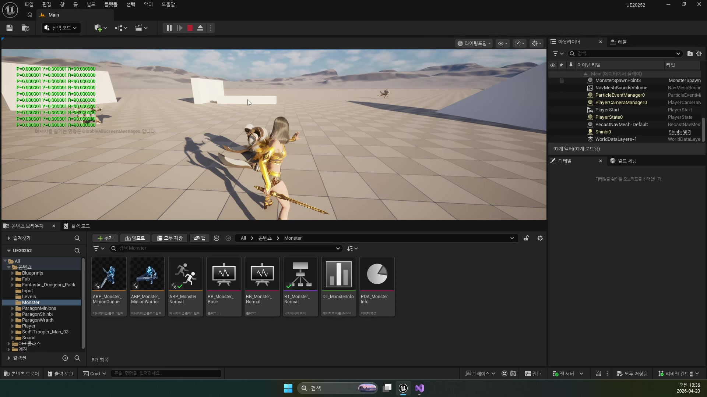

# 260420 01 Monster Death와 사망 상태 정리

[260420 허브](../) | [다음: 02 Ragdoll과 ItemBox 스폰 파이프라인](../02_intermediate_ragdoll_and_itembox_spawn_pipeline/)

## 문서 개요

첫 강의의 핵심은 `Death` 애니메이션을 재생하는 것보다, 몬스터를 전투 시스템에서 안전하게 내려오게 만드는 데 있다.

## 1. Death는 모션 교체가 아니라 상태 정리다

HP가 0이 되면 화면에는 죽는 모션만 보이기 쉽지만, 실제로는 더 많은 것이 동시에 내려와야 한다.

- AI 사고 중단
- 이동 중단
- 살아 있을 때 쓰던 캡슐 충돌 제거
- 후반 처리를 애니메이션 프레임과 맞추기

즉 `260420`의 출발점은 "죽는 연출"보다 "살아 있던 시스템을 어떻게 종료할 것인가"에 가깝다.


## 2. `TakeDamage()`는 1차 종료 지점이다

현재 `AMonsterBase::TakeDamage()`는 사망 직후 필요한 1차 정리를 거의 다 맡고 있다.

```cpp
if (mHP <= 0.f)
{
    mHP = 0.f;
    mAnimInst->SetAnim(EMonsterNormalAnim::Death);

    AMonsterController* MonsterController = GetController<AMonsterController>();
    if (IsValid(MonsterController))
    {
        MonsterController->BrainComponent->StopLogic(TEXT("Death"));
        MonsterController->BrainComponent->Cleanup();
    }

    mBody->SetCollisionEnabled(ECollisionEnabled::NoCollision);
    mMovement->StopMovementImmediately();
    mMovement->Deactivate();
    mMovement->SetComponentTickEnabled(false);
}
```

이 함수가 하는 일은 단순한 HP 감소가 아니다.

- `SetAnim(Death)`: 사망 애니메이션 진입
- `StopLogic / Cleanup`: 비헤이비어 트리 중단
- `NoCollision`: 살아 있을 때 충돌 끄기
- `StopMovementImmediately / Deactivate`: 이동 완전 정지

즉 `TakeDamage()`는 "죽기 시작했다"를 선언하는 1차 핸드오프 지점이다.

## 3. 사망 충돌 정리는 전투 판정뿐 아니라 내비게이션 정리이기도 하다

강의에서 반복해서 짚는 포인트는 죽은 몬스터가 계속 월드에 살아 있는 것처럼 남으면 안 된다는 점이다.
공격 판정만 문제가 아니라 AI 경로 계산, 카메라, 플레이어 이동 감각까지 같이 어색해질 수 있다.

현재 코드도 같은 방향으로 짜여 있다.

```cpp
mBody->SetCanEverAffectNavigation(false);
```

즉 이번 날짜는 "죽었을 때 안 맞게 만들기"보다 "죽은 객체가 월드 시스템에 남기는 흔적을 정리하기"에 더 가깝다.

## 4. `AnimNotify_Death()`가 후반 처리 시점을 닫아 준다

`TakeDamage()`가 즉시 랙돌로 넘어가지 않는 이유는 애니메이션 시간축을 존중하기 위해서다.
현재 `UMonsterAnimInstance::AnimNotify_Death()`는 매우 얇지만, 바로 그 얇음 때문에 역할이 선명하다.

```cpp
void UMonsterAnimInstance::AnimNotify_Death()
{
    TObjectPtr<AMonsterBase> Monster = Cast<AMonsterBase>(TryGetPawnOwner());
    Monster->Death();
}
```

이 함수는 후반 처리의 "시간표" 역할을 한다.

- `TakeDamage()`: 죽기 시작함
- `AnimNotify_Death()`: 이제 랙돌과 후반 처리를 시작해도 되는 프레임



## 5. 현재 branch에서는 사망 진입점과 후반 정리 층을 구분해서 읽어야 한다

지금 저장소에서 `AMonsterGAS::Death()`와 `AMonsterGAS::EndPlay()`는 legacy와 거의 같은 후반 파이프라인을 유지한다.
반대로 `AMonsterGAS::TakeDamage()`는 예전 `mHP` 차감과 `Death` 진입 코드가 아직 주석 상태다.

즉 현재 branch에서 `260420`를 읽을 때는 이렇게 받아들이는 편이 맞다.

- 사망 후반 정리 층: 여전히 유효
- 사망 진입점 직접 구현: GAS 쪽은 아직 덜 닫힘

이 구분을 머리에 넣어 두면 뒤의 랙돌, 드롭, 아이템 박스 설명이 훨씬 덜 헷갈린다.

## 정리

첫 강의의 결론은 Death가 애니메이션 하나가 아니라, AI와 이동과 충돌을 함께 내리는 상태 전환이라는 점이다.
이 1차 정리가 선명해야 다음 편의 `Ragdoll`과 `ItemBox`도 자연스럽게 이어진다.

[260420 허브](../) | [다음: 02 Ragdoll과 ItemBox 스폰 파이프라인](../02_intermediate_ragdoll_and_itembox_spawn_pipeline/)
