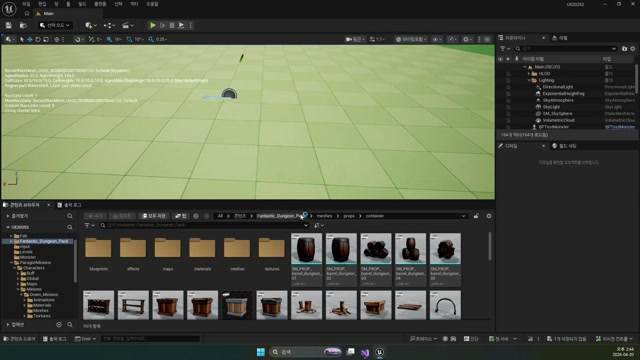

# 260420 02 Ragdoll과 ItemBox 스폰 파이프라인

[이전: 01 Monster Death와 사망 상태 정리](../01_intermediate_monster_death_and_state_shutdown/) | [260420 허브](../) | [다음: 03 ItemBox Drop 효과와 획득 오버랩](../03_intermediate_itembox_drop_effect_and_overlap/)

## 문서 개요

두 번째 강의의 핵심은 죽은 몬스터를 곧바로 없애지 않고, `Ragdoll`과 `ItemBox`를 통해 물리와 보상으로 넘기는 데 있다.

## 1. 랙돌은 Physics Asset이 있어야 성립한다

`Ragdoll`은 체크박스 한 줄이 아니라, 미리 준비된 물리 바디를 런타임에서 활성화하는 구조다.
그래서 강의는 먼저 `Physics Asset`을 보는 것부터 시작한다.


핵심은 아래 두 가지다.

- 스켈레탈 메시 본마다 물리 바디가 준비돼 있어야 한다
- 살아 있을 때의 전투 충돌과 죽은 뒤의 물리 충돌을 분리해야 한다

## 2. `Death()`는 메시를 물리 오브젝트로 넘기는 함수다

현재 `AMonsterBase::Death()`는 강의 설명과 거의 그대로 맞닿아 있다.

```cpp
void AMonsterBase::Death()
{
    mMesh->SetCollisionEnabled(ECollisionEnabled::QueryAndPhysics);
    mMesh->SetCollisionProfileName(TEXT("Ragdoll"));
    mMesh->SetSimulatePhysics(true);

    mMesh->SetAllPhysicsLinearVelocity(FVector::ZeroVector);
    mMesh->SetAllPhysicsAngularVelocityInDegrees(FVector::ZeroVector);

    mMesh->SetAllBodiesSimulatePhysics(false);
    mMesh->SetAllBodiesBelowSimulatePhysics(TEXT("pelvis"), true, true);
    mMesh->WakeAllRigidBodies();
    mMesh->bBlendPhysics = true;

    SetLifeSpan(3.f);
}
```

이 함수의 핵심은 순서다.

1. 메시 충돌을 `Ragdoll` 규칙으로 바꾼다.
2. 잔여 속도를 0으로 비워 튀는 느낌을 줄인다.
3. `pelvis` 아래만 물리를 켜 보다 제어된 랙돌을 만든다.
4. `SetLifeSpan(3.f)`으로 액터 정리 타이밍까지 예약한다.


## 3. Death 애니메이션과 랙돌은 경쟁 관계가 아니라 연결 단계다

좋은 사망 연출은 보통 두 단계로 읽으면 쉽다.

- 시작: Death 애니메이션
- 후반: 노티파이 시점의 랙돌 전환

즉 랙돌이 있다고 해서 Death 애니메이션이 필요 없는 것이 아니라, Death 애니메이션이 랙돌로 자연스럽게 넘겨 주는 구조가 더 중요하다.


## 4. `ItemBox`는 몬스터 본체가 아니라 독립 액터로 두는 편이 맞다

보상 오브젝트는 월드에 따로 남아 움직이고, 충돌하고, 나중에는 획득 이벤트까지 받아야 한다.
그래서 `AItemBox`를 별도 액터로 두는 설계가 자연스럽다.

```cpp
mBody = CreateDefaultSubobject<UBoxComponent>(TEXT("Body"));
mMesh = CreateDefaultSubobject<UStaticMeshComponent>(TEXT("Mesh"));

SetRootComponent(mBody);
mMesh->SetupAttachment(mBody);

mMesh->SetCollisionEnabled(ECollisionEnabled::NoCollision);
mBody->SetCollisionProfileName(TEXT("ItemBox"));
```

이 구조는 역할이 아주 분명하다.

- `mBody`: 실제 획득 판정
- `mMesh`: 보이는 상자 메시


## 5. 현재 구현에서 드롭 생성 책임은 `EndPlay()`가 가진다

현재 프로젝트에서는 몬스터가 정리될 때 `EndPlay()`가 직접 `AItemBox`를 스폰한다.
즉 "죽었다"는 사실과 "드롭을 남긴다"는 사실이 액터 생명주기 종료 시점에 묶여 있다.

```cpp
void AMonsterBase::EndPlay(const EEndPlayReason::Type EndPlayReason)
{
    Super::EndPlay(EndPlayReason);

    FActorSpawnParameters Param;
    Param.SpawnCollisionHandlingOverride =
        ESpawnActorCollisionHandlingMethod::AlwaysSpawn;

    GetWorld()->SpawnActor<AItemBox>(GetActorLocation(), GetActorRotation(), Param);
}
```

이 구조는 현재 `AMonsterGAS::EndPlay()`에도 거의 그대로 남아 있다.
즉 `260420`의 드롭 생성 후반부는 legacy 설명을 넘어, 최신 branch에서도 재사용되는 공통 규칙이다.



## 정리

두 번째 강의의 결론은 사망 후반부를 `Ragdoll`과 `ItemBox`로 넘기면, 죽은 몸과 월드 보상을 서로 다른 책임으로 분리할 수 있다는 점이다.

[이전: 01 Monster Death와 사망 상태 정리](../01_intermediate_monster_death_and_state_shutdown/) | [260420 허브](../) | [다음: 03 ItemBox Drop 효과와 획득 오버랩](../03_intermediate_itembox_drop_effect_and_overlap/)
