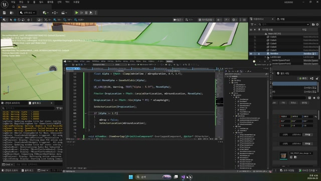

# 260420 03 ItemBox Drop 효과와 획득 오버랩

[이전: 02 Ragdoll과 ItemBox 스폰 파이프라인](../02_intermediate_ragdoll_and_itembox_spawn_pipeline/) | [260420 허브](../) | [다음: 04 공식 문서 부록](../04_appendix_official_docs_reference/)

## 문서 개요

세 번째 강의의 핵심은 아이템 박스를 그냥 생성하는 데서 멈추지 않고, 등장 연출과 획득 감각까지 붙여 월드 보상 오브젝트처럼 보이게 만드는 데 있다.

## 1. 드롭 연출은 `BeginPlay()`에서 시작하는 편이 가장 단순하다

현재 `AItemBox`는 스폰 직후 `BeginPlay()`에서 바로 드롭 연출을 시작한다.

```cpp
void AItemBox::BeginPlay()
{
    Super::BeginPlay();
    StartDropAnimation();
}
```

이렇게 두면 몬스터 쪽은 "상자를 생성한다"까지만 책임지고, 상자 스스로가 "어떻게 떨어질 것인가"를 맡게 된다.


## 2. `FindGroundLocation()`이 먼저 도착점을 잡는다

드롭 연출이 덜 어색한 이유는 현재 위치에서 Z만 내리는 것이 아니라, 먼저 "착지할 위치"를 구하기 때문이다.

```cpp
bool AItemBox::FindGroundLocation()
{
    FVector TraceStart = GetActorLocation() + FVector(0.0, 0.0, 50.0);
    FVector TraceEnd = TraceStart - FVector(0.0, 0.0, 500.0);

    FHitResult Hit;
    bool Collision = GetWorld()->LineTraceSingleByChannel(
        Hit, TraceStart, TraceEnd, ECollisionChannel::ECC_Visibility, Param);

    if (!Collision)
        return false;

    mGroundLocation = Hit.ImpactPoint;
    mGroundLocation.Z += mBody->GetScaledBoxExtent().Z;
    return true;
}
```

즉 현재 구현은 아래 순서를 따른다.

1. 라인트레이스로 바닥 위치 탐색
2. 성공하면 `ImpactPoint + 상자 반 높이`
3. 실패하면 `StartDropAnimation()`에서 임시 기본값 사용


## 3. 이동은 `Lerp + EaseOut + Sin` 조합으로 만든다

현재 `Tick()`은 아주 단순한 수학 조합으로 드롭 감각을 만든다.

```cpp
float Alpha = FMath::Clamp(mAnimTime / mDropDuration, 0.f, 1.f);
float MoveAlpha = EaseOutCubic(Alpha);

FVector DropLocation = FMath::Lerp(mStartLocation, mGroundLocation, MoveAlpha);
DropLocation.Z += FMath::Sin(Alpha * PI) * mJumpHeight;

SetActorLocation(DropLocation);
```

각 요소의 역할은 분명하다.

- `Lerp`: 시작점에서 도착점으로 이동
- `EaseOutCubic`: 끝으로 갈수록 감속
- `Sin`: 한 번 솟았다가 내려오는 높이감

즉 복잡한 물리 시뮬레이션 없이도 꽤 설득력 있는 보상 등장 연출을 만들 수 있다.


## 4. 회전은 작은 추가지만 보상 감각을 크게 올린다

현재 구현은 드롭 중에만 회전을 켜고, 착지 후에는 다시 정리한다.

```cpp
FRotator Rot = GetActorRotation();
Rot += mSpinSpeed * DeltaTime;
SetActorRotation(Rot);

if (Alpha >= 1.f)
{
    mDrop = false;
    SetActorLocation(mGroundLocation);
    SetActorRotation(FRotator::ZeroRotator);
}
```

이 설계 덕분에 드롭 중에는 시선이 잘 가고, 착지 후에는 정지 오브젝트처럼 안정된다.




## 5. 획득 판정은 현재 최소형 오버랩 루프다

현재 `ItemOverlap()`은 아주 얇다.

```cpp
void AItemBox::ItemOverlap(UPrimitiveComponent* OverlappedComponent, AActor* OtherActor,
    UPrimitiveComponent* OtherComp, int32 OtherBodyIndex, bool bFromSweep,
    const FHitResult& SweepResult)
{
    Destroy();
}
```

즉 지금 단계의 목표는 아이템 경제 시스템 완성이 아니라, 아래 최소 루프를 닫는 데 있다.

1. 드롭이 월드에 나타남
2. 자연스럽게 떨어짐
3. 플레이어가 닿으면 반응함

이 위에 나중에 아래 기능을 더 얹으면 된다.

- 플레이어 필터링
- 실제 아이템 지급
- 획득 이펙트와 사운드
- 드롭 테이블 분기


## 정리

세 번째 강의의 결론은 드롭 오브젝트는 스폰 자체보다 "어떻게 나타나고 어떻게 주워지는가"가 더 중요하다는 점이다.

[이전: 02 Ragdoll과 ItemBox 스폰 파이프라인](../02_intermediate_ragdoll_and_itembox_spawn_pipeline/) | [260420 허브](../) | [다음: 04 공식 문서 부록](../04_appendix_official_docs_reference/)
