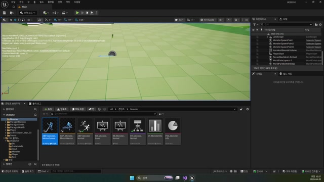

# 260420 05 현재 프로젝트 C++ 부록

[이전: 04 공식 문서 부록](../04_appendix_official_docs_reference/) | [260420 허브](../)

## 문서 개요

현재 `UE20252` 코드 기준으로 `260420`을 다시 읽으면, 이 날짜의 본질은 `사망 판정 -> 랙돌 -> 액터 정리 -> 드롭 생성 -> 드롭 연출 -> 획득 반응`을 하나의 순서로 묶는 데 있다.

## 1. 현재 구현의 큰 흐름

코드 기준 큰 흐름은 아래처럼 닫힌다.

1. `AMonsterBase::TakeDamage()`가 HP 0과 1차 정리를 처리한다.
2. `UMonsterAnimInstance::AnimNotify_Death()`가 후반 처리 시점을 연다.
3. `AMonsterBase::Death()`가 메시를 랙돌로 넘기고 `SetLifeSpan(3.f)`을 건다.
4. 액터가 정리될 때 `EndPlay()`가 `AItemBox`를 생성한다.
5. `AItemBox::BeginPlay()`가 `StartDropAnimation()`을 시작한다.
6. `Tick()`이 위치와 회전을 갱신한다.
7. `ItemOverlap()`이 현재 최소형 획득 반응을 닫는다.

즉 `260420`은 기능 세 개를 따로 붙이는 날이 아니라, 후반부 액터 생명주기를 하나의 파이프라인으로 묶는 날이다.

## 2. `EndPlay()`가 드롭 생성 책임을 직접 가진다

현재 구현에서 흥미로운 지점은 드롭 매니저가 따로 없고, 몬스터 본체가 `EndPlay()`에서 직접 상자를 만든다는 점이다.

```cpp
void AMonsterBase::EndPlay(const EEndPlayReason::Type EndPlayReason)
{
    Super::EndPlay(EndPlayReason);

    FActorSpawnParameters Param;
    Param.SpawnCollisionHandlingOverride =
        ESpawnActorCollisionHandlingMethod::AlwaysSpawn;

    GetWorld()->SpawnActor<AItemBox>(GetActorLocation(), GetActorRotation(), Param);
}
```

그래서 현재 구조는 아래처럼 읽으면 쉽다.

- 사망 진입: `TakeDamage()`
- 사망 후반 물리: `Death()`
- 드롭 생성: `EndPlay()`
- 드롭 연출: `AItemBox`



## 3. `AItemBox`는 스스로 드롭과 획득을 책임진다

`AItemBox`는 단순히 월드에 놓이는 메시가 아니라, 드롭 연출과 획득 이벤트를 스스로 책임지는 액터다.

```cpp
void AItemBox::StartDropAnimation()
{
    mStartLocation = GetActorLocation();

    if (!FindGroundLocation())
        mGroundLocation = mStartLocation + FVector(0.0, 0.0, -100.0);

    mSpinSpeed = FRotator(720.0, 1080.0, 0.0);
    mAnimTime = 0.f;
    mDrop = true;
}
```

즉 상자 생성 이후의 책임은 거의 전부 상자 쪽으로 옮겨진다.
이 분리 덕분에 몬스터는 사망과 종료에 집중하고, `ItemBox`는 등장과 획득 감각에 집중할 수 있다.

## 4. 현재 GAS branch에서도 후반 레이어는 거의 그대로 재사용된다

현재 `AMonsterGAS::Death()`와 `AMonsterGAS::EndPlay()`를 보면 랙돌 전환과 `AItemBox` 생성 후반부는 legacy와 거의 동일하다.
즉 `260420`의 핵심 파이프라인은 아직도 유효하다.

다만 사망 진입점은 차이가 있다.

- `AMonsterBase::TakeDamage()`: 직접 HP를 깎고 Death로 진입
- `AMonsterGAS::TakeDamage()`: 예전 직접 처리 코드가 현재 주석 상태

그래서 지금 branch 기준으로는 "사망 후반 파이프라인은 유지되지만, 사망 진입점은 GAS 쪽에서 아직 덜 닫혔다"라고 이해하는 편이 맞다.

## 5. 이후 확장 포인트

현재 코드 기준으로 다음 확장 포인트도 선명하다.

- `EndPlayReason`을 보고 정말 죽은 경우에만 드롭 생성하기
- `ItemOverlap()`에서 플레이어 필터링 추가하기
- 실제 보상 데이터와 드롭 테이블 연결하기
- GAS 사망 진입과 `Death()` 연결을 정리하기

즉 `260420`은 이미 충분히 완성된 파이프라인이면서도, 이후 게임 룰을 얹기 좋은 구조까지 갖춘 상태다.

## 정리

현재 프로젝트 C++ 기준으로 보면 `260420`은 `몬스터가 죽은 뒤 월드에 무엇을 남기고 어떻게 정리할 것인가`를 코드 레벨로 닫는 강의다.

[이전: 04 공식 문서 부록](../04_appendix_official_docs_reference/) | [260420 허브](../)
