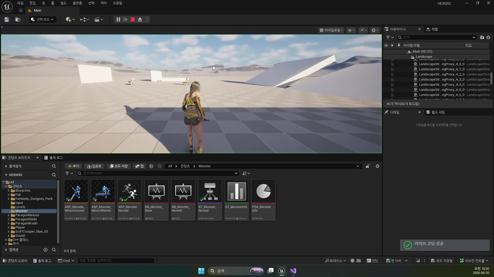
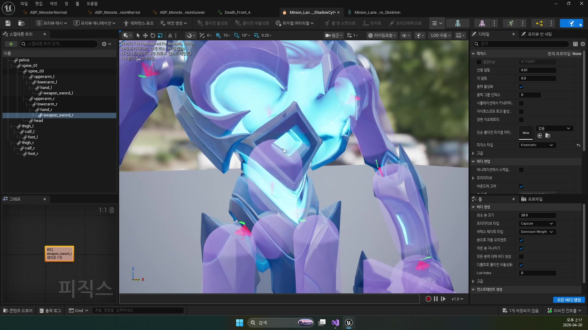
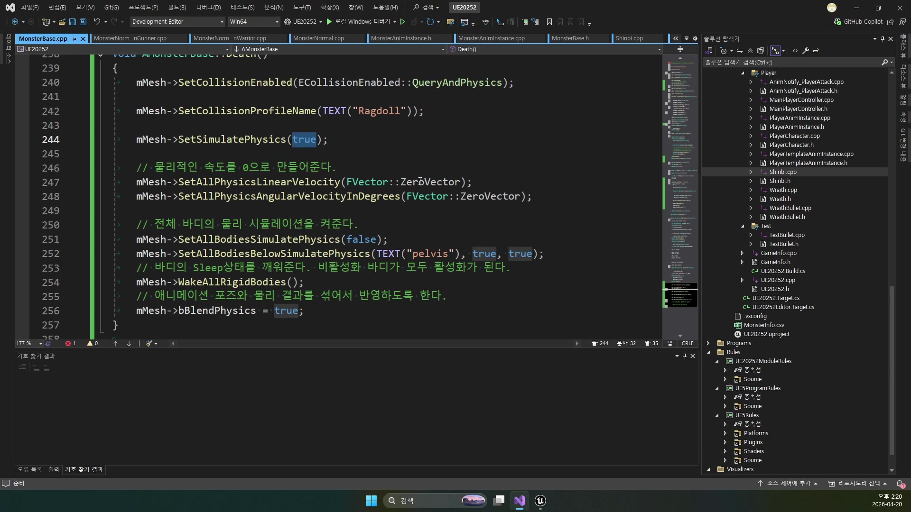
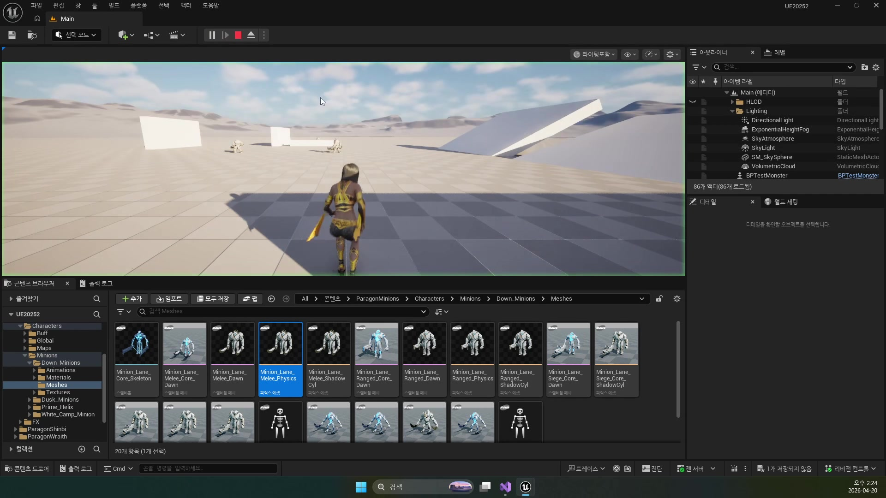
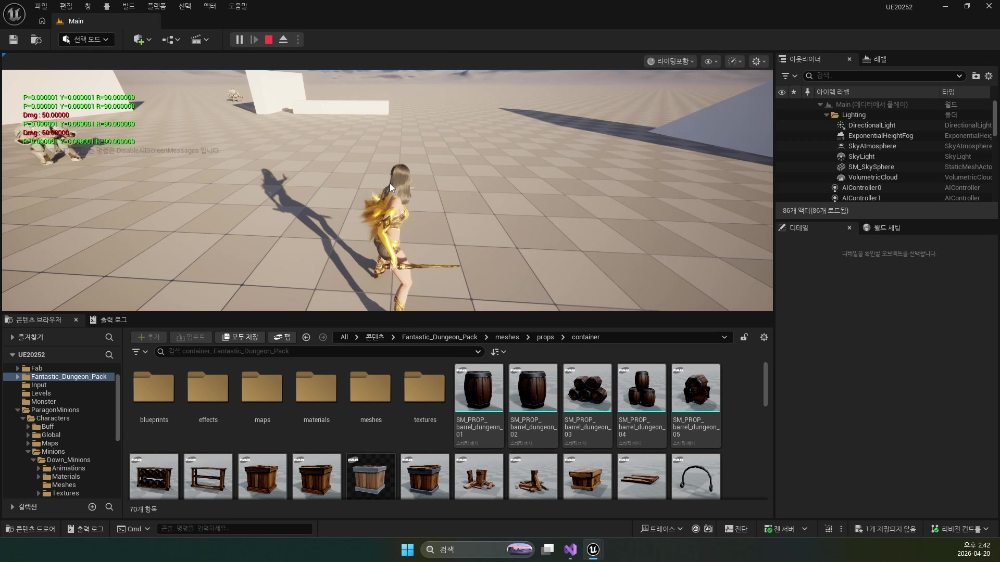
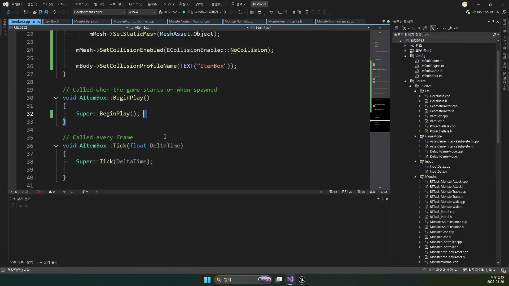
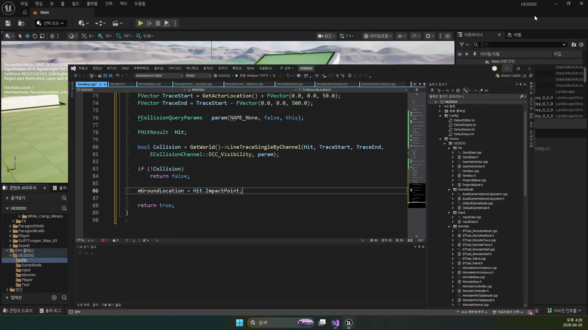
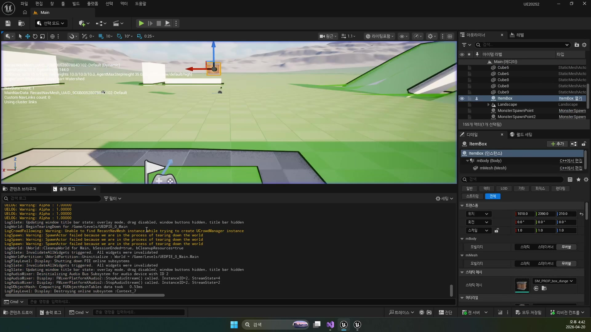
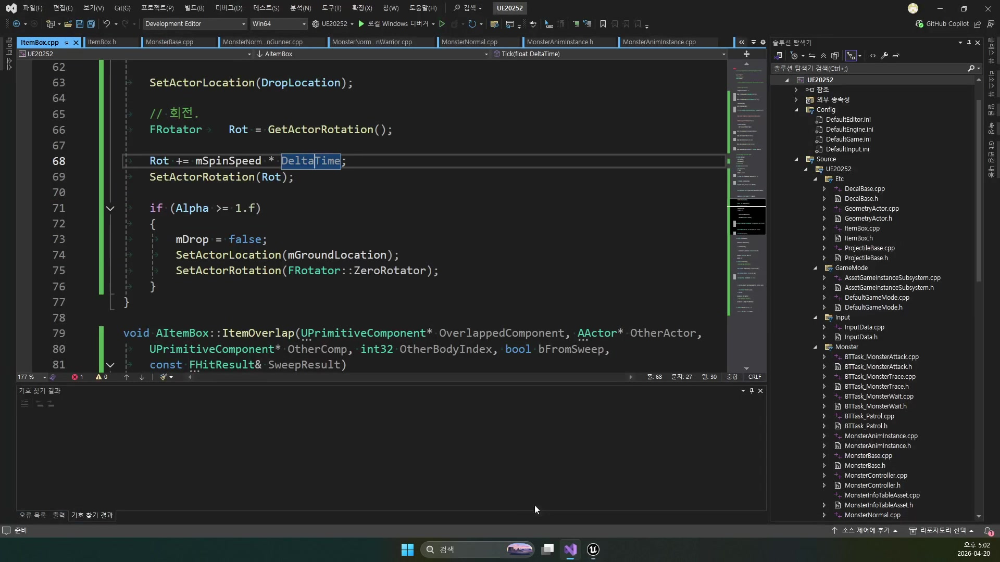
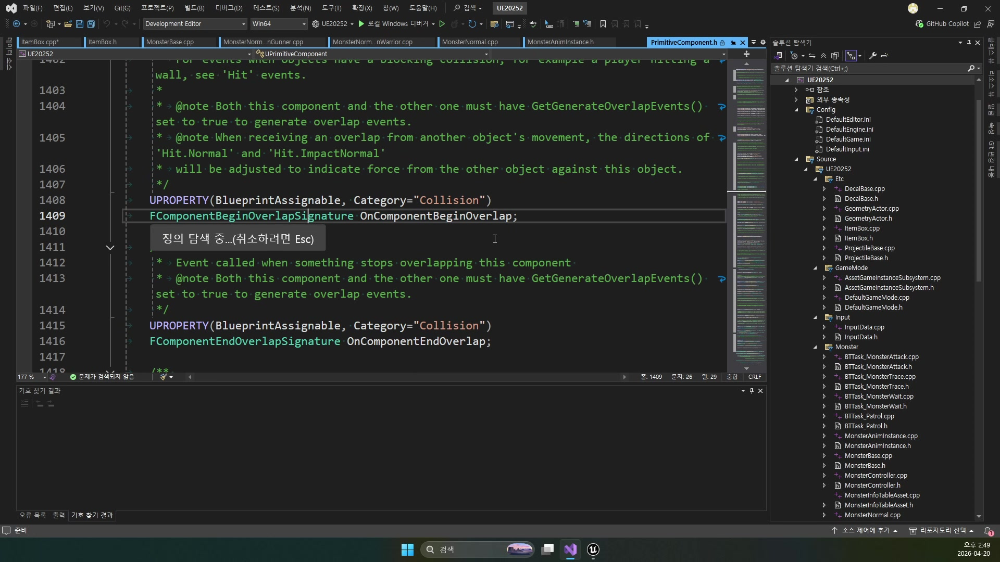

# 260420 몬스터가 죽은 뒤 랙돌로 쓰러지고 아이템 박스를 떨어뜨린 뒤 획득까지 이어지는 마무리

## 문서 개요

이 문서는 `260420_1_Monster Death`, `260420_2_Ragdoll과 ItemBox`, `260420_3_아이템상자 Drop 효과`를 하나의 연속된 교재로 다시 정리한 것이다.
이번 날짜의 핵심은 몬스터의 전투 루프를 “죽는 순간”에서 멈추지 않고, 사망 후 처리와 물리 전환, 아이템 드롭, 그리고 드롭 연출까지 하나의 흐름으로 묶는 데 있다.

강의 흐름을 한 줄로 요약하면 다음과 같다.

`Death 애니메이션과 AI 종료 -> Ragdoll 물리 전환 -> ItemBox 생성과 드롭 애니메이션`

즉 `260420`은 전투 AI의 끝맺음을 다루는 날이다.
전날까지 몬스터는 타깃을 추적하고 공격하는 루프를 갖게 되었지만, 실제 게임에서는 죽은 뒤의 상태가 더 중요할 때가 많다.
죽은 몬스터가 다시 추적하면 안 되고, 충돌과 내비게이션을 방해해도 안 되며, 보상 오브젝트가 너무 건조하게 생겨도 안 된다.
이번 날짜는 그래서 “사망 이후의 정리와 연출”을 묶는 후반부 시스템 설계라고 볼 수 있다.

이 교재는 다음 자료를 함께 대조해 작성했다.

- `D:\UE_Academy_Stduy_compressed`의 원본 영상과 자막
- 원본 MP4에서 다시 추출한 대표 장면 캡처
- `D:\UnrealProjects\UE_Academy_Stduy\Source\UE20252`의 실제 C++ 소스
- `D:\UnrealProjects\UE_Academy_Stduy\Saved\AcademyUtility`의 덤프 결과

## 학습 목표

- `HP <= 0` 시점에 Death 애니메이션, AI 정지, 충돌 정리, 이동 비활성화가 왜 함께 들어가야 하는지 설명할 수 있다.
- `AnimNotify_Death()`를 이용해 사망 후처리 시점을 애니메이션과 맞추는 이유를 말할 수 있다.
- `Ragdoll` 전용 충돌 프로필과 `Physics Asset`이 왜 필요한지 설명할 수 있다.
- `SetAllBodiesBelowSimulatePhysics`, `WakeAllRigidBodies`, `bBlendPhysics`가 랙돌 전환에서 어떤 역할을 하는지 이해할 수 있다.
- `AItemBox`가 `Box Collision + Static Mesh + OnComponentBeginOverlap` 구조를 가지는 이유를 설명할 수 있다.
- `StartDropAnimation`, `FindGroundLocation`, `Lerp + Sin`, `EaseOutCubic`, 회전 보정이 아이템 박스 드롭 연출을 어떻게 만드는지 정리할 수 있다.
- `TakeDamage() -> AnimNotify_Death() -> Death() -> SetLifeSpan() -> EndPlay() -> AItemBox::BeginPlay() -> Tick() -> ItemOverlap()` 흐름을 코드 기준으로 설명할 수 있다.
- 현재 구현에서 `ItemBox`가 `EndPlay()`에서 생성되고, 아직 드롭 확률/플레이어 필터링/보상 지급 데이터는 붙지 않았다는 점을 설명할 수 있다.

## 강의 흐름 요약

1. 몬스터가 죽었을 때는 `Death` 모션만 바꾸는 것이 아니라, 비헤이비어 트리와 이동, 충돌, 내비게이션 영향까지 함께 정지시켜야 한다.
2. 사망 후처리 시점은 애니메이션 노티파이로 맞추고, 그 순간 랙돌 물리 전환을 걸어 더 자연스러운 무너짐을 만든다.
3. 몬스터가 정리되는 시점에는 `ItemBox`를 생성해 보상 오브젝트를 월드에 남긴다.
4. 생성된 `ItemBox`는 그냥 땅에 박히듯 나타나는 대신, 위로 살짝 튀어올랐다가 바닥으로 내려오고 회전하는 드롭 애니메이션을 가진다.

---

## 제1장. Monster Death: 사망은 애니메이션 한 줄이 아니라 AI 종료와 상태 정리다

### 1.1 Death 애니메이션만 바꾸면 몬스터는 아직 “살아 있는 시스템”이다

첫 강의는 몬스터 사망 처리를 붙이는 것에서 시작한다.
자막도 아주 직설적이다.
이미 `Death` 애니메이션은 준비되어 있으니, 우선 `HP <= 0`일 때 애니메이션 타입을 `Death`로 바꾸는 것부터 연결해 본다는 식이다.

하지만 이 강의의 핵심은 거기서 끝나지 않는다.
사망 모션이 보인다고 해서 몬스터 시스템이 제대로 죽은 것은 아니기 때문이다.
여전히 비헤이비어 트리는 돌아가고 있을 수 있고, 타깃 판단이 갱신되면서 다른 상태로 튈 수 있으며, 충돌도 살아 있고, 이동도 끊기지 않을 수 있다.
즉 Death는 “애니메이션 교체”가 아니라, AI 객체 전체를 전투 루프에서 내려오는 절차다.

### 1.2 현재 `TakeDamage()`는 사망 시점의 핵심 전환점을 맡고 있다

현재 `UE20252` 구현에서 그 전환점은 `AMonsterBase::TakeDamage()`다.

```cpp
if (mHP <= 0.f)
{
    mHP = 0.f;

    mAnimInst->SetAnim(EMonsterNormalAnim::Death);

    AMonsterController* MonsterController = GetController<AMonsterController>();
    if (IsValid(MonsterController))
    {
        MonsterController->BrainComponent->StopLogic(TEXT("Death"));
        MonsterController->BrainComponent->Cleanup();
    }

    mBody->SetCollisionEnabled(ECollisionEnabled::NoCollision);
    mMovement->StopMovementImmediately();
    mMovement->Deactivate();
    mMovement->SetComponentTickEnabled(false);

    return Dmg;
}
```

이 구조가 이번 강의가 말하는 핵심을 거의 그대로 담고 있다.

- `SetAnim(Death)`: 사망 애니메이션 진입
- `StopLogic / Cleanup`: AI 종료
- `NoCollision`: 살아 있을 때의 전투 충돌 제거
- `StopMovementImmediately / Deactivate`: 이동 중단

즉 몬스터의 죽음은 “HP가 0이 되면 애니메이션만 바꿈”이 아니라, AI, 충돌, 이동이라는 세 축을 동시에 내려놓는 과정이다.
여기서 한 가지 더 중요한 점은 살아 있을 때 충돌의 주체가 `mBody`라는 것이다.
생성자에서 `mMesh`는 처음부터 `NoCollision`으로 두고, `mBody`는 `Monster` 프로파일을 쓴다.
따라서 사망 직후에는 우선 캡슐 충돌을 꺼 전투용 본체를 비활성화하고, 나중에 `Death()`에서 메시 쪽을 `Ragdoll` 충돌로 다시 켜는 2단계 전환이 일어난다.

### 1.3 사망 시 충돌을 정리하는 이유는 전투 판정뿐 아니라 내비게이션 때문이다

자막에서도 이 점을 길게 설명한다.
죽은 몬스터가 계속 플레이어 공격 판정과 부딪히거나, AI가 길을 찾을 때 장애물처럼 남아 있으면 매우 어색하다.
그래서 사망 후 충돌 정리는 단순히 “더 이상 맞지 않게 한다” 수준을 넘어, 내비게이션과 인식 시스템까지 정리하는 작업이 된다.

현재 소스에서도 시작점은 이미 잡혀 있다.

```cpp
mBody->SetCanEverAffectNavigation(false);
```

이 설정은 몬스터 캡슐이 내비게이션에 직접 영향을 주지 않게 만드는 기본 안전장치다.
즉 이번 날짜는 단순한 Death 연출 강의가 아니라, “죽은 객체가 월드 시스템에 남기는 흔적을 어떻게 지울 것인가”를 다루는 강의라고 보는 편이 정확하다.



### 1.4 Death는 노티파이 시점과 묶어야 후속 시스템을 자연스럽게 연결할 수 있다

첫 강의 후반에서 중요한 전환점이 하나 더 나온다.
Death 애니메이션 재생 도중 특정 시점에 후처리를 넣기 위해 `Death` 전용 애니메이션 노티파이를 만든다는 설명이다.

현재 소스에서는 이 흐름이 `UMonsterAnimInstance::AnimNotify_Death()`로 구현돼 있다.

```cpp
void UMonsterAnimInstance::AnimNotify_Death()
{
    TObjectPtr<AMonsterBase> Monster = Cast<AMonsterBase>(TryGetPawnOwner());
    Monster->Death();
}
```

이 구조가 좋은 이유는 명확하다.

- 사망 후처리 타이밍이 애니메이션 길이와 맞춰진다.
- 단순 `Destroy()` 대신 물리 전환이나 이펙트, 드롭 연결이 가능하다.
- 사망 연출이 캐릭터별로 달라져도 노티파이 시점으로 통일해 처리할 수 있다.

즉 `AnimNotify_Death`는 단순 콜백이 아니라, “사망 애니메이션이 어디에서 실제 시스템 정리로 넘어갈 것인가”를 정하는 접점이다.
현재 `MonsterAnimInstance.cpp` 기준으로도 이 함수는 매우 얇다.
`TryGetPawnOwner()`로 몬스터를 얻은 뒤 `Monster->Death()`만 호출하므로, 사망 후반부 규칙은 애님 인스턴스가 아니라 몬스터 본체가 책임지는 구조라고 읽는 편이 맞다.

### 1.5 현재 강의 설명과 visible code 사이에는 작은 차이가 있다

자막에서는 스폰 포인트에게 “몬스터가 죽었다”는 사실을 알려 다시 생성까지 이어질 수 있게 해야 한다고 설명한다.
이 아이디어는 `260415`의 스폰 포인트 설계와 자연스럽게 이어진다.

다만 현재 보이는 소스 기준으로는, 그 연결이 명시적으로 노출된 부분보다 `EndPlay() -> ItemBox 스폰` 쪽이 더 분명하다.
`AMonsterSpawnPoint`에는 `ClearSpawn()`가 존재하지만, 현재 검색 범위 내에서는 그것이 `MonsterBase` 사망 루프에서 직접 호출되는 흔적은 보이지 않는다.
반대로 `AMonsterBase::EndPlay()`는 종료 이유를 따지지 않고 `AItemBox`를 바로 생성한다.

이 말은 곧, 현재 프로젝트가 이미 아이템 드롭 파이프라인은 갖췄지만, 리스폰 통지나 “정말 죽어서 끝난 경우에만 드롭” 같은 조건은 아직 더 정리될 여지가 있다는 뜻이다.
교재를 읽을 때는 이 차이를 함께 기억해 두는 편이 좋다.

### 1.6 장 정리

제1장의 결론은 Death는 모션 전환 하나로 끝나는 기능이 아니라, AI 종료, 충돌 정리, 이동 비활성화, 후처리 시점 제어가 함께 들어가는 상태 전환이라는 점이다.
이 구조가 잡혀야 뒤의 랙돌과 드롭 보상도 자연스럽게 이어진다.

---

## 제2장. Ragdoll과 ItemBox: 사망 이후의 물리와 보상 오브젝트를 어떻게 붙일 것인가

### 2.1 Ragdoll은 “죽는 느낌”을 물리로 넘기는 방법이다

두 번째 강의의 앞부분은 `Ragdoll` 설명이다.
자막도 정확히 그 정의를 말한다.
단순 Death 애니메이션만 재생하는 것보다, 물리 시뮬레이션을 켜서 실제로 무너지는 느낌을 주는 방식이라는 것이다.

이 접근의 핵심은 사망 상태를 애니메이션이 아니라 물리로 넘기는 데 있다.
애니메이션은 미리 정의된 포즈 변화지만, 랙돌은 본과 물리 바디가 월드의 힘과 충돌에 따라 반응한다.
그래서 훨씬 “쓰러지는” 인상이 강해진다.

### 2.2 Physics Asset이 있어야 랙돌은 성립한다

자막은 가장 먼저 `Physics Asset`의 존재를 짚는다.
스켈레탈 메시의 각 본에 대해 캡슐, 박스, 구 같은 물리 도형이 잡혀 있어야만 랙돌 계산이 가능하기 때문이다.
즉 랙돌 품질은 단순히 `Simulate Physics`를 켰느냐로 정해지지 않고, 물리 자산을 얼마나 잘 다듬었느냐에 크게 좌우된다.



### 2.3 현재 `Death()`는 랙돌 전환의 정석적인 순서를 따른다

현재 `AMonsterBase::Death()`는 강의 설명과 거의 완전히 일치한다.

```cpp
void AMonsterBase::Death()
{
    mMesh->SetCollisionEnabled(ECollisionEnabled::QueryAndPhysics);
    mMesh->SetCollisionProfileName(TEXT("Ragdoll"));
    mMesh->SetSimulatePhysics(true);

    mMesh->SetAllPhysicsLinearVelocity(FVector::ZeroVector);
    mMesh->SetAllPhysicsAngularVelocityInDegrees(FVector::ZeroVector);

    mMesh->SetAllBodiesSimulatePhysics(false);
    mMesh->SetAllBodiesBelowSimulatePhysics(TEXT("pelvis"), true, true);
    mMesh->WakeAllRigidBodies();
    mMesh->bBlendPhysics = true;

    SetLifeSpan(3.f);
}
```

이 흐름을 의미 단위로 풀면 다음과 같다.

- Mesh 충돌을 랙돌용으로 바꾼다
- 전체 물리 시뮬레이션을 켠다
- 이전 이동/회전 속도를 0으로 초기화한다
- `pelvis` 아래 본만 실제 랙돌 물리로 넘긴다
- 수면 상태의 바디를 깨운다
- 애니메이션 포즈와 물리 결과를 섞는다
- 잠시 뒤 자동 제거되도록 수명을 건다

즉 랙돌은 “물리 켜기 한 줄”이 아니라, 충돌/속도/본 범위/웨이크/블렌딩을 함께 다루는 세팅 묶음이다.
특히 여기서 `SetAllBodiesSimulatePhysics(false)`를 한 번 호출한 뒤 `pelvis` 아래만 다시 켠다는 점이 중요하다.
현재 구현은 전신 전체를 무조건 풀어 버리기보다, 골반 아래를 중심으로 보다 제어된 랙돌 전환을 택한 셈이다.



### 2.4 Ragdoll 전용 충돌 프로필은 살아 있을 때의 전투 충돌과 분리해야 한다

자막은 `Ragdoll` 전용 프로파일을 따로 두는 이유도 설명한다.
살아 있을 때 쓰는 전투 충돌과 죽은 뒤 물리 오브젝트로 남는 충돌은 목적이 완전히 다르기 때문이다.

- 살아 있을 때: 플레이어 공격, 감지, 이동, 타깃 판정
- 죽은 뒤: 월드와의 물리 반응, 보기 좋은 쓰러짐

그래서 `mMesh->SetCollisionProfileName(TEXT("Ragdoll"))`는 단지 문자열 하나가 아니라, “전투 규칙에서 물리 규칙으로 넘어간다”는 선언에 가깝다.

### 2.5 Death 모션 라이브러리와 랙돌은 경쟁 관계가 아니라 연결 단계다

강의 중간에는 Death 애니메이션 자산을 확인하는 장면도 나온다.
이 부분이 중요한 이유는 랙돌이 있다고 해서 Death 애니메이션이 필요 없어지는 것이 아니기 때문이다.
보통은 애니메이션으로 시작하고, 적절한 노티파이 지점에서 랙돌로 전환한다.



즉 Death 애니메이션과 랙돌은 선택지가 아니라 연속 단계다.
잘 만든 게임일수록 “사망 시작”은 애니메이션이 담당하고, “쓰러진 이후의 자연스러움”은 물리가 담당한다.

### 2.6 ItemBox는 월드 보상 오브젝트이므로 독립 액터가 맞다

두 번째 강의 후반은 `ItemBox` 제작으로 넘어간다.
이 흐름은 `260402`의 `BPBullet`과도 비슷하다.
어떤 기능이 월드에 독립적으로 존재하고, 충돌과 수명, 연출을 가져야 한다면 별도 액터가 맞다.

현재 프로젝트의 `AItemBox`는 정확히 그런 구조를 가진다.

```cpp
mBody = CreateDefaultSubobject<UBoxComponent>(TEXT("Body"));
mMesh = CreateDefaultSubobject<UStaticMeshComponent>(TEXT("Mesh"));

SetRootComponent(mBody);
mMesh->SetupAttachment(mBody);

mMesh->SetCollisionEnabled(ECollisionEnabled::NoCollision);
mBody->SetCollisionProfileName(TEXT("ItemBox"));
mBody->OnComponentBeginOverlap.AddDynamic(this, &AItemBox::ItemOverlap);
```

이 구조를 해석하면 다음과 같다.

- `Box Collision`: 획득 판정 담당
- `Static Mesh`: 보이는 상자 외형 담당
- `OnComponentBeginOverlap`: 플레이어 접촉 감지 담당

즉 `ItemBox`는 단순 메시 오브젝트가 아니라, 월드와 플레이어 사이의 획득 상호작용을 가진 독립 액터다.
현재 구현은 여기서 한 걸음 더 나가, 생성자 안에서 `SM_PROP_box_dungeon_03` 메시를 직접 로드하고 박스 크기 `47,47,42`, 메시 오프셋 `-42`까지 세팅한다.
즉 강의의 ItemBox는 추상 보상 오브젝트가 아니라, 현재 프로젝트 안에서 바로 떨어뜨려 볼 수 있는 구체 자산까지 연결된 상태다.

### 2.7 현재 구현에서 ItemBox는 `EndPlay()`에서 생성된다

자막은 “Death 연출이 끝나고 정리되는 시점에 `SpawnActor`로 ItemBox를 만든다”고 설명한다.
현재 visible code에서는 그 연결이 `AMonsterBase::EndPlay()`에 구현돼 있다.

```cpp
void AMonsterBase::EndPlay(const EEndPlayReason::Type EndPlayReason)
{
    Super::EndPlay(EndPlayReason);

    FActorSpawnParameters param;
    param.SpawnCollisionHandlingOverride =
        ESpawnActorCollisionHandlingMethod::AlwaysSpawn;

    AItemBox* ItemBox = GetWorld()->SpawnActor<AItemBox>(
        GetActorLocation(), GetActorRotation(), param);
}
```

즉 현재 프로젝트 기준으로는 “TakeDamage -> Death 애니메이션 -> AnimNotify_Death -> Ragdoll + SetLifeSpan(3.f) -> EndPlay -> ItemBox 스폰” 흐름이 가장 분명하다.
이 구조는 랙돌과 드롭 오브젝트가 서로 겹치지 않게 시간을 분리한다는 점에서 꽤 실용적이다.
다만 현재 `EndPlay()`는 종료 이유를 검사하지 않으므로, 장기적으로는 “정말 사망으로 사라질 때만 스폰”되도록 보강하는 편이 더 안전하다.

### 2.8 ItemBox의 초기 코드 구조는 단순할수록 좋다

강의는 ItemBox를 처음부터 복잡하게 만들지 않는다.
`BeginPlay`, `Tick`, 충돌, 메쉬, 바디만 갖춘 얇은 액터로 시작한다.
이 선택이 좋은 이유는 뒤에서 드롭 애니메이션이나 회전을 붙일 여지가 크기 때문이다.





### 2.9 장 정리

제2장의 결론은 랙돌과 ItemBox는 모두 “사망 이후 상태”를 담당하지만 역할이 다르다는 점이다.
랙돌은 죽음의 물리적 연출을, ItemBox는 보상과 획득 상호작용을 담당한다.
둘을 애니메이션 노티파이와 EndPlay로 나눠 연결하면 구조가 훨씬 깔끔해진다.
현재 코드 기준으로는 이 둘이 정확히 `AnimNotify_Death`와 `EndPlay()`에 나뉘어 있으므로, 문서상 파이프라인도 이 순서로 읽는 것이 가장 자연스럽다.

---

## 제3장. ItemBox Drop 효과: 그냥 스폰하지 말고 떨어지게 만들기

### 3.1 드롭 연출의 목표는 보상 오브젝트가 “나타났다”는 감각을 주는 것이다

세 번째 강의는 ItemBox를 단순히 월드에 생성하는 데서 멈추지 않고, 살짝 튀어올랐다가 바닥으로 내려오며 회전하는 드롭 연출까지 붙인다.
이 파트가 중요한 이유는 보상 오브젝트가 시각적으로 “죽은 몬스터로부터 나왔다”는 인상을 주기 때문이다.

단순 스폰은 기능적으로는 충분하지만, 게임 플레이 피드백이 약하다.
반면 짧은 드롭 아크와 회전만 있어도 플레이어는 “무언가 떨어졌다”는 사실을 즉시 알아차릴 수 있다.

### 3.2 현재 구현은 `StartDropAnimation()`을 BeginPlay에서 시작한다

현재 `AItemBox::BeginPlay()`는 생성 직후 드롭 애니메이션을 시작한다.

```cpp
void AItemBox::BeginPlay()
{
    Super::BeginPlay();
    StartDropAnimation();
}
```

즉 ItemBox는 월드에 생기자마자 곧바로 드롭 상태에 들어간다.
이 구조가 좋은 이유는 스폰한 쪽인 `MonsterBase`가 드롭 연출 세부를 알 필요가 없기 때문이다.
생성만 해 주면, 상자 스스로 자신의 등장 애니메이션을 책임진다.
이 방식 덕분에 `MonsterBase`는 “언제 생성할 것인가”만 알고, `ItemBox`는 “어떻게 떨어질 것인가”를 스스로 해결한다.
즉 사망 보상 시스템이 `생성 책임`과 `연출 책임`으로 깔끔하게 분리되어 있다.

### 3.3 `FindGroundLocation()`은 드롭의 도착점을 먼저 구한다

강의 자막은 땅을 찾기 위해 라인트레이스를 사용한다고 설명한다.
현재 구현도 정확히 그렇게 되어 있다.

```cpp
FVector TraceStart = GetActorLocation() + FVector(0.0, 0.0, 50.0);
FVector TraceEnd = TraceStart - FVector(0.0, 0.0, 500.0);

bool Collision = GetWorld()->LineTraceSingleByChannel(
    Hit, TraceStart, TraceEnd, ECollisionChannel::ECC_Visibility, param);
```

그리고 땅을 찾으면 상자의 절반 높이만큼 올려 `mGroundLocation`을 만든다.

```cpp
mGroundLocation = Hit.ImpactPoint;
mGroundLocation.Z += mBody->GetScaledBoxExtent().Z;
```

이 구조의 의미는 단순하다.
드롭 연출은 무작정 현재 위치에서 Z만 내려 주는 것이 아니라, “최종 착지 지점”을 먼저 정하고 그 사이를 보간하는 방식이 훨씬 안정적이라는 것이다.
현재 구현은 라인트레이스를 `ECC_Visibility` 채널로 하고, 시작점은 현재 위치보다 `+50`, 끝점은 거기서 `-500`이다.
만약 바닥을 못 찾으면 `StartDropAnimation()`이 임시로 `-100` 아래를 착지점으로 잡는다.
즉 이 시스템은 정상 착지와 실패 시 대체 착지를 모두 준비한 상태다.

### 3.4 위치 이동은 `Lerp + EaseOut + Sin` 조합으로 만든다

`Tick()` 안에서 드롭 연출이 실제로 진행된다.

```cpp
float Alpha = FMath::Clamp(mAnimTime / mDropDuration, 0.f, 1.f);
float MoveAlpha = EaseOutCubic(Alpha);

FVector DropLocation = FMath::Lerp(mStartLocation, mGroundLocation, MoveAlpha);
DropLocation.Z += FMath::Sin(Alpha * PI) * mJumpHeight;

SetActorLocation(DropLocation);
```

이 수식을 역할별로 보면 아주 깔끔하다.

- `Alpha`: 진행 시간 비율
- `EaseOutCubic`: 끝으로 갈수록 부드럽게 감속하는 보간
- `Lerp`: 시작점에서 착지점까지 이동
- `Sin(Alpha * PI) * mJumpHeight`: 위로 솟았다가 내려오는 포물선 느낌의 점프 높이

즉 강의가 말하는 드롭 효과는 복잡한 물리 시뮬레이션이 아니라, 시간 기반 보간과 삼각함수를 잘 섞은 연출이다.
현재 함수 이름은 `EaseOutCubic`이지만, 실제 계산은 `mDropPow`를 쓰므로 기본값 `3.f`일 때 cubic처럼 동작하고 필요하면 곡선 강도를 조절할 수 있다.

### 3.5 드롭 속도와 높이를 변수로 분리한 이유는 에디터 조정 때문이다

자막도 `DropDuration`, `JumpHeight`를 조절하면서 느낌을 테스트한다고 설명한다.
현재 헤더를 보면 이 철학이 반영돼 있다.

```cpp
UPROPERTY(EditAnywhere, BlueprintReadOnly)
float mDropDuration = 1.f;

UPROPERTY(EditAnywhere, BlueprintReadOnly)
float mDropPow = 3.f;

float mJumpHeight = 80.f;
```

드롭 연출은 “정답 수치”가 있는 기능이 아니다.
맵 크기, 카메라 거리, 아이템 상자 크기에 따라 느낌이 달라지므로, 값을 노출해 빠르게 바꿔볼 수 있는 구조가 중요하다.
이 점에서 이번 날짜는 `260401`의 변수 설계 원칙이 실제 연출 시스템으로 이어지는 좋은 예다.
현재 기본값은 `mDropDuration = 1.f`, `mDropPow = 3.f`, `mJumpHeight = 80.f`다.
즉 지금 보이는 연출은 우연히 나온 값이 아니라, 노출된 파라미터를 조정해 다듬을 수 있는 구조 위에 놓여 있다.

### 3.6 회전은 아주 작은 추가지만 체감 품질이 크게 올라간다

강의 후반은 상자가 떨어지는 동안 회전하도록 만든다.
현재 구현도 단순하고 효과적이다.

```cpp
FRotator Rot = GetActorRotation();
Rot += mSpinSpeed * DeltaTime;
SetActorRotation(Rot);
```

애니메이션이 끝나면 회전은 다시 정리된다.

```cpp
if (Alpha >= 1.f)
{
    mDrop = false;
    SetActorLocation(mGroundLocation);
    SetActorRotation(FRotator::ZeroRotator);
}
```

이 설계는 장점이 분명하다.

- 떨어지는 동안에는 시선이 잘 간다
- 착지 후에는 너무 어지럽지 않다
- 상자라는 정적인 오브젝트 특성도 유지된다

즉 회전은 과한 연출이 아니라, 보상 오브젝트를 플레이어 눈에 띄게 만드는 가벼운 시각 장치다.
현재 기본 회전 속도는 `FRotator(720, 1080, 0)`이고, 드롭이 끝나면 `FRotator::ZeroRotator`로 초기화된다.
즉 회전은 착지 전까지만 쓰는 임시 연출이며, 착지 후에는 다시 안정된 정지 오브젝트로 돌아간다.







### 3.7 획득 판정은 오버랩이 가장 자연스럽다

강의는 ItemBox가 플레이어와 닿았을 때 획득되도록 `OnComponentBeginOverlap`을 사용한다.
현재 구현은 가장 얇은 형태로 남아 있다.

```cpp
void AItemBox::ItemOverlap(UPrimitiveComponent* OverlappedComponent, AActor* OtherActor,
    UPrimitiveComponent* OtherComp, int32 OtherBodyIndex, bool bFromSweep,
    const FHitResult& SweepResult)
{
    Destroy();
}
```

지금은 획득 데이터 지급 로직이 아직 없고, 접촉하면 사라지는 최소 구현 상태다.
또한 현재 코드는 `OtherActor`가 플레이어인지 검사하지 않으므로, 오버랩만 발생하면 파괴되는 아주 초기 형태다.
하지만 구조상 확장 지점은 명확하다.

- 플레이어 여부 확인
- 아이템 지급
- 획득 이펙트 재생
- Destroy 또는 숨김 처리

즉 이번 날짜의 목적은 아이템 경제 시스템 완성이 아니라, “사망 보상 오브젝트가 월드에 생기고, 움직이고, 획득될 수 있다”는 기본 루프를 만드는 데 있다.



### 3.8 장 정리

제3장의 결론은 보상 오브젝트는 스폰 자체보다 등장 연출과 획득 감각이 더 중요하다는 점이다.
`FindGroundLocation`, `Lerp`, `Sin`, `EaseOut`, 회전, 오버랩만으로도 매우 그럴듯한 드롭 루프를 만들 수 있다.

---

## 제4장. 현재 프로젝트 C++ 코드로 다시 읽는 260420 핵심 구조

### 4.1 왜 260420은 "죽는 모션 추가"가 아니라 "사망 이후 파이프라인 완성" 강의인가

`260420`을 겉으로만 보면 몬스터가 죽을 때 랙돌이 되고 상자가 떨어지는 날처럼 보인다.
하지만 현재 프로젝트 C++를 기준으로 읽으면, 이 날짜의 핵심은 기능 세 개를 따로 붙이는 것이 아니라,
`사망 판정`, `AI 정리`, `물리 전환`, `월드 보상 생성`, `드롭 연출`, `획득 처리`를 하나의 순서로 묶는 데 있다.

현재 구현의 큰 흐름은 아래처럼 이어진다.

1. `AMonsterBase::TakeDamage()`가 `HP <= 0`을 확인한다.
2. 그 순간 `Death` 애니메이션 상태로 바꾸고 AI, 충돌, 이동을 먼저 정리한다.
3. Death 애니메이션 재생 중 `AnimNotify_Death()`가 오면 `AMonsterBase::Death()`를 호출한다.
4. `Death()`가 메시를 랙돌 물리로 넘기고 `SetLifeSpan(3.f)`을 건다.
5. 수명이 끝나 액터가 정리될 때 `EndPlay()`가 `AItemBox`를 스폰한다.
6. `AItemBox::BeginPlay()`가 `StartDropAnimation()`을 시작한다.
7. `Tick()`이 `FindGroundLocation()`, `Lerp`, `Sin`, `EaseOutCubic`, 회전으로 드롭 연출을 만든다.
8. 마지막엔 `ItemOverlap()`이 오버랩 감지 시 상자를 제거한다.

즉 `260420`은 “죽는 연출” 강의라기보다, 전투 시스템이 끝난 뒤 남아야 할 정리와 보상을 안전하게 이어 주는 후반부 파이프라인 강의다.

아래 코드는 `D:\UnrealProjects\UE_Academy_Stduy\Source\UE20252`의 실제 구현에서 핵심만 추려 온 뒤,
처음 보는 사람도 읽을 수 있게 설명용 주석을 붙인 축약판이다.

### 4.2 `AMonsterBase::TakeDamage()`: 사망 직후 가장 먼저 AI와 전투용 몸체를 내린다

현재 코드에서 “죽었다”를 가장 먼저 판단하는 곳은 `Destroy()`가 아니라 `TakeDamage()`다.
그리고 여기서 하는 일은 생각보다 많다.

```cpp
float AMonsterBase::TakeDamage(float DamageAmount, const FDamageEvent& DamageEvent,
    AController* EventInstigator, AActor* DamageCauser)
{
    float Dmg = Super::TakeDamage(DamageAmount, DamageEvent, EventInstigator, DamageCauser);

    Dmg -= mDefense;
    if (Dmg < 1.f)
        Dmg = 1.f;

    mHP -= Dmg;

    if (mHP <= 0.f)
    {
        mHP = 0.f;

        // 우선 애니메이션 상태를 Death로 바꿔 사망 모션에 진입한다.
        mAnimInst->SetAnim(EMonsterNormalAnim::Death);

        AMonsterController* MonsterController = GetController<AMonsterController>();
        if (IsValid(MonsterController))
        {
            // 더 이상 비헤이비어 트리가 새 행동을 하지 못하게 막는다.
            MonsterController->BrainComponent->StopLogic(TEXT("Death"));
            MonsterController->BrainComponent->Cleanup();
        }

        // 살아 있을 때 충돌을 맡던 캡슐을 끈다.
        mBody->SetCollisionEnabled(ECollisionEnabled::NoCollision);

        // 이동도 즉시 멈추고 비활성화한다.
        mMovement->StopMovementImmediately();
        mMovement->Deactivate();
        mMovement->SetComponentTickEnabled(false);

        return Dmg;
    }

    return Dmg;
}
```

이 함수에서 초보자가 꼭 봐야 할 점은 “죽었다 = 바로 파괴”가 아니라는 것이다.
현재 구현은 먼저 전투 시스템을 끄고, 그 다음 애니메이션과 후처리에게 시간을 준다.

즉 `TakeDamage()`는 다음 세 가지를 동시에 처리하는 1차 정리 지점이다.

- 전투 상태를 `Death`로 바꾼다.
- AI 사고를 멈춘다.
- 살아 있을 때 쓰던 캡슐 충돌과 이동을 끈다.

### 4.3 `AnimNotify_Death()`: 사망 후반 처리 시점을 애니메이션 프레임과 맞춘다

`TakeDamage()`에서 바로 랙돌로 넘기지 않고, 한 번 더 `AnimNotify_Death()`를 거치는 구조도 중요하다.
현재 구현은 매우 얇지만, 바로 그 얇음 때문에 역할이 선명하다.

```cpp
void UMonsterAnimInstance::AnimNotify_Death()
{
    TObjectPtr<AMonsterBase> Monster = Cast<AMonsterBase>(TryGetPawnOwner());

    // 사망 후반 물리 처리와 수명 관리는 몬스터 본체가 맡는다.
    Monster->Death();
}
```

이 구조의 의미는 간단하다.

- `TakeDamage()`는 “죽기 시작했다”를 처리한다.
- `AnimNotify_Death()`는 “이제 랙돌과 후반 처리를 시작해도 되는 프레임이다”를 알려 준다.

즉 사망 시스템을 `즉시 판정`과 `후반 처리 타이밍`으로 나눠서 읽어야 한다.
그래야 Death 애니메이션 길이나 캐릭터별 사망 모션이 달라져도, 후속 시스템은 같은 접점에서 안정적으로 실행할 수 있다.

### 4.4 `AMonsterBase::Death()`: 살아 있던 메시를 랙돌 물리 오브젝트로 바꾼다

실제 랙돌 전환은 `AMonsterBase::Death()`에 들어 있다.
여기서 중요한 포인트는 “메시에 물리를 켠다” 한 줄이 아니라, 충돌/속도/시뮬레이션 범위/웨이크/블렌딩을 묶어서 처리한다는 점이다.

```cpp
void AMonsterBase::Death()
{
    // 이제 캡슐이 아니라 메시가 물리 반응을 맡아야 하므로 충돌을 다시 켠다.
    mMesh->SetCollisionEnabled(ECollisionEnabled::QueryAndPhysics);
    mMesh->SetCollisionProfileName(TEXT("Ragdoll"));

    // 메시의 물리 시뮬레이션을 활성화한다.
    mMesh->SetSimulatePhysics(true);

    // 살아 있을 때의 잔여 속도를 0으로 비워, 이상한 튀기 현상을 줄인다.
    mMesh->SetAllPhysicsLinearVelocity(FVector::ZeroVector);
    mMesh->SetAllPhysicsAngularVelocityInDegrees(FVector::ZeroVector);

    // 전체를 무작정 풀기보다 pelvis 아래 본부터 물리로 넘긴다.
    mMesh->SetAllBodiesSimulatePhysics(false);
    mMesh->SetAllBodiesBelowSimulatePhysics(TEXT("pelvis"), true, true);

    // 잠든 바디를 깨워 실제로 쓰러지게 만든다.
    mMesh->WakeAllRigidBodies();

    // 애니메이션 포즈와 물리 결과를 섞어 보다 자연스럽게 연결한다.
    mMesh->bBlendPhysics = true;

    // 3초 뒤 액터가 정리되며 EndPlay가 호출된다.
    SetLifeSpan(3.f);
}
```

이 함수가 좋은 이유는 역할 전환이 명확하기 때문이다.

- 살아 있을 때 충돌의 주체: `mBody` 캡슐
- 죽은 뒤 충돌과 쓰러짐의 주체: `mMesh` 랙돌

즉 현재 구현은 `mBody`를 끄고 `mMesh`를 랙돌로 켜는 2단계 전환 구조다.
그래서 전투 판정용 충돌과 사망 후 물리용 충돌이 섞이지 않는다.

### 4.5 `EndPlay()`: 현재 구현에서 드롭 생성 책임은 몬스터 본체가 직접 가진다

현재 프로젝트에서 아이템 박스 생성은 별도 드롭 매니저가 아니라 `AMonsterBase::EndPlay()`가 직접 맡는다.

```cpp
void AMonsterBase::EndPlay(const EEndPlayReason::Type EndPlayReason)
{
    Super::EndPlay(EndPlayReason);

    FActorSpawnParameters param;
    param.SpawnCollisionHandlingOverride =
        ESpawnActorCollisionHandlingMethod::AlwaysSpawn;

    AItemBox* ItemBox = GetWorld()->SpawnActor<AItemBox>(
        GetActorLocation(), GetActorRotation(), param);
}
```

이 코드를 보면 현재 파이프라인은 매우 직선적이다.

`Death() -> SetLifeSpan(3.f) -> 액터 종료 -> EndPlay() -> ItemBox 생성`

장점은 단순하다는 것이다.
죽은 몬스터가 정리되는 순간 자동으로 드롭이 이어지므로, 다른 시스템이 없어도 동작한다.

반면 현재 visible code 기준 한계도 분명하다.

- `EndPlayReason`을 보지 않는다.
- 사망 플래그를 따로 확인하지 않는다.
- 드롭 확률이나 몬스터 종류별 보상 표가 아직 없다.

즉 지금은 “무조건 상자를 떨군다”는 학습용 최소 구조에 가깝고, 이후엔 조건 분기가 붙을 여지가 크다.

### 4.6 `AItemBox` 생성자와 `BeginPlay()`: 보상 오브젝트가 스스로 드롭 연출을 책임진다

`AItemBox`가 좋은 점은 몬스터 쪽이 드롭 연출 세부를 몰라도 된다는 것이다.
몬스터는 “언제 생성할지”만 알고, 상자는 “어떻게 등장할지”를 스스로 처리한다.

```cpp
AItemBox::AItemBox()
{
    PrimaryActorTick.bCanEverTick = true;

    mBody = CreateDefaultSubobject<UBoxComponent>(TEXT("Body"));
    mMesh = CreateDefaultSubobject<UStaticMeshComponent>(TEXT("Mesh"));

    SetRootComponent(mBody);
    mMesh->SetupAttachment(mBody);

    // 보이는 상자 메시를 세팅한다.
    mMesh->SetCollisionEnabled(ECollisionEnabled::NoCollision);

    // 실제 획득 판정은 BoxComponent가 맡는다.
    mBody->SetCollisionProfileName(TEXT("ItemBox"));
    mBody->SetBoxExtent(FVector(47.0, 47.0, 42.0));

    // 상자 메시가 충돌 박스 안에서 자연스럽게 보이도록 오프셋을 준다.
    mMesh->SetRelativeLocation(FVector(0.0, 0.0, -42.0));

    // 오버랩 시 ItemOverlap이 호출되도록 델리게이트를 연결한다.
    mBody->OnComponentBeginOverlap.AddDynamic(this, &AItemBox::ItemOverlap);
}

void AItemBox::BeginPlay()
{
    Super::BeginPlay();

    // 스폰되자마자 자기 등장 연출을 시작한다.
    StartDropAnimation();
}
```

이 구조 덕분에 생성 책임과 연출 책임이 분리된다.

- `MonsterBase`: 상자를 생성할지 결정
- `ItemBox`: 생성된 뒤 어떻게 보일지, 언제 획득될지 결정

### 4.7 `StartDropAnimation()`과 `FindGroundLocation()`: 착지점을 먼저 찾고 그 사이를 연출한다

현재 드롭 시스템은 물리로 상자를 떨어뜨리는 대신, 먼저 시작점과 착지점을 정한 뒤 그 사이를 보간하는 방식이다.
이 방식이 학습용으로 특히 좋은 이유는 결과가 예측 가능하고 튜닝도 쉽기 때문이다.

```cpp
void AItemBox::StartDropAnimation()
{
    // 스폰된 현재 위치를 출발점으로 저장한다.
    mStartLocation = GetActorLocation();

    // 바닥을 찾을 수 있으면 실제 착지점을 쓴다.
    if (!FindGroundLocation())
    {
        // 실패하면 임시로 100 아래를 바닥처럼 사용한다.
        mGroundLocation = mStartLocation + FVector(0.0, 0.0, -100.0);
    }

    mSpinSpeed = FRotator(720.0, 1080.0, 0.0);
    mAnimTime = 0.f;
    mDrop = true;
}

bool AItemBox::FindGroundLocation()
{
    FVector TraceStart = GetActorLocation() + FVector(0.0, 0.0, 50.0);
    FVector TraceEnd = TraceStart - FVector(0.0, 0.0, 500.0);

    FHitResult Hit;
    bool Collision = GetWorld()->LineTraceSingleByChannel(
        Hit, TraceStart, TraceEnd, ECollisionChannel::ECC_Visibility, param);

    if (!Collision)
        return false;

    mGroundLocation = Hit.ImpactPoint;

    // 상자 절반 높이만큼 띄워 바닥에 박히지 않게 만든다.
    mGroundLocation.Z += mBody->GetScaledBoxExtent().Z;
    return true;
}
```

즉 `ItemBox`는 “떨어지는 오브젝트”처럼 보이지만, 실제로는 먼저 착지 지점을 계산한 뒤 그 사이를 잘 연출하는 구조다.
이 덕분에 맵 경사나 높낮이가 조금 달라도 안정적으로 보인다.

### 4.8 `Tick()`과 `EaseOutCubic()`: 시간 기반 보간과 회전으로 드롭 감각을 만든다

실제 드롭 연출은 `Tick()`에서 매 프레임 갱신된다.
이 코드가 좋은 이유는 수식 하나하나의 역할이 뚜렷하기 때문이다.

```cpp
void AItemBox::Tick(float DeltaTime)
{
    if (!mDrop)
        return;

    mAnimTime += DeltaTime;

    // 0~1 진행률
    float Alpha = FMath::Clamp(mAnimTime / mDropDuration, 0.f, 1.f);

    // 끝으로 갈수록 감속하는 이동 곡선
    float MoveAlpha = EaseOutCubic(Alpha);

    // 시작점과 바닥 사이를 부드럽게 보간한다.
    FVector DropLocation = FMath::Lerp(mStartLocation, mGroundLocation, MoveAlpha);

    // 위로 한 번 솟았다가 내려오는 높이감을 더한다.
    DropLocation.Z += FMath::Sin(Alpha * PI) * mJumpHeight;

    SetActorLocation(DropLocation);

    // 떨어지는 동안엔 회전해 시선을 끌고,
    // 착지하면 다시 0 회전으로 정리한다.
    FRotator Rot = GetActorRotation();
    Rot += mSpinSpeed * DeltaTime;
    SetActorRotation(Rot);

    if (Alpha >= 1.f)
    {
        mDrop = false;
        SetActorLocation(mGroundLocation);
        SetActorRotation(FRotator::ZeroRotator);
    }
}

float AItemBox::EaseOutCubic(float Alpha) const
{
    return 1.f - FMath::Pow(1.f - Alpha, mDropPow);
}
```

이 수식을 역할별로 보면 아래처럼 읽힌다.

- `mDropDuration`: 얼마나 오래 떨어질지
- `mDropPow`: 감속 곡선을 얼마나 강하게 줄지
- `mJumpHeight`: 얼마나 튀어 오를지
- `mSpinSpeed`: 얼마나 회전할지

즉 현재 `ItemBox` 드롭은 물리 시뮬레이션이 아니라, 시간 기반 연출 파라미터 묶음으로 설계된 시스템이다.

### 4.9 `ItemOverlap()`: 현재 구현은 최소형 획득 루프이고, 이후 확장 지점이 명확하다

현재 획득 로직은 매우 얇다.

```cpp
void AItemBox::ItemOverlap(UPrimitiveComponent* OverlappedComponent, AActor* OtherActor,
    UPrimitiveComponent* OtherComp, int32 OtherBodyIndex, bool bFromSweep,
    const FHitResult& SweepResult)
{
    Destroy();
}
```

지금 이 함수가 의미하는 것은 “보상 오브젝트가 플레이어 접촉 같은 월드 이벤트를 받아 사라질 수 있다”는 최소 루프다.
아직은 아래 요소가 없다.

- 플레이어 필터링
- 아이템 지급 데이터
- 획득 이펙트/사운드
- 인벤토리 연결

하지만 구조상 확장 포인트는 아주 분명하다.
즉 `ItemOverlap()`은 완성형 시스템이 아니라, 이후 경제 시스템이나 보상 시스템을 꽂을 준비가 된 접점이라고 보면 된다.

### 4.10 장 정리

현재 C++ 코드로 읽으면 `260420`의 사망 후 파이프라인은 다음 한 문장으로 요약할 수 있다.

`TakeDamage()가 전투 시스템을 끈다 -> AnimNotify_Death()가 후반 처리 시점을 연다 -> Death()가 랙돌과 LifeSpan을 건다 -> EndPlay()가 ItemBox를 만든다 -> ItemBox가 스스로 드롭 연출과 오버랩 획득 루프를 수행한다`

이 구조가 좋은 이유는 책임이 분리되어 있기 때문이다.

- `TakeDamage()`: 사망 판정과 1차 정리
- `AnimNotify_Death()`: 애니메이션 타이밍 동기화
- `Death()`: 랙돌 전환과 수명 설정
- `EndPlay()`: 월드 보상 생성
- `AItemBox`: 등장 연출과 획득 상호작용

즉 `260420`은 “몬스터가 죽었다”가 아니라, 죽음이 게임 안에서 연출과 보상까지 이어지는 완전한 후처리 루프로 닫히는 날이라고 보는 편이 맞다.

---

## 전체 정리

`260420`은 몬스터 전투 루프의 마지막 퍼즐을 맞추는 날이다.
사망 애니메이션과 AI 종료를 연결하고, 애니메이션 노티파이 시점에서 랙돌로 전환하고, 일정 시간이 지나면 `ItemBox`가 생성되며, 그 상자는 다시 짧은 드롭 연출과 오버랩 획득 루프를 가진다.
현재 저장소 기준으로 이 파이프라인은 다음처럼 읽는 것이 가장 정확하다.

`TakeDamage -> Death 애니메이션 -> AnimNotify_Death -> Death() -> SetLifeSpan(3.f) -> EndPlay() -> ItemBox 생성 -> BeginPlay() -> Drop Animation -> Overlap 시 Destroy()`

이 날짜를 이해하면 전투 시스템이 왜 훨씬 “게임답게” 보이기 시작하는지도 알 수 있다.

- 살아 있을 때는 BT와 이동, 공격이 중심이다.
- 죽는 순간에는 AI와 충돌 정리가 중심이다.
- 죽은 뒤에는 물리와 보상 연출이 중심이다.
- 현재 C++ 기준으로는 `MonsterBase`가 사망 정리와 드롭 생성을 책임지고, `ItemBox`가 등장 연출과 획득 루프를 책임진다.

즉 `260420`의 진짜 성과는 “몬스터가 죽는다”가 아니라, “죽음이 게임 시스템 안에서 자연스럽게 정리되고 보상으로 이어진다”는 데 있다.

## 복습 체크리스트

- Death 애니메이션만으로는 왜 몬스터 사망이 완성되지 않는가?
- `StopLogic`, 충돌 비활성화, 이동 비활성화가 각각 왜 필요한가?
- `AnimNotify_Death()`가 후처리 시점을 잡는 데 왜 유리한가?
- `Ragdoll` 전용 충돌 프로필과 `Physics Asset`이 왜 필요한가?
- `SetAllBodiesBelowSimulatePhysics("pelvis")`가 의미하는 바를 설명할 수 있는가?
- `ItemBox`가 왜 별도 액터여야 하는가?
- `Lerp + Sin + EaseOutCubic` 조합이 어떤 드롭 곡선을 만드는지 설명할 수 있는가?
- 오버랩 획득 구조를 이후 아이템 지급 시스템으로 어떻게 확장할지 말할 수 있는가?
- 현재 `EndPlay()`의 무조건 드롭, `ItemOverlap()`의 무조건 `Destroy()`가 어떤 한계를 가지는지 설명할 수 있는가?
- `TakeDamage() -> AnimNotify_Death() -> Death() -> EndPlay() -> AItemBox::BeginPlay() -> Tick()` 순서를 코드 기준으로 설명할 수 있는가?

## 세미나 질문

1. 몬스터 사망 직후 바로 `Destroy()`하지 않고, Death 애니메이션과 랙돌, LifeSpan을 거치는 구조는 어떤 장점을 주는가?
2. 사망 후 드롭 오브젝트를 `MonsterBase` 내부에서 직접 처리하는 방식과, 별도 보상 시스템이 이벤트를 받아 생성하는 방식은 어떤 차이를 가질까?
3. 현재 `EndPlay()`가 종료 이유를 검사하지 않고 `ItemBox`를 생성하는 구조는 어떤 상황에서 문제를 만들 수 있을까?
4. 현재 `ItemOverlap()`이 단순 `Destroy()`에 머물러 있는 구조를 실제 아이템 지급 시스템으로 발전시키려면 어떤 데이터와 판정이 추가되어야 할까?
5. 랙돌 전환 책임을 `AnimNotify_Death()`가 쥐는 현재 구조는 Death 애니메이션 길이가 다른 몬스터가 늘어날수록 어떤 장점을 주는가?

## 권장 과제

1. `AItemBox`에 플레이어 여부 확인 로직을 추가한다고 가정하고, 어떤 클래스나 태그, 팀 ID를 기준으로 판정할지 스스로 설계해 본다.
2. `mDropDuration`, `mDropPow`, `mJumpHeight`, `mSpinSpeed` 값을 조합해 “묵직한 상자”와 “가벼운 보석” 두 가지 드롭 느낌을 어떻게 다르게 만들지 정리해 본다.
3. `MonsterBase::EndPlay()`가 현재는 무조건 `ItemBox`를 생성하는 구조인데, `EEndPlayReason`, 사망 플래그, 몬스터 종류, 드롭 확률을 기준으로 어떤 분기 구조를 두면 좋을지 적어 본다.
4. `ItemOverlap()`에 플레이어 필터링과 아이템 지급 로직을 붙인다고 가정하고, 최소한 어떤 순서로 검사해야 안전할지 절차를 정리해 본다.
5. `MonsterBase.cpp`, `MonsterAnimInstance.cpp`, `ItemBox.cpp`를 기준으로 `사망 판정 -> 노티파이 -> 랙돌 -> 수명 종료 -> 상자 생성 -> 드롭 연출 -> 획득` 시퀀스 다이어그램을 그려 본다.
