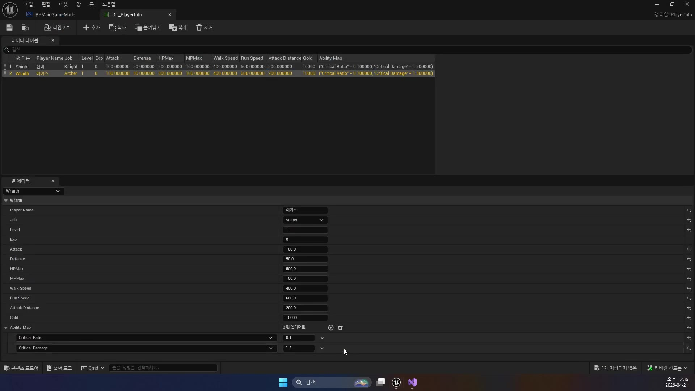

# 중급 1편. AttributeSet과 GameplayEffect 후처리

[이전: 초급 2편](../02_beginner_jump_ability/) | [허브](../) | [다음: 중급 2편](../04_intermediate_initialization_and_granting/)

## 이 편의 목표

이 편에서는 `UGDAttributeSetBase`를 기준으로 GAS의 숫자 저장소와 후처리 구조를 정리한다.
처음 GAS가 어려운 가장 큰 이유 중 하나는 `Health`, `Damage`, `PreAttributeChange`, `PostGameplayEffectExecute`가 각각 어디서 뭘 하는지 헷갈리기 때문이다.

## 봐야 할 파일

- `D:\UnrealProjects\GASDocumentation\Source\GASDocumentation\Public\Characters\Abilities\AttributeSets\GDAttributeSetBase.h`
- `D:\UnrealProjects\GASDocumentation\Source\GASDocumentation\Private\Characters\Abilities\AttributeSets\GDAttributeSetBase.cpp`

## `FGameplayAttributeData`는 왜 쓰나

이 예제는 아래 값들을 전부 `FGameplayAttributeData`로 저장한다.

- `Health`
- `MaxHealth`
- `Mana`
- `MaxMana`
- `Stamina`
- `Armor`
- `Damage`
- `MoveSpeed`

그 이유는 GAS가 이 값을 `Attribute`로 인식해야 하기 때문이다.

장점은 아래와 같다.

- GameplayEffect로 값을 바꿀 수 있다
- 복제와 RepNotify를 붙일 수 있다
- Attribute 변경 delegate를 등록할 수 있다
- `GetHealthAttribute()` 같은 GAS용 핸들을 얻을 수 있다

## `ATTRIBUTE_ACCESSORS` 매크로가 만드는 것

```cpp
#define ATTRIBUTE_ACCESSORS(ClassName, PropertyName) \
    // "이 Attribute 자체"를 가리키는 핸들을 만든다.
    GAMEPLAYATTRIBUTE_PROPERTY_GETTER(ClassName, PropertyName) \
    // 현재 값을 읽는 Getter를 만든다.
    GAMEPLAYATTRIBUTE_VALUE_GETTER(PropertyName) \
    // 값을 직접 바꾸는 Setter를 만든다.
    GAMEPLAYATTRIBUTE_VALUE_SETTER(PropertyName) \
    // 시작값을 넣는 Init 함수를 만든다.
    GAMEPLAYATTRIBUTE_VALUE_INITTER(PropertyName)
```

이 매크로 덕분에 각 Attribute마다 아래 같은 함수가 생긴다.

- `GetHealth()`
- `SetHealth()`
- `InitHealth()`
- `GetHealthAttribute()`

즉 이 매크로는 GAS용 Getter/Setter 묶음을 자동 생성하는 도구다.

## `Damage`는 진짜 체력이 아니다

이 예제에서 가장 중요한 Attribute는 `Damage`다.

```cpp
// 이 값은 진짜 HP가 아니라
// "이번 공격이 얼마였는가"를 잠깐 담는 메타 Attribute다.
UPROPERTY(BlueprintReadOnly, Category = "Damage")
FGameplayAttributeData Damage;
```

이 값은 최종 HP가 아니다.
이번 타격에서 들어온 데미지를 잠깐 담아 두는 메타 Attribute다.

구조를 아주 단순하게 풀면 아래와 같다.

- `Health`
  진짜 체력
- `Damage`
  방금 들어온 피해량 임시 저장값

즉 이 예제는 데미지를 곧바로 HP에 꽂는 구조가 아니라,
먼저 `Damage`에 기록한 뒤 후처리 단계에서 `Health`를 줄인다.

## `PreAttributeChange()`는 바뀌기 직전 보정

이 함수는 값이 바뀌기 전에 실행된다.
예제에서는 아래 두 가지가 핵심이다.

- `MaxHealth`, `MaxMana`, `MaxStamina`가 바뀌면 현재값 비율 유지
- `MoveSpeed`는 `150 ~ 1000` 사이로 clamp

즉 이 함수는 보통 아래 용도로 쓴다.

- 최대값이 바뀔 때 현재값 비율 보정
- 속도나 수치 범위 제한
- 값 변경 직전 사전 조정

## `PostGameplayEffectExecute()`는 적용 후 후처리

이 함수는 Effect가 적용된 뒤 실행된다.
이 예제에서 가장 중요한 분기는 `Damage`가 들어왔을 때다.

큰 흐름은 아래와 같다.

1. `Damage` 값을 읽는다
2. `Damage`를 0으로 비운다
3. `Health - Damage` 계산
4. `Health`를 `0 ~ MaxHealth`로 clamp
5. 피격 방향에 따라 HitReact
6. 공격자에게 데미지 숫자 표시
7. 죽었으면 XP와 Gold 지급

즉 이 함수는 단순 수치 반영뿐 아니라 게임적 후처리까지 맡는다.

## 왜 이 구조가 좋은가

데미지 계산과 체력 감소를 분리하면 장점이 많다.

- 계산 로직과 반영 로직이 분리된다
- 여러 스킬이 같은 피해 파이프라인을 재사용할 수 있다
- 피격 연출, 데미지 숫자, 보상 처리 위치가 통일된다
- 나중에 실드, 저항, 반사 같은 시스템 추가가 쉬워진다

즉 이 구조는 “공격 스킬마다 HP를 직접 깎지 않게 만드는 안전장치” 역할도 한다.

## 복제 처리도 AttributeSet 쪽에서 한다

`GetLifetimeReplicatedProps()`와 여러 `OnRep_...()` 함수가 있는 이유는,
Attribute가 네트워크에서 바뀔 때 GAS 내부 상태와 동기화해야 하기 때문이다.

즉 AttributeSet은 단순 데이터 구조체가 아니라, 복제와 후처리까지 포함한 전용 클래스다.

## 초심자용 코드 읽기

먼저 `PreAttributeChange()`를 보자.

```cpp
void UGDAttributeSetBase::PreAttributeChange(const FGameplayAttribute& Attribute, float& NewValue)
{
    Super::PreAttributeChange(Attribute, NewValue);

    // 최대 체력이 바뀌면 현재 체력도 같은 비율을 유지하도록 같이 조정한다.
    if (Attribute == GetMaxHealthAttribute())
    {
        AdjustAttributeForMaxChange(Health, MaxHealth, NewValue, GetHealthAttribute());
    }
    else if (Attribute == GetMaxManaAttribute())
    {
        AdjustAttributeForMaxChange(Mana, MaxMana, NewValue, GetManaAttribute());
    }
    else if (Attribute == GetMaxStaminaAttribute())
    {
        AdjustAttributeForMaxChange(Stamina, MaxStamina, NewValue, GetStaminaAttribute());
    }
    else if (Attribute == GetMoveSpeedAttribute())
    {
        // 이동속도는 너무 작거나 너무 커지지 않게 범위를 제한한다.
        NewValue = FMath::Clamp<float>(NewValue, 150, 1000);
    }
}
```

이 함수는 “값이 바뀌기 직전”에 부르는 곳이다.
그래서 여기서는 보통 아래 같은 보정을 한다.

- 최대값이 바뀔 때 현재값 비율 유지
- 속도 같은 값 clamp

다음은 가장 중요한 `PostGameplayEffectExecute()`의 핵심 부분이다.

```cpp
if (Data.EvaluatedData.Attribute == GetDamageAttribute())
{
    // 이번 타격량을 로컬 변수에 빼 둔다.
    const float LocalDamageDone = GetDamage();

    // Damage는 메타 Attribute이므로, 읽고 나면 다시 0으로 비운다.
    SetDamage(0.f);

    if (LocalDamageDone > 0.0f)
    {
        bool WasAlive = true;

        if (TargetCharacter)
        {
            WasAlive = TargetCharacter->IsAlive();
        }

        // 이제야 실제 체력을 깎는다.
        const float NewHealth = GetHealth() - LocalDamageDone;
        SetHealth(FMath::Clamp(NewHealth, 0.0f, GetMaxHealth()));

        if (TargetCharacter && WasAlive)
        {
            // 피격 방향에 따라 히트 리액션을 재생한다.
            // 공격자가 자기 자신이 아니면 데미지 숫자도 띄운다.
            // 이번 타격으로 죽었다면 XP/Gold 보상도 준다.
        }
    }
}
```

이 코드가 의미하는 흐름은 아주 중요하다.

1. ExecutionCalculation이 `Damage` 값을 만든다
2. AttributeSet이 그 값을 읽는다
3. 그 다음에야 `Health`를 줄인다
4. 그리고 피격 연출과 보상 처리까지 묶는다

즉 `Damage`는 최종 체력이 아니라 “이번 피해량을 전달하는 임시 통로”다.

## UE20252 대응: 이 프로젝트는 `Damage`보다 스탯 미러링이 먼저 보인다

`UE_Academy_Stduy` 덤프 기준으로 보면, 현재 프로젝트의 `AttributeSet` 축은 아래처럼 잡혀 있다.

강의 화면에서도 `DT_PlayerInfo`가 `Attack`, `Defense`, `HPMax`, `MPMax`, `WalkSpeed`, `RunSpeed`, `AttackDistance`를 한 표에 모아 두고 있다.
그래서 현재 branch가 `GameplayEffect`만 먼저 읽는 구조가 아니라,
`데이터 테이블 원본 -> PlayerState -> AttributeSet` 순서로 스탯을 밀어 넣는 프로젝트라는 점이 더 선명하게 보인다.



- `UBaseAttributeSet`
  `Attack`, `Defense`, `HP`, `HPMax`, `MP`, `MPMax`, `WalkSpeed`, `RunSpeed`, `AttackDistance`, `Gold`
- `UPlayerAttributeSet`
  기본 전투 수치에 더해 플레이어 전용 정보인 `Job`

여기서 시작값은 `GameplayEffect`에서 바로 나오지 않는다.
`AMainPlayerState`가 `PDA_PlayerInfo`를 통해 `DT_PlayerInfo`를 읽고,
`Shinbi`, `Wraith` 행에 들어 있는 스탯을 자기 멤버 값으로 받은 뒤 `UPlayerAttributeSet`에도 다시 넣는다.
즉 현재 구조는 `데이터 테이블 -> PlayerState -> AttributeSet` 미러링이 먼저 보이는 형태다.

`GameplayEffect` 쪽도 `GASDocumentation` 예제와 결이 조금 다르다.
지금 가장 분명한 실전 예시는 `UGameplayEffect_ManaCost`이고,
이 Effect는 `Effect.Mana` 태그를 키로 받는 `SetByCaller` 값을 이용해 `MP`를 즉시 수정한다.

그래서 이 프로젝트를 읽을 때는 아래처럼 정리하면 덜 헷갈린다.

1. 시작 스탯은 `DT_PlayerInfo`에서 온다.
2. 현재 가장 또렷한 `GameplayEffect` 예시는 `MP` 코스트다.
3. `PostGameplayEffectExecute()`는 여전히 후처리 확장 지점이지만,
   지금 단계에서는 `Damage 메타 Attribute`보다 `ManaCost 적용`이 먼저 눈에 띈다.

## 이 편의 핵심 정리

이 편에서 꼭 기억할 문장은 하나다.

`Damage는 메타 Attribute이고, 실제 체력 감소는 PostGameplayEffectExecute에서 처리한다.`

이걸 이해하면 이후 `ExecutionCalculation`, `SetByCaller`, `DamageGameplayEffect`가 훨씬 덜 헷갈린다.

## 공식 문서 연결

- [Understanding the Unreal Engine Gameplay Ability System](https://dev.epicgames.com/documentation/en-us/unreal-engine/understanding-the-unreal-engine-gameplay-ability-system)
  Epic은 Attribute Set이 Gameplay Attributes를 담고, Gameplay Effects가 그 값을 바꾸며, Effect Calculations가 재사용 가능한 계산 로직을 제공한다고 설명한다.

- [Gameplay Attributes and Gameplay Effects (UE 4.27)](https://dev.epicgames.com/documentation/en-us/unreal-engine/gameplay-attributes-and-gameplay-effects?application_version=4.27)
  이 문서는 버전은 오래됐지만, `Attribute는 수치 상태`, `AttributeSet은 그 수치의 집합`, `GameplayEffect는 그 값을 일시적 또는 영구적으로 변경한다`는 핵심 개념을 아주 선명하게 설명한다. 또한 Attribute Set은 네이티브 코드에서 만들고 ASC에 등록해야 한다는 점도 확인할 수 있다.

- [Unreal Engine 5.6 Release Notes](https://dev.epicgames.com/documentation/en-us/unreal-engine/unreal-engine-5-6-release-notes)
  5.6 릴리스 노트에는 GAS의 `ATTRIBUTE_ACCESSORS` 계열 개선과 Attribute/Effect 관련 변경 사항이 기록되어 있다. 즉 예제와 최신 엔진 문서의 표현이 조금 다른 이유를 버전 차이로 이해할 수 있다.

## 다음 편

[중급 2편. 초기화와 Ability 지급](../04_intermediate_initialization_and_granting/)
