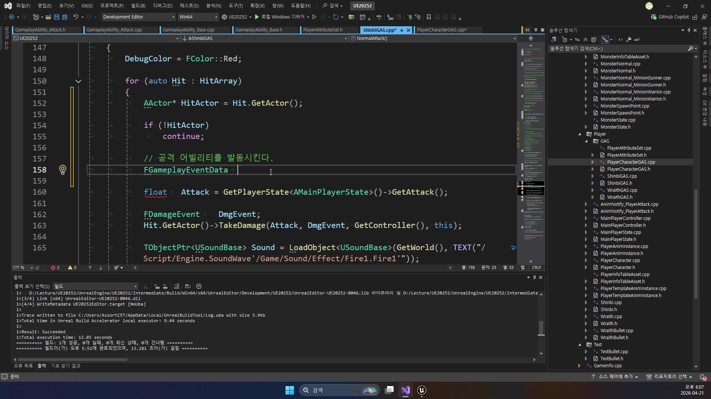
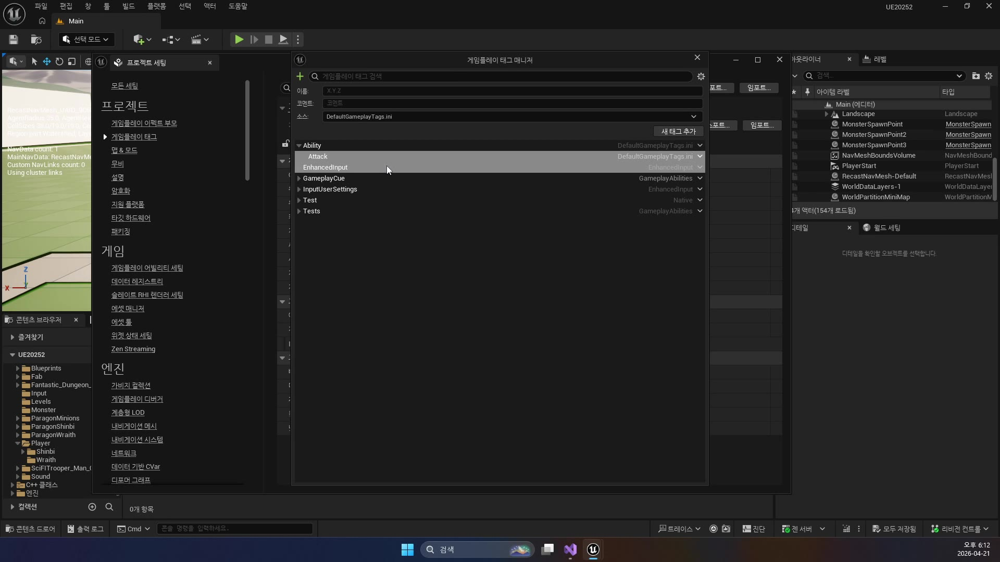

# 고급 1편. FireGun과 데미지 파이프라인

[이전: 중급 2편](../04_intermediate_initialization_and_granting/) | [허브](../) | [다음: 고급 2편](../06_advanced_playerstate_and_multiplayer/)

## 이 편의 목표

이 편에서는 실전 공격 Ability가 어떻게 동작하는지 본다.
핵심은 `UGDGA_FireGun` 하나가 모든 걸 직접 하지 않는다는 점이다.

즉 아래 책임이 분리된다.

- Ability
  발동 절차
- GameplayEffectSpec
  데미지 데이터 전달
- ExecutionCalculation
  실제 계산
- AttributeSet
  최종 반영과 후처리

## 봐야 할 파일

- `D:\UnrealProjects\GASDocumentation\Source\GASDocumentation\Private\Characters\Heroes\Abilities\GDGA_FireGun.cpp`
- `D:\UnrealProjects\GASDocumentation\Source\GASDocumentation\Private\Characters\Abilities\GDDamageExecCalculation.cpp`
- `D:\UnrealProjects\GASDocumentation\Source\GASDocumentation\Private\Characters\Abilities\AttributeSets\GDAttributeSetBase.cpp`

## 전체 흐름 한 줄

`FireGun ActivateAbility -> CommitAbility -> 몽타주 재생 -> 발사 이벤트 수신 -> DamageGameplayEffectSpec 생성 -> SetByCaller(Data.Damage) -> ExecutionCalculation -> Damage 메타 Attribute -> PostGameplayEffectExecute -> Health 감소`

## `UGDGA_FireGun`은 왜 `InstancedPerActor`인가

점프와 달리 총쏘기는 아래 요소를 가진다.

- 몽타주 재생
- AbilityTask 사용
- 이벤트 수신
- 발사 타이밍 관리

즉 실행 중에 관리할 상태가 더 많다.
그래서 `NonInstanced`보다 `InstancedPerActor`가 자연스럽다.

## `ActivateAbility()`는 바로 쏘지 않는다

`FireGun`의 핵심은 `CommitAbility()` 뒤에 곧바로 투사체를 만들지 않는다는 점이다.
먼저 몽타주를 재생하고, 그 안에서 특정 이벤트가 왔을 때 실제 발사를 한다.

```cpp
// "총쏘기 몽타주 재생 + 이벤트 대기"용 AbilityTask를 만든다.
UGDAT_PlayMontageAndWaitForEvent* Task =
    UGDAT_PlayMontageAndWaitForEvent::PlayMontageAndWaitForEvent(...);

// 몽타주가 끝나면 Ability도 끝낼 수 있게 델리게이트를 연결한다.
Task->OnCompleted.AddDynamic(this, &UGDGA_FireGun::OnCompleted);

// 애니메이션 이벤트가 오면 EventReceived()에서 처리한다.
Task->EventReceived.AddDynamic(this, &UGDGA_FireGun::EventReceived);

// AbilityTask를 실제로 시작한다.
Task->ReadyForActivation();
```

이 구조의 장점은 아래와 같다.

- 애니메이션 타이밍과 코드 발사가 맞는다
- Ability가 너무 많은 일을 한 번에 하지 않는다
- `발동`과 `결과`를 분리하기 쉽다

## `EventReceived()`에서 실제 발사

실제 발사는 `EventReceived()`에서 한다.
이 함수는 애님 이벤트를 받고, 서버에서만 투사체를 생성한다.

핵심 코드는 아래다.

```cpp
// 데미지용 GameplayEffect Spec을 만든다.
FGameplayEffectSpecHandle DamageEffectSpecHandle =
    MakeOutgoingGameplayEffectSpec(DamageGameplayEffect, GetAbilityLevel());

// "이번 공격 데미지 값"을 SetByCaller로 런타임에 넣는다.
DamageEffectSpecHandle.Data.Get()->SetSetByCallerMagnitude(
    FGameplayTag::RequestGameplayTag(FName("Data.Damage")), Damage);
```

여기서 중요한 것은 `SetByCaller`다.
즉 Ability가 “이번 발사는 데미지 12” 같은 런타임 값을 Spec에 넣어 둔다.

이 값은 나중에 `ExecutionCalculation`이 읽어 간다.

## `UGDDamageExecCalculation`은 계산 전담이다

이 클래스는 아래 값을 가져와서 최종 피해를 계산한다.

- Target의 `Armor`
- Spec의 `Data.Damage`

예제 계산식은 단순하다.

```cpp
// 방어력이 높을수록 최종 피해가 줄어드는 공식이다.
float MitigatedDamage = (UnmitigatedDamage) * (100 / (100 + Armor));
```

그리고 이 값으로 바로 `Health`를 깎지 않는다.
대신 `Damage` 메타 Attribute에 결과를 적는다.

```cpp
// 계산된 최종 피해를 HP에 바로 꽂지 않고,
// Damage 메타 Attribute에 먼저 적어 둔다.
OutExecutionOutput.AddOutputModifier(
    FGameplayModifierEvaluatedData(
        DamageStatics().DamageProperty,
        EGameplayModOp::Additive,
        MitigatedDamage));
```

즉 이 클래스의 역할은 딱 하나다.

`최종 피해량 계산`

## HP 감소는 어디서 하나

실제 HP 감소는 `UGDAttributeSetBase::PostGameplayEffectExecute()`에서 한다.
즉 구조는 아래처럼 나뉜다.

- `FireGun`
  발동 절차
- `DamageEffectSpec`
  이번 공격 데이터
- `GDDamageExecCalculation`
  계산
- `GDAttributeSetBase`
  Health 감소, 피격 연출, 보상 처리

이 구조가 GAS의 장점을 가장 잘 보여 준다.

`공격 스킬 클래스 하나에 입력, 발동, 계산, HP 감소, 보상 지급까지 전부 우겨넣지 않는다`

## 왜 이 파이프라인이 중요한가

이 구조가 있으면 다음 확장이 쉬워진다.

- 방어력 공식 변경
- 크리티컬 추가
- 속성 저항 추가
- 상태이상 연계 추가
- 피해 숫자 표시 통일
- 사망 보상 처리 통일

즉 FireGun은 단순 총쏘기 예제가 아니라, GAS다운 공격 구조 예제다.

## 초심자용 코드 읽기

먼저 `UGDGA_FireGun::ActivateAbility()`의 핵심을 보자.

```cpp
void UGDGA_FireGun::ActivateAbility(...)
{
    // 코스트와 쿨다운을 확정한다.
    if (!CommitAbility(Handle, ActorInfo, ActivationInfo))
    {
        EndAbility(CurrentSpecHandle, CurrentActorInfo, CurrentActivationInfo, true, true);
    }

    UAnimMontage* MontageToPlay = FireHipMontage;

    // 조준 상태면 다른 몽타주를 고른다.
    if (GetAbilitySystemComponentFromActorInfo()->HasMatchingGameplayTag(
            FGameplayTag::RequestGameplayTag(FName("State.AimDownSights"))) &&
        !GetAbilitySystemComponentFromActorInfo()->HasMatchingGameplayTag(
            FGameplayTag::RequestGameplayTag(FName("State.AimDownSights.Removal"))))
    {
        MontageToPlay = FireIronsightsMontage;
    }

    // 총쏘기 애니메이션을 재생하고,
    // 애님 이벤트가 올 때까지 기다리는 AbilityTask를 만든다.
    UGDAT_PlayMontageAndWaitForEvent* Task =
        UGDAT_PlayMontageAndWaitForEvent::PlayMontageAndWaitForEvent(...);

    Task->OnCompleted.AddDynamic(this, &UGDGA_FireGun::OnCompleted);
    Task->OnCancelled.AddDynamic(this, &UGDGA_FireGun::OnCancelled);
    Task->EventReceived.AddDynamic(this, &UGDGA_FireGun::EventReceived);
    Task->ReadyForActivation();
}
```

이 Ability는 발동하자마자 총알을 만드는 게 아니다.
먼저 몽타주를 재생하고, 애님에서 `지금 발사해`라는 이벤트가 올 때까지 기다린다.

실제 발사는 `EventReceived()`에서 일어난다.

```cpp
if (GetOwningActorFromActorInfo()->GetLocalRole() == ROLE_Authority &&
    EventTag == FGameplayTag::RequestGameplayTag(FName("Event.Montage.SpawnProjectile")))
{
    AGDHeroCharacter* Hero = Cast<AGDHeroCharacter>(GetAvatarActorFromActorInfo());

    FVector Start = Hero->GetGunComponent()->GetSocketLocation(FName("Muzzle"));
    FVector End = Hero->GetCameraBoom()->GetComponentLocation() +
        Hero->GetFollowCamera()->GetForwardVector() * Range;
    FRotator Rotation = UKismetMathLibrary::FindLookAtRotation(Start, End);

    // 이번 공격에 쓸 Damage Effect Spec을 만든다.
    FGameplayEffectSpecHandle DamageEffectSpecHandle =
        MakeOutgoingGameplayEffectSpec(DamageGameplayEffect, GetAbilityLevel());

    // "이번 발사 데미지는 12" 같은 런타임 값을 SetByCaller로 넣는다.
    DamageEffectSpecHandle.Data.Get()->SetSetByCallerMagnitude(
        FGameplayTag::RequestGameplayTag(FName("Data.Damage")),
        Damage);

    // 투사체에 이 DamageEffectSpec을 실어 보낸다.
    AGDProjectile* Projectile = GetWorld()->SpawnActorDeferred<AGDProjectile>(...);
    Projectile->DamageEffectSpecHandle = DamageEffectSpecHandle;
    Projectile->Range = Range;
    Projectile->FinishSpawning(MuzzleTransform);
}
```

여기서 중요한 건 `SetByCallerMagnitude()`다.
Ability는 HP를 직접 깎지 않고, “이번 공격의 피해량 데이터”를 EffectSpec에 넣어 둔다.

그 다음 계산은 `UGDDamageExecCalculation`이 맡는다.

```cpp
void UGDDamageExecCalculation::Execute_Implementation(...)
{
    float Armor = 0.0f;
    ExecutionParams.AttemptCalculateCapturedAttributeMagnitude(
        DamageStatics().ArmorDef, EvaluationParameters, Armor);

    float Damage = 0.0f;
    ExecutionParams.AttemptCalculateCapturedAttributeMagnitude(
        DamageStatics().DamageDef, EvaluationParameters, Damage);

    // Ability가 SetByCaller로 넣어 둔 값을 읽는다.
    Damage += FMath::Max<float>(
        Spec.GetSetByCallerMagnitude(FGameplayTag::RequestGameplayTag(FName("Data.Damage")), false, -1.0f),
        0.0f);

    float UnmitigatedDamage = Damage;
    float MitigatedDamage = (UnmitigatedDamage) * (100 / (100 + Armor));

    if (MitigatedDamage > 0.f)
    {
        // HP를 직접 깎지 않고 Damage 메타 Attribute에 적는다.
        OutExecutionOutput.AddOutputModifier(
            FGameplayModifierEvaluatedData(
                DamageStatics().DamageProperty,
                EGameplayModOp::Additive,
                MitigatedDamage));
    }
}
```

즉 전체 흐름은 아래다.

1. `FireGun Ability`
   발동 절차 담당
2. `DamageEffectSpec`
   이번 공격 데이터 전달
3. `DamageExecCalculation`
   방어력까지 반영해 최종 피해 계산
4. `AttributeSet`
   실제 HP 감소와 후처리 담당

## UE20252 대응: `ShinbiGAS`는 이벤트 기반으로 Attack Ability를 깨운다

`GASDocumentation`의 `FireGun`은 `AbilityTask`, `ExecutionCalculation`, `Damage 메타 Attribute`까지 포함한 정석형 공격 파이프라인이다.
반면 `UE_Academy_Stduy`의 현재 공격 흐름은 더 짧고, 대신 프로젝트에 맞는 연결 지점이 선명하다.

핵심 흐름은 아래다.

1. `ShinbiGAS::InputAttack()`
   애님 인스턴스에 공격 재생을 요청한다.
2. `ShinbiGAS::NormalAttack()`
   캡슐 스윕으로 실제 타격 대상을 찾는다.
3. `FGameplayEventData`
   `Ability.Attack` 태그와 `FGameplayAbilityTargetData_SingleTargetHit`를 담아 만든다.
4. `SendGameplayEventToActor()`
   이벤트로 `UGameplayAbility_Attack`를 깨운다.
5. `UGameplayAbility_Base`
   `UGameplayEffect_ManaCost` 스펙을 만들고 `SetByCaller(Effect.Mana)`로 `MP` 코스트를 적용한다.

강의 후반 코드 화면에서는 `ShinbiGAS`가 `FGameplayEventData`를 만들면서
"공격 Ability를 깨우는 이벤트 묶음"을 구성하는 장면이 그대로 보인다.



즉 `UE20252`에서는 아직 `FireGun`처럼 큰 계산 파이프라인이 완성된 상태는 아니다.
대신 아래 두 축이 먼저 잡혀 있다.

- 공격 판정 전달
  `Sweep -> GameplayEvent -> TargetData`
- 코스트 적용
  `MakeOutgoingGameplayEffectSpec -> SetByCaller -> ApplyGameplayEffectSpecToSelf`

또 프로젝트 세팅의 태그 관리자에서 `Ability.Attack`를 따로 등록하는 화면도 확인된다.
이 태그가 있어야 `SendGameplayEventToActor()`와 `UGameplayAbility_Attack`가 같은 이름으로 만나게 된다.



나중에 이 프로젝트에 실제 데미지 계산을 더 붙인다면,
`UGDGA_FireGun`의 `ExecutionCalculation` 자리에 해당하는 부분을 새로 넣고
최종 반영은 `AttributeSet::PostGameplayEffectExecute()` 쪽으로 모으는 식으로 확장하게 된다.

## 이 편의 핵심 정리

`Ability는 발동 절차를 맡고, ExecutionCalculation은 계산을 맡고, AttributeSet은 최종 반영과 후처리를 맡는다.`

이 문장을 이해하면 복잡한 공격 스킬도 훨씬 덜 무겁게 느껴진다.

## 공식 문서 연결

- [Using Gameplay Abilities in Unreal Engine](https://dev.epicgames.com/documentation/en-us/unreal-engine/using-gameplay-abilities-in-unreal-engine)
  Epic 문서는 Ability가 애니메이션, 입력, 비용, 쿨다운, 비동기 실행을 조율할 수 있다고 설명한다. `FireGun`의 몽타주 재생과 발사 이벤트 대기는 이 설명과 정확히 맞아떨어진다.

- [UAbilityTask API Reference](https://dev.epicgames.com/documentation/en-us/unreal-engine/API/Plugins/GameplayAbilities/UAbilityTask)
  공식 API 문서를 보면 AbilityTask는 Ability 내부의 비동기 작업을 담당하는 전용 도구다. `UGDAT_PlayMontageAndWaitForEvent`는 이 개념을 실전적으로 보여 주는 예다.

- [Understanding the Unreal Engine Gameplay Ability System](https://dev.epicgames.com/documentation/en-us/unreal-engine/understanding-the-unreal-engine-gameplay-ability-system)
  이 문서는 Gameplay Effect Calculations가 재사용 가능한 계산 조각이라고 설명한다. `UGDDamageExecCalculation`이 바로 그 역할을 수행한다.

## 다음 편

[고급 2편. PlayerState, Owner/Avatar, 멀티플레이 구조](../06_advanced_playerstate_and_multiplayer/)
