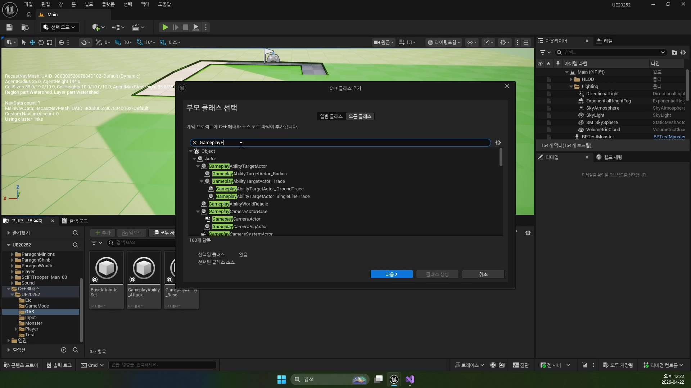
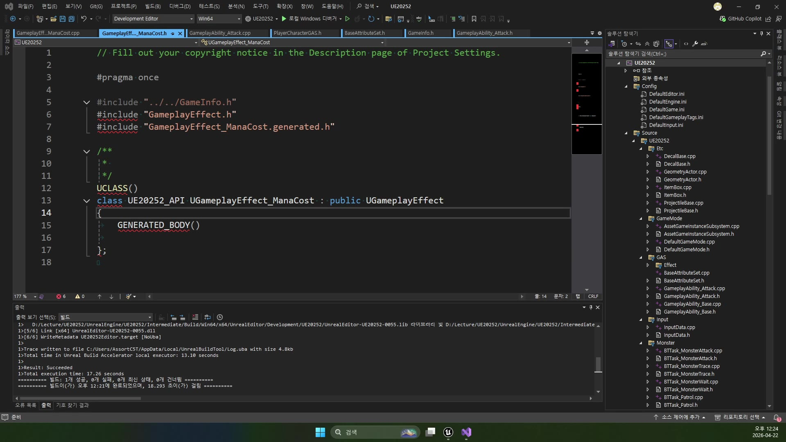

# 중급 1편. ManaCost GameplayEffect와 SetByCaller

[이전: 초급 1편](../01_beginner_event_to_asc_and_attribute/) | [허브](../) | [다음: 중급 2편](../03_intermediate_spec_apply_and_post_execute/)

## 이 편의 목표

이 편에서는 `UGameplayEffect_ManaCost` 생성자 하나를 기준으로, 마나 소모를 왜 직접 `SetMP()` 하지 않고 `GameplayEffect`로 만드는지 정리한다.
핵심은 `SetByCaller`가 “런타임마다 달라지는 비용”을 안전하게 실어 나르는 방식이라는 점이다.

처음 읽을 때는 아래처럼만 번역해도 충분하다.

- `GameplayEffect`
  규칙 카드
- `Modifier`
  무엇을 어떻게 바꿀지 적는 칸
- `SetByCaller`
  실행할 때 나중에 값을 꽂는 입력칸

## 봐야 할 파일

- `D:\UnrealProjects\UE_Academy_Stduy\Source\UE20252\GAS\Effect\GameplayEffect_ManaCost.h`
- `D:\UnrealProjects\UE_Academy_Stduy\Source\UE20252\GAS\Effect\GameplayEffect_ManaCost.cpp`
- `D:\UnrealProjects\UE_Academy_Stduy\Source\UE20252\GAS\BaseAttributeSet.h`

강의 화면에서는 먼저 새 C++ 클래스 추가 창에서 `GameplayEffect` 계열 부모를 검색해, 마나 비용 규칙을 별도 클래스로 분리할 준비를 한다.



## 왜 마나 소모를 `GameplayEffect`로 분리하나

이 강의의 중심 메시지는 단순하다.

`Ability가 직접 Attribute를 바꾸지 말고, Effect를 만들어 실행하자`

이렇게 분리하면 장점이 생긴다.

- 비용 처리 규칙이 Ability 밖으로 빠진다
- 여러 Ability가 같은 비용 Effect를 재사용할 수 있다
- 나중에 태그, 지속시간, 쿨다운 같은 규칙을 같은 방식으로 붙이기 쉽다
- `PostGameplayEffectExecute()` 같은 후처리 지점과도 자연스럽게 연결된다

즉 `GameplayEffect_ManaCost`는 단순 마나 감소 클래스가 아니라, “비용 규칙을 별도 객체로 분리한다”는 선언이다.

그리고 생성 직후 헤더에서 `UGameplayEffect_ManaCost` 틀을 먼저 세워 둔 다음, 생성자에서 `DurationPolicy`, `Modifier`, `SetByCaller`를 채워 넣는 흐름으로 강의가 이어진다.



## `DurationPolicy = Instant`는 왜 중요하나

생성자 첫 줄에서 가장 먼저 눈에 띄는 건 아래다.

```cpp
// 이 Effect는 한 번 적용되고 바로 끝나는 즉발형 규칙이다.
DurationPolicy = EGameplayEffectDurationType::Instant;
```

이 값은 Effect가 얼마나 오래 지속될지를 정한다.

- `Instant`
  즉시 적용하고 끝
- `HasDuration`
  일정 시간 유지
- `Infinite`
  별도 제거 전까지 유지

마나 소모는 “한 번 깎이고 끝나는” 효과라서 `Instant`가 맞다.
즉 이 강의는 지속형 버프가 아니라, 즉발형 비용 처리에 `GameplayEffect`를 쓰는 기본 형태를 보여 준다.

## `FGameplayModifierInfo`는 “무엇을 어떻게 바꿀지”를 담는 구조체다

다음 핵심은 `Modifier`다.

```cpp
// 어떤 Attribute를 바꿀지 적는 Modifier 칸을 하나 만든다.
FGameplayModifierInfo Modifier;
// 이번 규칙의 대상은 MP다.
Modifier.Attribute = UBaseAttributeSet::GetMPAttribute();
// 더하기 규칙을 쓴다. 나중에 음수를 넣으면 실제로는 감소가 된다.
Modifier.ModifierOp = EGameplayModOp::Additive;
```

여기서 읽어야 할 것은 두 가지다.

- `Modifier.Attribute`
  어느 Attribute를 바꿀 것인가
- `Modifier.ModifierOp`
  어떤 방식으로 바꿀 것인가

즉 이 코드는 아래 의미다.

`MP를 대상으로, Additive 방식으로 값을 더한다`

여기서 “더한다”는 말이 조금 헷갈릴 수 있는데, 나중에 음수 값을 넣으면 결과적으로 감소가 된다.

## 왜 `GetMPAttribute()`를 쓰나

`UBaseAttributeSet`에는 `MP`가 `FGameplayAttributeData`로 들어 있고, `ATTRIBUTE_ACCESSORS` 매크로 덕분에 `GetMPAttribute()` 같은 함수가 생긴다.

이 함수는 현재 수치 자체가 아니라, `MP라는 GAS Attribute를 가리키는 핸들`을 준다.

즉 아래 구분이 중요하다.

- `GetMP()`
  지금 MP 값 읽기
- `GetMPAttribute()`
  “MP라는 Attribute를 바꾸겠다”라고 GAS에 알려 주는 핸들

`Modifier.Attribute`에는 당연히 두 번째가 들어가야 한다.

## `SetByCaller`가 필요한 이유

강의에서 가장 중요한 포인트는 바로 여기다.

```cpp
// 실행 시점에 값을 받을 입력칸 이름을 정한다.
FSetByCallerFloat Caller;
Caller.DataTag = FGameplayTag::RequestGameplayTag(TEXT("Effect.Mana"));

// ModifierMagnitude가 고정값이 아니라, 위 입력칸 값을 읽게 만든다.
Modifier.ModifierMagnitude = FGameplayEffectModifierMagnitude(Caller);
```

만약 모든 스킬의 마나 비용이 항상 같다면, 그냥 고정 숫자를 넣어도 된다.
하지만 실제 게임에서는 스킬마다 마나 비용이 다르다.

- 기본 공격은 0 또는 아주 적음
- 스킬1은 20
- 스킬2는 35
- 궁극기는 100

이걸 전부 별도 GameplayEffect 클래스로 만들면 재사용성이 떨어진다.
그래서 Effect는 “이 값을 어디서 받아올지”만 정의해 두고, 실제 숫자는 Ability가 실행될 때 넣도록 만든다.

그 통로가 `SetByCaller`다.

즉 `Effect.Mana` 태그는 아래 뜻이다.

`이 Effect는 실행 시점에 Effect.Mana라는 이름으로 숫자를 받아 쓸 것이다`

## `Effect.Mana` 태그는 비용 데이터의 슬롯 이름이다

`RequestGameplayTag(TEXT("Effect.Mana"))`는 단순 문자열이 아니라, “마나 비용을 넣을 슬롯 이름”이라고 생각하면 이해가 쉽다.

즉 이 구조는 아래처럼 읽으면 된다.

1. GameplayEffect는 `Effect.Mana`라는 입력칸을 하나 만든다
2. Ability는 실행 시점에 그 칸에 `-mMana`를 넣는다
3. Effect는 그 값을 MP에 Additive로 적용한다

이렇게 보면 `SetByCaller`는 변수 전달, `Modifier`는 적용 규칙이라고 분리해서 읽을 수 있다.

## 마지막 `Modifiers.Add(Modifier)`가 의미하는 것

생성자 마지막 줄은 아주 짧다.

```cpp
// 지금까지 만든 규칙을 실제 Effect의 Modifier 목록에 등록한다.
Modifiers.Add(Modifier);
```

하지만 이 줄이 중요한 이유는, 지금까지 만든 규칙을 실제 `UGameplayEffect`의 Modifier 배열에 등록하는 순간이기 때문이다.

즉 `DurationPolicy`, `Attribute`, `ModifierOp`, `ModifierMagnitude`를 전부 세팅했더라도, 배열에 안 넣으면 Effect 정의는 완성되지 않는다.

이 강의의 `GameplayEffect_ManaCost`는 결국 아래 정의를 가진 셈이다.

- 즉발형 Effect다
- MP를 바꾼다
- Additive 방식이다
- 값은 `Effect.Mana`라는 SetByCaller 입력으로 받는다

## 이 편의 핵심 정리

이 편에서 꼭 기억할 문장은 아래다.

`GameplayEffect는 규칙을 들고 있고, SetByCaller는 실행 시점의 숫자를 들고 온다.`

즉 `UGameplayEffect_ManaCost`는 마나를 “직접 깎는 함수”가 아니라,
`MP를 Additive로 바꾸되, 실제 수치는 Effect.Mana로 받겠다`라고 선언한 규칙 객체다.

## 다음 편

[중급 2편. Spec 적용과 PostGameplayEffectExecute](../03_intermediate_spec_apply_and_post_execute/)
