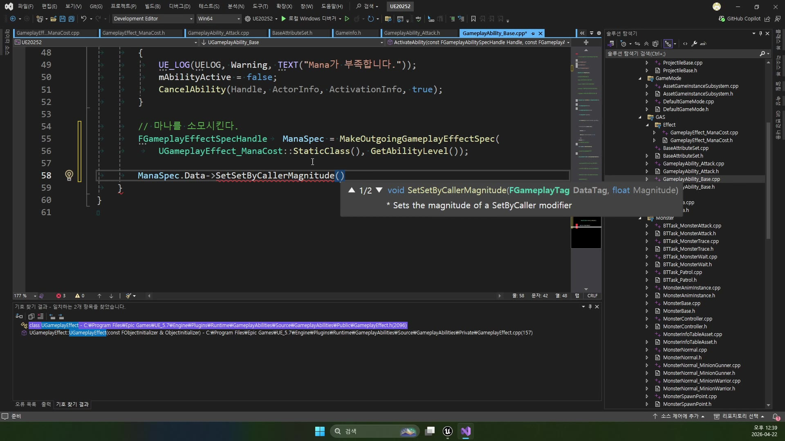

# 중급 2편. Spec 적용과 PostGameplayEffectExecute

[이전: 중급 1편](../02_intermediate_manacost_effect_and_setbycaller/) | [허브](../) | [다음: 고급 1편](../04_advanced_targetdata_and_damage_preview/)

## 이 편의 목표

이 편에서는 `UGameplayAbility_Base::ActivateAbility()` 안에서 실제 마나 비용이 어떻게 적용되는지 정리한다.
핵심은 `GameplayEffect 클래스`와 `실행용 Spec`, 그리고 `AttributeSet 후처리 지점`을 구분해서 읽는 것이다.

처음엔 아래 세 단어만 구분해도 된다.

- `GameplayEffect`
  규칙 원본
- `Spec`
  이번 시전에만 쓰는 실행용 복사본
- `PostGameplayEffectExecute`
  값이 바뀐 뒤 반응을 모아 두는 자리

## 봐야 할 파일

- `D:\UnrealProjects\UE_Academy_Stduy\Source\UE20252\GAS\GameplayAbility_Base.h`
- `D:\UnrealProjects\UE_Academy_Stduy\Source\UE20252\GAS\GameplayAbility_Base.cpp`
- `D:\UnrealProjects\UE_Academy_Stduy\Source\UE20252\GAS\BaseAttributeSet.cpp`

## 먼저 마나 부족부터 막는다

`UGameplayAbility_Base`는 모든 공격/스킬 Ability의 공통 부모 역할을 한다.
그래서 먼저 `mMana`와 현재 MP를 비교해, 비용이 부족하면 Ability를 중단한다.

```cpp
// 이 Ability에 마나 비용이 있는지 먼저 본다.
if (mMana > 0.f)
{
    // 현재 MP가 필요한 비용보다 부족하면
    if (SourceAttr && SourceAttr->GetMP() < mMana)
    {
        // Ability를 더 진행하지 않고 바로 취소한다.
        UE_LOG(UELOG, Warning, TEXT("Mana가 부족합니다."));
        mAbilityActive = false;
        CancelAbility(Handle, ActorInfo, ActivationInfo, true);
        return;
    }
}
```

이 분기의 의미는 아래와 같다.

- `mMana`
  이 Ability가 요구하는 비용
- `SourceAttr->GetMP()`
  현재 캐릭터가 가진 MP
- 비용 부족 시
  Effect를 만들기 전에 바로 취소

즉 비용이 없으면 애초에 발동 단계에서 막고, 비용이 충분할 때만 Effect를 만든다.

## `GameplayEffect`와 `GameplayEffectSpec`은 다르다

이 강의에서 가장 헷갈리기 쉬운 부분이 바로 이 구분이다.

```cpp
// ManaCost 규칙 원본으로부터, 이번 시전에만 쓸 실행용 Spec을 만든다.
FGameplayEffectSpecHandle ManaSpec = MakeOutgoingGameplayEffectSpec(
    UGameplayEffect_ManaCost::StaticClass(), GetAbilityLevel());
```

여기서

- `UGameplayEffect_ManaCost`
  클래스 정의, 즉 규칙 원본
- `FGameplayEffectSpecHandle ManaSpec`
  이번 실행에 사용할 인스턴스형 데이터 핸들

이라고 이해하면 된다.

비유하면 아래와 같다.

- `GameplayEffect 클래스`
  설계도
- `GameplayEffectSpec`
  이번 시전에서 사용할 실제 복사본

즉 Ability는 설계도를 직접 수정하지 않고, 매번 실행용 Spec을 만들어 거기에 값을 넣는다.

## `SetSetByCallerMagnitude()`에서 이번 시전 값이 들어간다

`SetByCaller`를 실제로 채우는 지점은 여기다.

```cpp
// "Effect.Mana" 입력칸에 이번 시전 비용을 넣는다.
// 음수값을 넣는 이유는 Additive 규칙으로 MP를 줄이기 위해서다.
ManaSpec.Data->SetSetByCallerMagnitude(
    FGameplayTag::RequestGameplayTag(TEXT("Effect.Mana")),
    -mMana);
```

중요한 건 두 가지다.

- 태그 이름은 `GameplayEffect_ManaCost`에서 정의한 것과 같아야 한다
- 값은 `-mMana`처럼 음수로 넣어야 Additive 연산에서 감소가 된다

즉 이전 문서의 Effect는 “Effect.Mana라는 입력칸이 있다”고만 정해 두었고,
이 코드가 그 칸에 실제 숫자를 넣는 순간이다.

강의 화면에서도 이 부분이 핵심 장면으로 잡힌다.
`ManaSpec.Data`에 `Effect.Mana`와 `-mMana`를 넣는 순간, 앞 편에서 만든 규칙 객체가 이번 시전용 데이터로 구체화된다.



## 왜 `-mMana`인가

Effect 쪽 연산은 `Additive`였다.
즉 결국은 “더하기”다.

그래서 아래처럼 해석된다.

- `+10`
  MP 증가
- `-10`
  MP 감소

즉 이 프로젝트는 “빼기 전용 연산”을 따로 두지 않고, `Additive + 음수값`으로 비용을 처리한다.
실전에서 매우 자주 보이는 패턴이다.

## `ApplyGameplayEffectSpecToSelf()`는 자기 자신에게 비용을 적용한다

값을 다 채웠으면 마지막으로 실행한다.

```cpp
// 방금 채운 ManaSpec을 사용자 자신의 ASC에 적용한다.
SourceASC->ApplyGameplayEffectSpecToSelf(*ManaSpec.Data);
```

이 줄은 아래 의미다.

- `SourceASC`
  이 Ability를 쓰는 주체의 ASC
- `ManaSpec.Data`
  이번 실행용 EffectSpec
- `ToSelf`
  대상은 자기 자신

즉 공격 Ability가 적을 때리는 것과는 별개로, 비용 Effect는 먼저 자기 자신에게 적용되는 구조다.

이 강의가 실전적인 이유가 바로 여기 있다.

- 공격 대상에게 갈 데미지 Effect
- 사용자 자신에게 갈 ManaCost Effect

를 따로 생각하기 시작하기 때문이다.

## `SpecHandle`, `Spec`, `Data`를 어떻게 읽어야 하나

강의 중간에 이 부분이 많이 헷갈리는데, 아래처럼 읽으면 정리가 쉽다.

- `FGameplayEffectSpecHandle`
  안전하게 들고 다니는 핸들 래퍼
- `ManaSpec.Data`
  실제 `FGameplayEffectSpec`를 가리키는 포인터
- `*ManaSpec.Data`
  실제 Spec 본체를 넘길 때 쓰는 역참조

즉 코드가 길어 보여도 본질은 간단하다.

1. SpecHandle 만든다
2. 그 안의 Data를 꺼내 SetByCaller를 채운다
3. 그 Spec을 ASC에 적용한다

## `PostGameplayEffectExecute()`는 “적용 후” 후처리 자리다

이제 비용 Effect가 적용되면, 다음으로 중요한 지점이 `UBaseAttributeSet::PostGameplayEffectExecute()`다.

```cpp
void UBaseAttributeSet::PostGameplayEffectExecute(
    const FGameplayEffectModCallbackData& Data)
{
    // 방금 바뀐 값이 MP라면, 여기서 MP 후처리를 넣을 수 있다.
    if (Data.EvaluatedData.Attribute == GetMPAttribute())
    {
    }

    // 방금 바뀐 값이 HP라면, 여기서 HP 후처리를 넣을 수 있다.
    else if (Data.EvaluatedData.Attribute == GetHPAttribute())
    {
    }
}
```

현재 구현은 비어 있지만, 의미는 매우 명확하다.

- 방금 바뀐 Attribute가 MP인지 확인할 수 있다
- HP인지 확인할 수도 있다
- 이후 clamp, 로그, 사망 처리, UI 갱신 같은 후처리를 넣을 수 있다

즉 이 함수는 “Effect가 적용된 뒤 어떤 반응을 할지”를 모으는 장소다.

## 지금 구현에서 비어 있는 이유도 오히려 중요하다

많은 초보자가 이 코드를 보고 “아직 아무것도 안 하네”라고 생각하기 쉽다.
하지만 오히려 이 빈 칸이 설계 의도를 보여 준다.

이미 구조는 잡혀 있다.

- 비용은 Effect로 적용한다
- 변경된 결과는 AttributeSet이 받는다
- 구체 후처리는 다음 단계에서 채운다

즉 `260422`는 완성형 데미지 시스템 강의가 아니라, 그 구조를 우리 프로젝트 안에 먼저 심는 날이다.

## 이 편의 핵심 정리

이 편에서 꼭 기억할 흐름은 아래다.

1. `MakeOutgoingGameplayEffectSpec()`로 실행용 Spec을 만든다
2. `SetSetByCallerMagnitude()`로 이번 시전 값을 넣는다
3. `ApplyGameplayEffectSpecToSelf()`로 자기 자신에게 적용한다
4. 적용 후 반응은 `PostGameplayEffectExecute()`가 받을 준비를 한다

즉 아래 한 문장으로 정리할 수 있다.

`GameplayEffect는 규칙이고, Spec은 이번 실행 데이터이며, AttributeSet은 적용 이후 후처리 지점이다.`

## 다음 편

[고급 1편. TargetData와 다음 데미지 이펙트 예고](../04_advanced_targetdata_and_damage_preview/)
