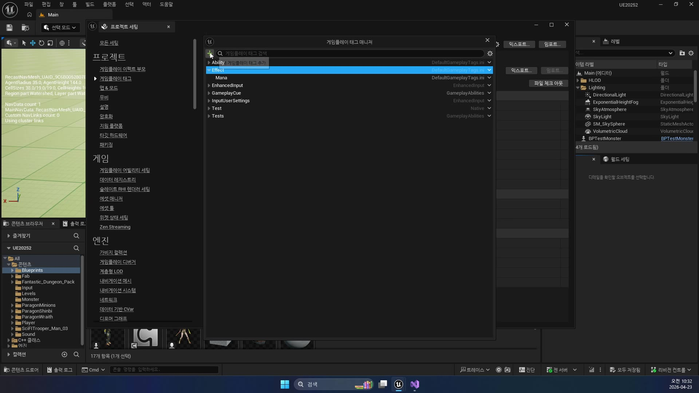
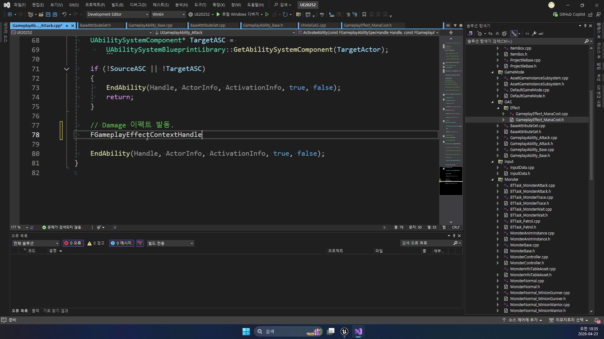
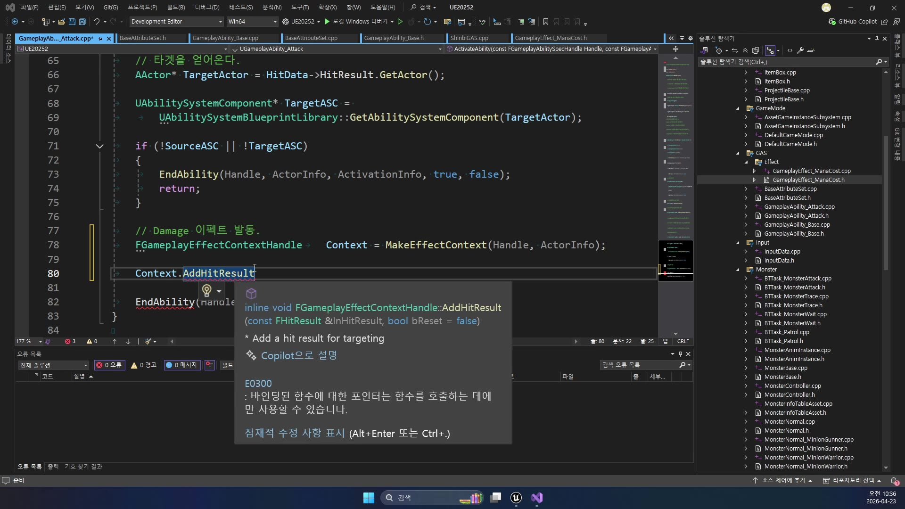
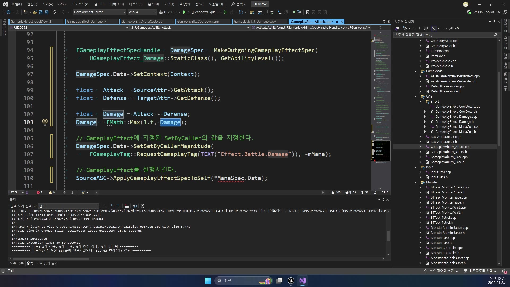

# 중급 1편. GAS 공격 파이프라인 완성

[이전: 260422 고급 2편](../../260422/05_advanced_damage_effect_and_gameplaycue/) | [허브](../) | [다음: 중급 2편](../02_intermediate_gameplaycue_application/)

## 이 편의 목표

이 편에서는 `260422`에서 "거의 다 됐다" 수준으로 설명했던 공격 Ability 흐름이,
실제로 어떤 코드 조각들 덕분에 완성형 공격 파이프라인으로 읽히는지 다시 묶어 본다.

핵심은 아래 네 조각을 한 번에 연결해서 보는 것이다.

- `Effect.Battle.Damage` 태그 슬롯
- `FGameplayEffectContextHandle`과 `AddHitResult`
- `DamageSpec` 생성과 `SetByCaller`
- `ApplyGameplayEffectSpecToTarget` 뒤의 `PostGameplayEffectExecute`

즉 이번 편은 `GameplayAbility_Attack.cpp` 한 파일을 중심으로,
`260422`에서 분리해 설명했던 조각들을 "실제로는 하나의 공격 함수"라는 관점에서 다시 읽는 편이다.

## 봐야 할 파일

- `D:\UnrealProjects\UE_Academy_Stduy\Source\UE20252\GAS\GameplayAbility_Attack.cpp`
- `D:\UnrealProjects\UE_Academy_Stduy\Source\UE20252\GAS\Effect\GameplayEffect_Damage.cpp`
- `D:\UnrealProjects\UE_Academy_Stduy\Source\UE20252\GAS\BaseAttributeSet.cpp`
- `D:\UnrealProjects\UE_Academy_Stduy\Config\DefaultGameplayTags.ini`

## 전체 흐름 한 줄

`Ability.Attack 이벤트 수신 -> HitData 복원 -> EffectContext에 HitResult 적재 -> DamageSpec 생성 -> Effect.Battle.Damage 주입 -> ApplyGameplayEffectSpecToTarget -> BaseAttributeSet::PostGameplayEffectExecute()`

## 태그 이름부터 먼저 맞아야 한다

`GameplayEffect_Damage`와 `GameplayAbility_Attack`가 제대로 연결되려면,
먼저 같은 태그 이름을 공유한다는 전제가 필요하다.

`DefaultGameplayTags.ini`에는 실제로 아래 태그가 들어 있다.

```ini
+GameplayTagList=(Tag="Ability.Attack",DevComment="")
+GameplayTagList=(Tag="Effect.Battle.Damage",DevComment="")
+GameplayTagList=(Tag="GameplayCue.Battle.Attack",DevComment="")
```

즉 현재 프로젝트는 아래처럼 읽으면 된다.

- `Ability.Attack`
  공격 Ability를 깨우는 신호
- `Effect.Battle.Damage`
  이번 공격 피해량을 넣는 슬롯 이름
- `GameplayCue.Battle.Attack`
  타격 연출을 부르는 신호

강의 초반에도 이 태그 구조를 맞춰 두는 장면이 먼저 나온다.
이 이름이 어긋나면 뒤의 `SetByCaller`, `GameplayCue` 연결도 전부 끊긴다.



## `EffectContext`는 "이번 공격이 어떤 히트였는가"를 싣는 상자다

`Damage` 숫자만 있으면 HP 감소는 가능하다.
하지만 "어디를 맞았는지", "어떤 히트 결과를 기반으로 계산했는지" 같은 문맥은 별도 상자에 넣어야 한다.
그 역할이 `FGameplayEffectContextHandle`이다.

```cpp
FGameplayEffectContextHandle Context = MakeEffectContext(Handle, ActorInfo);
Context.AddHitResult(HitData->HitResult);

FGameplayEffectSpecHandle DamageSpec = MakeOutgoingGameplayEffectSpec(
    UGameplayEffect_Damage::StaticClass(), GetAbilityLevel());

DamageSpec.Data->SetContext(Context);
```

여기서 중요한 건 아래 두 줄이다.

- `MakeEffectContext(...)`
  이번 공격 실행의 문맥 상자를 만든다
- `AddHitResult(...)`
  실제 히트 결과를 그 상자에 실어 둔다

강의 화면도 이 흐름을 두 컷으로 잘 보여 준다.
먼저 컨텍스트를 만들고,
곧바로 `HitResult`를 추가해 "수치만 있는 데미지"가 아니라 "실제 충돌 기반 데미지"로 정리한다.





즉 현재 프로젝트는 아직 부위별 판정이나 표면별 연출까지는 안 가더라도,
그 확장을 받을 수 있는 상자를 이미 준비해 둔 셈이다.

## `DamageSpec`은 계산값을 직접 HP에 넣지 않고 Effect에 실어 보낸다

`260422`에서도 강조했듯이, 현재 프로젝트는 `Attack - Defense` 계산을 `Ability` 안에서 직접 한다.
하지만 계산을 직접 한다고 해서 `SetHP()`까지 직접 호출하지는 않는다.
값을 바꾸는 마지막 수단은 여전히 `GameplayEffect`다.

```cpp
float Attack = SourceAttr->GetAttack();
float Defense = TargetAttr->GetDefense();

float Damage = Attack - Defense;
Damage = FMath::Max(1.f, Damage);

DamageSpec.Data->SetSetByCallerMagnitude(
    FGameplayTag::RequestGameplayTag(TEXT("Effect.Battle.Damage")), -Damage);
```

이 코드를 초심자 관점에서 다시 풀면 아래 의미다.

- 이번 공격 피해량은 Ability가 계산한다
- 그 계산값은 `Effect.Battle.Damage` 슬롯에 넣는다
- HP를 바로 깎지 않고 `DamageSpec`에 실어 보낸다

강의 화면도 바로 이 구간을 핵심으로 잡는다.
`DamageSpec` 생성, `Attack - Defense`, `FMath::Max(1.f, Damage)`, `Effect.Battle.Damage` 주입이 한 화면 안에 이어진다.



즉 현재 `UE20252`의 공격 완성은 "데미지 계산 공식을 끝냈다"가 아니라,
"계산한 값을 Effect 규칙 안에 다시 넣는 흐름까지 닫았다"는 뜻이다.

## `ApplyGameplayEffectSpecToTarget()`가 진짜 실행 지점이다

이제 남은 건 대상에게 적용하는 일이다.
현재 구현은 `TargetActor` 하나만 있어도, GAS 표준 경로를 유지하기 위해 `TargetData_ActorArray`를 다시 만든다.

```cpp
FGameplayAbilityTargetDataHandle TargetData;

FGameplayAbilityTargetData_ActorArray* TargetArray =
    new FGameplayAbilityTargetData_ActorArray;

TargetArray->TargetActorArray.Add(TargetActor);
TargetData.Add(TargetArray);

ApplyGameplayEffectSpecToTarget(
    Handle, ActorInfo, ActivationInfo, DamageSpec, TargetData);
```

여기서 기억하면 좋은 건 세 가지다.

- `TargetActor`
  월드의 실제 대상
- `TargetData`
  GAS가 대상을 전달받는 표준 포맷
- `ApplyGameplayEffectSpecToTarget`
  이번 공격이 상대 HP 변화로 이어지는 실행 지점

즉 `GameplayAbility_Attack`은 여기서 끝나는 것이지,
중간 계산만 하고 빠지는 함수가 아니다.

## `PostGameplayEffectExecute()`는 공격 완성 이후의 첫 반응 지점이다

적용이 끝나면 `UBaseAttributeSet::PostGameplayEffectExecute()`가 반응을 받을 준비를 한다.

```cpp
void UBaseAttributeSet::PostGameplayEffectExecute(
    const FGameplayEffectModCallbackData& Data)
{
    if (Data.EvaluatedData.Attribute == GetMPAttribute())
    {
    }
    else if (Data.EvaluatedData.Attribute == GetHPAttribute())
    {
        UE_LOG(UELOG, Warning, TEXT("HP : %.2f / %.2f"), GetHP(), GetHPMax());
    }
}
```

현재 구현은 아직 얇다.
HP가 변하면 로그만 찍고 끝난다.
하지만 이 빈 공간은 오히려 설계 지점을 분명히 보여 준다.

- HP clamp
- 사망 처리
- UI 갱신
- 피격 수치 표시

같은 후속 반응은 모두 여기로 모을 수 있다.

즉 이번 편에서 말하는 "공격 완성"은 단순히 피격 숫자를 넣었다는 뜻이 아니라,
그 뒤 후처리를 받을 위치까지 확정됐다는 뜻이다.

## 이 편의 핵심 정리

이 편에서 꼭 기억할 문장은 아래다.

`260423 기준 UE20252의 공격 완성은 HitResult 문맥을 EffectContext에 싣고, DamageSpec에 SetByCaller 값을 넣고, 그 Spec을 Target에 적용해 AttributeSet 후처리까지 이어지게 하는 구조다.`

즉 `260422`가 "할 수 있다"를 보여 준 날이었다면,
`260423`은 그 공격이 실제로 어디서 닫히는지 다시 확정하는 날이다.
