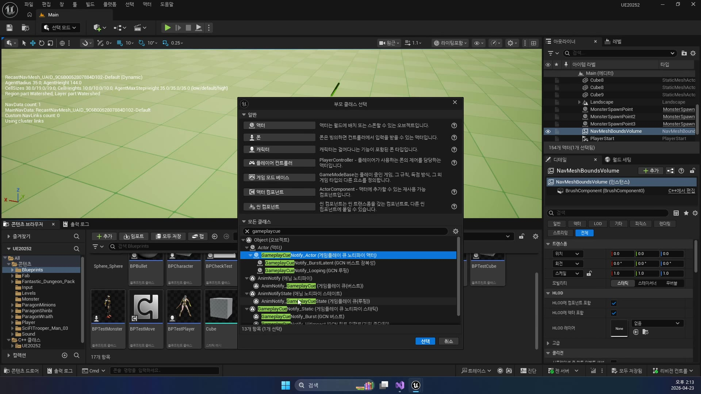
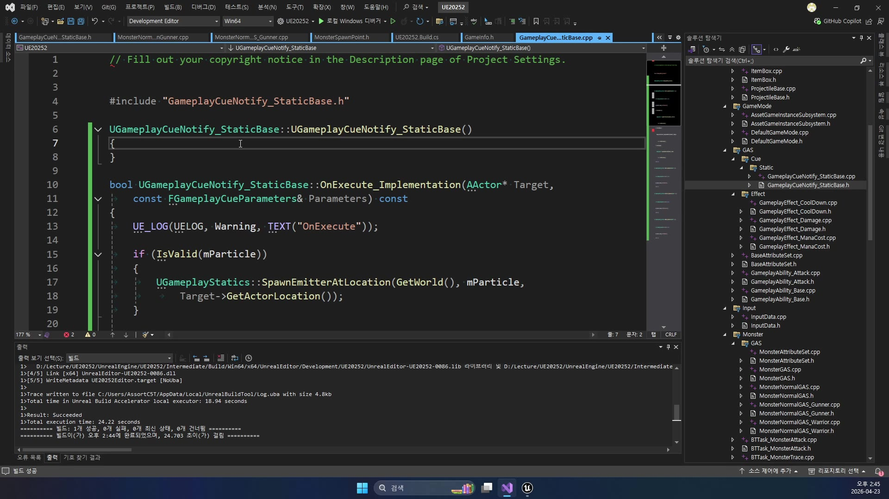
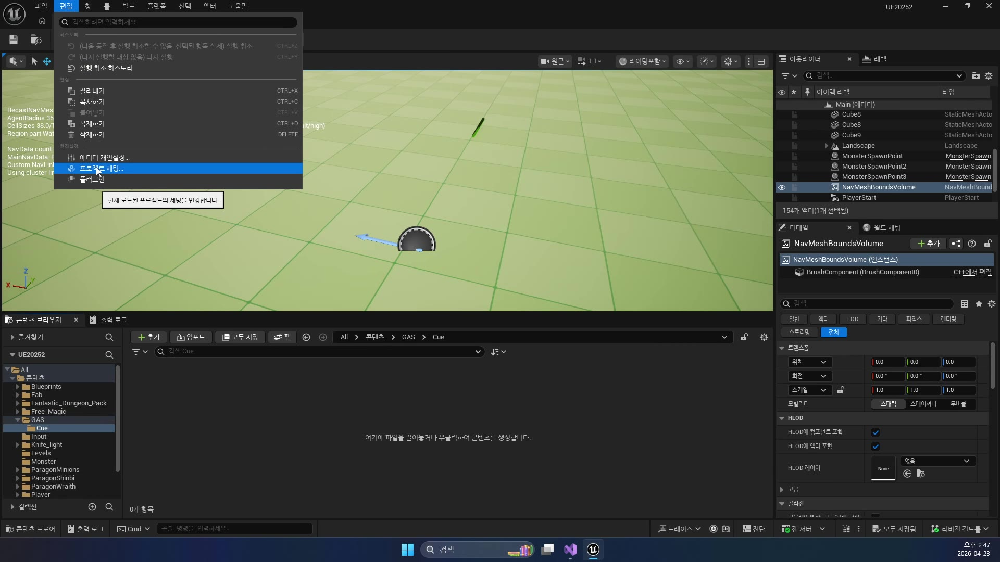
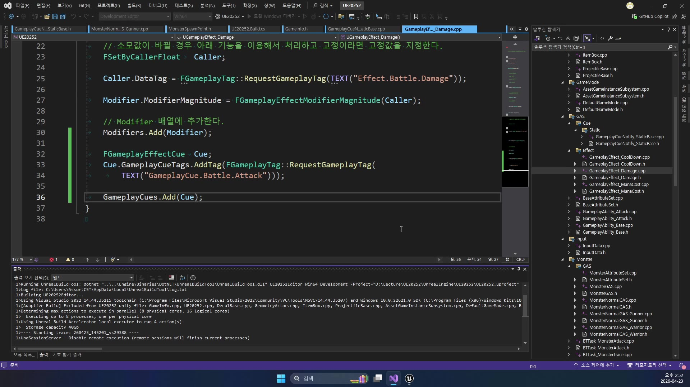

# 중급 2편. GameplayCue 적용과 타격 연출 분리

[이전: 중급 1편](../01_intermediate_gas_attack_completion/) | [허브](../) | [다음: 고급 1편](../03_advanced_monster_attack_gas_application/)

## 이 편의 목표

이 편에서는 `GameplayEffect_Damage`가 단순히 HP만 깎는 규칙이 아니라,
같은 타이밍에 타격 연출까지 부를 수 있는 구조라는 점을 정리한다.

핵심은 아래 세 층을 분리해서 보는 것이다.

- `GameplayEffect_Damage`
  수치 규칙
- `GameplayCue.Battle.Attack`
  연출 신호
- `GameplayCueNotify_StaticBase`와 `BPGCN_ShareDamage`
  실제 이펙트/사운드 실행체

즉 이번 편은 "피가 깎였다"와 "타격 이펙트가 보였다"를 같은 함수로 섞지 않고도,
같은 타이밍에 움직이게 만드는 이유를 설명하는 편이다.

## 봐야 할 파일

- `D:\UnrealProjects\UE_Academy_Stduy\Source\UE20252\GAS\Cue\Static\GameplayCueNotify_StaticBase.h`
- `D:\UnrealProjects\UE_Academy_Stduy\Source\UE20252\GAS\Cue\Static\GameplayCueNotify_StaticBase.cpp`
- `D:\UnrealProjects\UE_Academy_Stduy\Source\UE20252\GAS\Effect\GameplayEffect_Damage.cpp`
- `D:\UnrealProjects\UE_Academy_Stduy\Config\DefaultGameplayTags.ini`
- `D:\UnrealProjects\UE_Academy_Stduy\Config\DefaultGame.ini`
- `D:\UnrealProjects\UE_Academy_Stduy\Content\GAS\Cue\BPGCN_ShareDamage.uasset`

## 전체 흐름 한 줄

`GameplayEffect_Damage 적용 -> GameplayCue.Battle.Attack 태그 동반 -> /Game/GAS/Cue/ 아래 Cue 자산 탐색 -> GameplayCueNotify_StaticBase::OnExecute_Implementation() -> 파티클 / 나이아가라 / 사운드 재생`

## 왜 `GameplayCue`를 따로 두나

현재 프로젝트가 좋은 이유는 데미지 수치와 타격 연출을 같은 함수에 섞지 않았다는 점이다.
`Damage` 계산은 `Ability`와 `GameplayEffect`가 맡고,
실제 눈에 보이는 반응은 `GameplayCue`가 맡는다.

이 분리가 주는 장점은 분명하다.

- 숫자 규칙을 바꿔도 연출 코드를 덜 건드린다
- 같은 데미지 규칙에 여러 Cue 자산을 붙이기 쉽다
- 플레이어/몬스터/속성별 타격 연출을 나누기 쉽다

즉 `GameplayCue`는 단순 이펙트 재생 도구가 아니라,
수치 계층과 연출 계층을 느슨하게 묶는 태그 기반 연결점이다.

## 어떤 Cue Notify 클래스를 고르나

강의 초반에는 새 클래스 생성 화면에서 `GameplayCueNotify` 계열 부모를 고르는 장면이 나온다.
현재 날짜에서 선택하는 핵심은 `Static` 계열을 쓰는 이유를 이해하는 것이다.



지금 구현은 `UGameplayCueNotify_StaticBase`를 만든다.
이 선택은 "짧게 한 번 반응하고 끝나는 타격 이펙트"에 잘 맞는다.

- 매번 오래 살아 있는 액터가 필요하지 않다
- 타격 위치에 파티클/사운드 한 번만 뿌리면 된다
- 호출 시점이 `OnExecute` 하나로 단순하다

즉 이번 프로젝트의 기본 타격 반응은 `Static` 계열이 가장 단순하고 잘 맞는다.

## `GameplayCueNotify_StaticBase`는 연출 자산 슬롯을 먼저 만든다

헤더를 보면 이 클래스는 화려한 연산보다,
먼저 어떤 연출 자산을 받을지 슬롯을 열어 두는 데 집중한다.

```cpp
UPROPERTY(EditAnywhere, BlueprintReadOnly, Category = "Effect")
TObjectPtr<UParticleSystem> mParticle;

UPROPERTY(EditAnywhere, BlueprintReadOnly, Category = "Effect")
TObjectPtr<UNiagaraSystem> mNiagara;

UPROPERTY(EditAnywhere, BlueprintReadOnly, Category = "Effect")
TObjectPtr<USoundBase> mSound;
```

즉 이 클래스는 직접 어떤 파티클을 강제하지 않는다.
대신 블루프린트 자산 쪽에서 아래를 골라 꽂을 수 있게 한다.

- Cascade 파티클
- Niagara 시스템
- 사운드

현재 프로젝트에서는 `/Game/GAS/Cue/BPGCN_ShareDamage`가 바로 이 기반 클래스를 실제 자산으로 사용하게 만드는 자리라고 보면 된다.

## `OnExecute_Implementation()`은 실제 재생 지점이다

구현 파일은 더 직관적이다.
타깃 위치를 기준으로 파티클, 나이아가라, 사운드를 한 번씩 재생한다.

```cpp
bool UGameplayCueNotify_StaticBase::OnExecute_Implementation(
    AActor* Target,
    const FGameplayCueParameters& Parameters) const
{
    if (IsValid(mParticle))
    {
        UGameplayStatics::SpawnEmitterAtLocation(
            GetWorld(), mParticle, Target->GetActorLocation());
    }

    if (IsValid(mNiagara))
    {
        UNiagaraFunctionLibrary::SpawnSystemAtLocation(
            GetWorld(), mNiagara, Target->GetActorLocation());
    }

    if (IsValid(mSound))
    {
        UGameplayStatics::SpawnSoundAtLocation(
            GetWorld(), mSound, Target->GetActorLocation());
    }

    return true;
}
```

강의 화면도 이 지점을 그대로 보여 준다.
`OnExecute_Implementation()` 안에서 "실제로 뿌리는" 함수가 어디인지 한눈에 보인다.



즉 현재 Cue 기반 구조는 아래처럼 읽으면 된다.

- `GameplayCue` 태그가 들어오면
- `OnExecute`가 호출되고
- 타깃 위치에 이펙트와 사운드가 나온다

## 설정 파일과 자산 경로가 같이 맞아야 한다

코드만 맞아서는 Cue가 동작하지 않는다.
엔진이 Cue 자산을 어디서 찾아야 하는지도 알아야 한다.

`DefaultGame.ini`에는 실제로 아래 설정이 들어 있다.

```ini
+GameplayCueNotifyPaths=/Game/GAS/Cue/
```

그리고 강의 화면에서도 프로젝트 세팅에서 이 탐색 경로를 맞추는 장면이 나온다.



즉 현재 프로젝트는 아래 세 층이 같이 맞아야 한다.

- 태그 이름
  `GameplayCue.Battle.Attack`
- 탐색 경로
  `/Game/GAS/Cue/`
- 실제 자산
  `BPGCN_ShareDamage.uasset`

이 셋 중 하나라도 빠지면 `OnExecute`까지 도달하지 못한다.

## `GameplayEffect_Damage`가 Cue 태그를 같이 싣는다

현재 구현에서 가장 중요한 연결은 `GameplayEffect_Damage` 쪽에 있다.

```cpp
FGameplayEffectCue Cue;
Cue.GameplayCueTags.AddTag(FGameplayTag::RequestGameplayTag(
    TEXT("GameplayCue.Battle.Attack")));

GameplayCues.Add(Cue);
```

즉 현재 프로젝트는 "데미지 Effect가 성공적으로 적용되면,
같은 흐름 안에서 `GameplayCue.Battle.Attack`도 함께 따라간다"는 구조다.

강의 화면에서도 이 연결이 아주 직접적으로 보인다.
`GameplayEffect_Damage.cpp` 안에서 `GameplayCue.Battle.Attack`를 넣는 순간이 한 화면에 나온다.



이 지점이 중요한 이유는,
타격 연출이 플레이어 공격 함수 안에 하드코딩된 게 아니라
`Damage Effect` 자체의 속성으로 붙어 있다는 점을 보여 주기 때문이다.

## 이 편의 핵심 정리

이 편에서 꼭 기억할 문장은 아래다.

`현재 UE20252의 타격 연출은 GameplayEffect_Damage가 GameplayCue.Battle.Attack 태그를 함께 싣고, /Game/GAS/Cue/ 아래의 Cue 자산이 GameplayCueNotify_StaticBase::OnExecute로 실제 이펙트와 사운드를 재생하는 구조다.`

즉 이번 편은 "이펙트를 틀었다"가 아니라,
수치 규칙과 연출 규칙을 태그 기반으로 분리했다는 점이 핵심이다.
