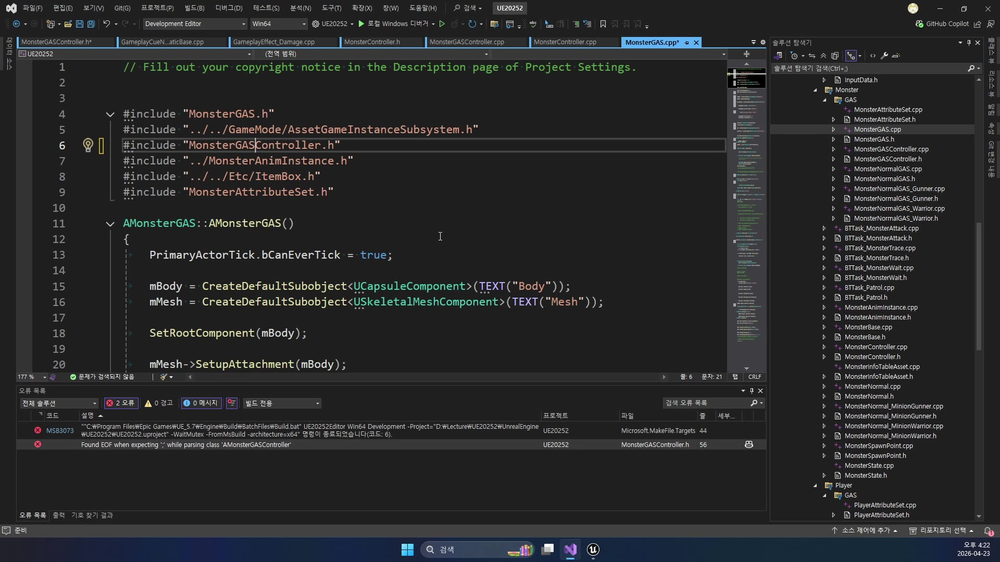
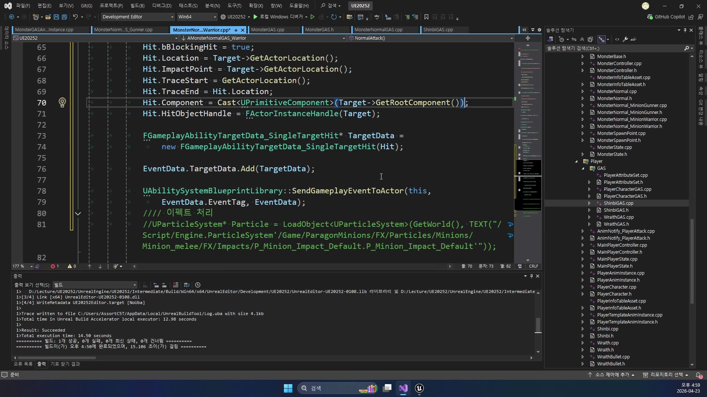
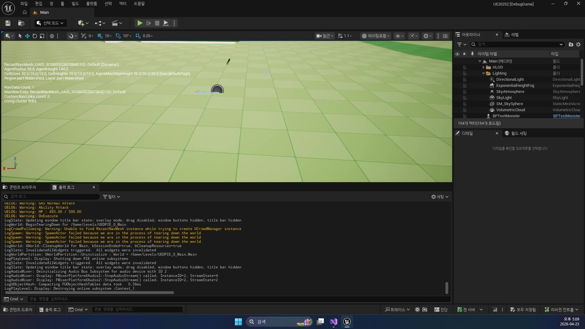
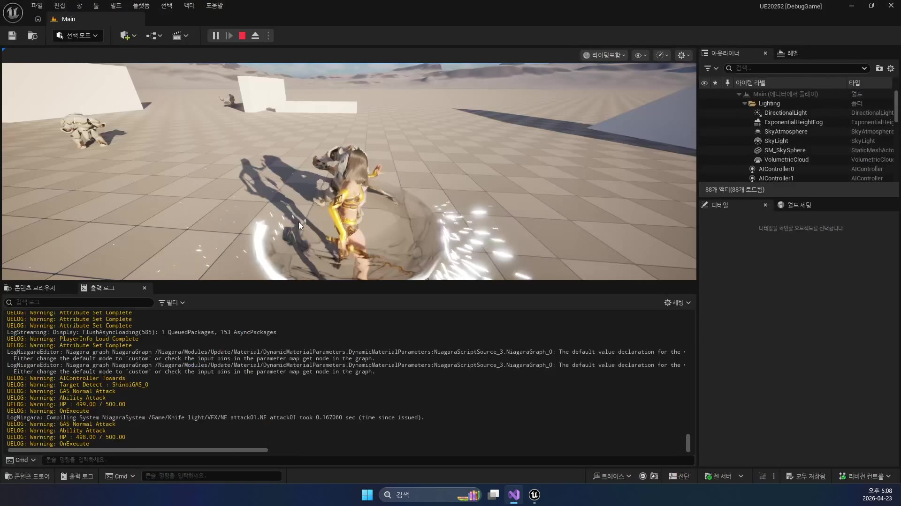

# 고급 1편. MonsterGAS에 공격 파이프라인 적용

[이전: 중급 2편](../02_intermediate_gameplaycue_application/) | [허브](../)

## 이 편의 목표

이 편에서는 `260414 ~ 260416`에서 만들었던 몬스터 AI 뼈대 위에,
`260422 ~ 260423`에서 정리한 GAS 공격 파이프라인이 어떻게 얹히는지 본다.

핵심은 아래 세 질문에 답하는 것이다.

- 몬스터 본체는 어디서 `ASC`와 `AttributeSet`을 얻는가
- AI가 감지/추적/공격하는 루프는 어디에 남아 있는가
- 실제 타격 시점에 왜 `TakeDamage()` 대신 `Ability.Attack` 이벤트를 보내는가

즉 이번 편은 플레이어 공격 GAS를 다시 설명하는 편이 아니라,
같은 공격 Ability가 몬스터 AI 전투 루프에도 재사용되기 시작하는 지점을 설명하는 편이다.

## 봐야 할 파일

- `D:\UnrealProjects\UE_Academy_Stduy\Source\UE20252\Monster\GAS\MonsterGAS.cpp`
- `D:\UnrealProjects\UE_Academy_Stduy\Source\UE20252\Monster\GAS\MonsterGASController.cpp`
- `D:\UnrealProjects\UE_Academy_Stduy\Source\UE20252\Monster\GAS\MonsterNormalGAS.cpp`
- `D:\UnrealProjects\UE_Academy_Stduy\Source\UE20252\Monster\GAS\MonsterNormalGAS_Warrior.cpp`
- `D:\UnrealProjects\UE_Academy_Stduy\Source\UE20252\Monster\GAS\MonsterNormalGAS_Gunner.cpp`
- `D:\UnrealProjects\UE_Academy_Stduy\Source\UE20252\Monster\GAS\MonsterAttributeSet.h`
- `D:\UnrealProjects\UE_Academy_Stduy\Source\UE20252\Monster\GAS\BTTask_TraceGAS.cpp`
- `D:\UnrealProjects\UE_Academy_Stduy\Source\UE20252\Monster\GAS\BTTask_AttackGAS.cpp`
- `D:\UnrealProjects\UE_Academy_Stduy\Source\UE20252\GAS\GameplayAbility_Attack.cpp`

## 전체 흐름 한 줄

`MonsterGAS가 ASC와 MonsterAttributeSet을 소유 -> MonsterGASController가 Target을 감지 -> BTTask_TraceGAS / BTTask_AttackGAS가 추적과 공격 타이밍 관리 -> MonsterNormalGAS_Warrior::NormalAttack()이 Ability.Attack 이벤트 전송 -> GameplayAbility_Attack / GameplayEffect_Damage / GameplayCue가 실제 타격과 연출 수행`

## `MonsterGAS`는 기존 몬스터 본체 위에 ASC를 얹은 형태다

`AMonsterGAS` 생성자를 보면 기존 몬스터 뼈대는 거의 유지하면서,
`ASC`와 `MonsterAttributeSet`이 새로 들어온다.

```cpp
mASC = CreateDefaultSubobject<UAbilitySystemComponent>(TEXT("ASC"));
mAttributeSet = CreateDefaultSubobject<UMonsterAttributeSet>(TEXT("AttributeSet"));

mASC->AddAttributeSetSubobject<UMonsterAttributeSet>(mAttributeSet);
```

그리고 `BeginPlay()`에서는 이 ASC를 실제로 활성화한다.

```cpp
mASC->InitAbilityActorInfo(this, this);

mASC->GiveAbility(FGameplayAbilitySpec(
    UGameplayAbility_Attack::StaticClass(), 1, 0));
```

즉 `MonsterGAS`는 아래 의미를 갖는다.

- 몬스터도 이제 자기 ASC를 가진다
- 몬스터도 `GameplayAbility_Attack`를 지급받는다
- 플레이어 공격과 같은 Ability 클래스를 몬스터도 재사용한다

강의 초반 화면도 이 구조 전환을 그대로 보여 준다.
`MonsterGASController`, `MonsterAttributeSet`, `GameplayAbility_Attack`가 같은 축에 들어오기 시작한다.



## 데이터는 이제 `MonsterAttributeSet`으로 들어간다

`MonsterInfoLoadComplete()`는 기존처럼 `mAttack`, `mHP` 같은 멤버를 직접 채우지 않는다.
대신 `UMonsterAttributeSet`에 수치를 넘긴다.

```cpp
mAttributeSet->SetAttack(Info->Attack);
mAttributeSet->SetDefense(Info->Defense);
mAttributeSet->SetHP(Info->HPMax);
mAttributeSet->SetHPMax(Info->HPMax);
mAttributeSet->SetWalkSpeed(Info->WalkSpeed);
mAttributeSet->SetRunSpeed(Info->RunSpeed);
mAttributeSet->SetAttackDistance(Info->AttackDistance);
mAttributeSet->SetDetectRange(Info->DetectRange);
```

즉 현재 branch에서 몬스터 데이터 흐름은 아래처럼 읽는 편이 정확하다.

`DataTable -> MonsterInfoLoadComplete() -> MonsterAttributeSet -> AI 이동속도/감지범위/공격거리`

`UMonsterAttributeSet`도 특별한 별도 스탯을 많이 넣는 대신,
기존 `UBaseAttributeSet`을 상속하고 `DetectRange`만 추가한다.
즉 플레이어와 몬스터가 꽤 많은 수치 구조를 함께 쓰기 시작한 셈이다.

## 감지와 추적 AI 루프는 여전히 컨트롤러와 BT가 맡는다

이 지점이 중요하다.
몬스터 전투가 GAS로 옮겨 갔다고 해서,
기존 AI 뼈대가 사라진 것은 아니다.

`AMonsterGASController::OnTarget()`는 감지 성공 시 블랙보드 `Target`을 세팅하고,
`Monster->DetectTarget(true)`를 호출한다.

```cpp
if (Stimulus.WasSuccessfullySensed())
{
    Blackboard->SetValueAsObject(TEXT("Target"), Actor);
    Monster->DetectTarget(true);
}
else
{
    Blackboard->SetValueAsObject(TEXT("Target"), nullptr);
    Monster->DetectTarget(false);
}
```

`Monster->DetectTarget()`는 다시 이동속도를 바꾼다.

```cpp
if (Detect)
    mMovement->MaxSpeed = mAttributeSet->GetRunSpeed();
else
    mMovement->MaxSpeed = mAttributeSet->GetWalkSpeed();
```

강의 화면도 이 감지 전환과 속도 전환을 같은 흐름 안에서 보여 준다.
즉 AI는 여전히 "감지하면 달리고, 잃으면 걷는" 기존 몬스터 규칙을 그대로 유지한다.



따라서 `MonsterGAS`를 읽을 때는
"AI가 전부 GAS로 바뀌었다"라고 읽는 것이 아니라,
"AI는 그대로 두고 공격/수치 적용 레이어만 GAS로 옮겼다"라고 읽는 편이 맞다.

## `BTTask_TraceGAS`와 `BTTask_AttackGAS`는 기존 전투 루프를 유지한다

추적 태스크는 `MoveToActor(Target)`를 걸고,
공격 거리 안에 들어가면 실패를 반환해 다음 공격 분기로 넘어가게 만든다.

공격 태스크는 바로 데미지를 주지 않는다.
대신 공격 애니메이션을 재생하고,
`AttackTarget`을 블랙보드에 기록한 채 애니메이션 종료와 거리 재판정을 기다린다.

즉 현재 AI 루프는 여전히 아래 구조다.

- `Trace`
  붙을 때까지 쫓아간다
- `Attack`
  공격 모션을 재생하고 노티파이 시점을 기다린다
- `AttackEnd`
  끝났으면 거리와 방향을 다시 본다

이 구조는 `260416`에서 설명했던 legacy 몬스터 전투 루프를 거의 그대로 유지한다.
달라진 건 "노티파이 시점에 무엇을 호출하는가"다.

## 워리어는 이제 `TakeDamage()` 대신 `Ability.Attack` 이벤트를 보낸다

가장 중요한 변화는 `AMonsterNormalGAS_Warrior::NormalAttack()`에 있다.
예전 `MonsterNormal` 계열은 애니메이션 노티파이에서 직접 `TakeDamage()`를 호출하는 쪽에 가까웠다.
반면 지금 워리어는 `FGameplayEventData`와 `FGameplayAbilityTargetData_SingleTargetHit`를 만들어,
플레이어와 같은 `Ability.Attack` 이벤트를 보낸다.

```cpp
FGameplayEventData EventData;
EventData.Target = Target;
EventData.Instigator = this;
EventData.EventTag = FGameplayTag::RequestGameplayTag(TEXT("Ability.Attack"));

FHitResult Hit;
Hit.bBlockingHit = true;
Hit.Location = Target->GetActorLocation();
Hit.ImpactPoint = Target->GetActorLocation();
Hit.TraceStart = GetActorLocation();
Hit.TraceEnd = Hit.Location;
Hit.Component = Cast<UPrimitiveComponent>(Target->GetRootComponent());
Hit.HitObjectHandle = FActorInstanceHandle(Target);

FGameplayAbilityTargetData_SingleTargetHit* TargetData =
    new FGameplayAbilityTargetData_SingleTargetHit(Hit);

EventData.TargetData.Add(TargetData);

UAbilitySystemBlueprintLibrary::SendGameplayEventToActor(
    this, EventData.EventTag, EventData);
```

즉 몬스터도 이제 아래 구조를 쓴다.

- 애니메이션 노티파이 시점에
- 히트 정보를 GAS 표준 `TargetData`로 감싸고
- `Ability.Attack` 이벤트를 보내
- 이미 등록된 `UGameplayAbility_Attack`가 실제 데미지를 처리한다

강의 화면도 바로 이 장면이 핵심이다.
`HitResult`를 채우고 `TargetData`를 만든 뒤 `SendGameplayEventToActor()`로 마무리하는 흐름이 한눈에 보인다.



즉 플레이어 공격 GAS와 몬스터 공격 GAS는 결국 같은 Ability 클래스에서 만난다.

## 런타임 로그를 보면 실제 연결이 한 번에 보인다

실행 화면을 보면 이 연결이 더 분명하다.
로그에는 `GAS Normal Attack`, `Ability Attack`, `HP : ...`, `OnExecute`가 같은 전투 순간 안에서 이어진다.



이 로그를 한 줄씩 해석하면 아래 의미다.

- `GAS Normal Attack`
  몬스터 워리어가 노티파이 시점에 이벤트를 보냈다
- `Ability Attack`
  공용 공격 Ability가 실제로 발동됐다
- `HP : ...`
  타겟 `AttributeSet`에 HP 변화가 적용됐다
- `OnExecute`
  `GameplayCueNotify_StaticBase`가 타격 연출까지 실행했다

즉 `260423`은 몬스터가 "GAS를 가진다" 수준이 아니라,
실제로 공격 이벤트, 수치 적용, Cue 연출이 한 번에 닫히는 날이다.

## 아직 완전히 옮겨지지 않은 지점도 있다

현재 branch를 읽을 때 같이 봐야 할 사실이 하나 있다.
`AMonsterNormalGAS_Gunner::NormalAttack()`는 아직 `Ability.Attack` 이벤트를 보내지 않고,
파티클만 직접 뿌린다.

즉 현재 상태는 아래처럼 읽는 편이 정확하다.

- `Warrior`
  공격 GAS 이관이 완료된 쪽
- `Gunner`
  연출만 남아 있고 데미지/Cue 루프는 아직 덜 옮겨진 쪽

이 메모는 나중에 `260416`이나 `260420` 문서를 현재 branch 기준으로 다시 읽을 때도 중요하다.

## 이 편의 핵심 정리

이 편에서 꼭 기억할 문장은 아래다.

`현재 UE20252의 MonsterGAS 전투 루프는 기존 AIController/BehaviorTree/AnimNotify 구조를 유지한 채, 실제 공격 판정만 Ability.Attack 이벤트와 GameplayAbility_Attack, GameplayEffect_Damage, GameplayCue로 옮겨 놓은 구조다.`

즉 `260423`의 마지막은 몬스터 AI를 새로 만든 날이 아니라,
기존 몬스터 전투 루프를 GAS 공격 파이프라인에 접속시킨 날이라고 이해하는 편이 맞다.
